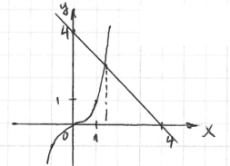
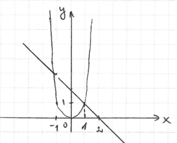

# 1. temats. Kopsavilkums

## 1. Nosaki, kuras no dotajām izteiksmēm ir veselas un kuras daļveida!

a) $a-5x$ &nbsp;&nbsp; $\color{blue}{\text{Ir}}$

b) $\dfrac{5}{x}$ &nbsp;&nbsp; $\color{blue}{\text{Nav}}$

c) $\dfrac{x}{5}$ &nbsp;&nbsp; $\color{blue}{\text{Ir}}$

d) $\dfrac{2}{3k-7}$ &nbsp;&nbsp; $\color{blue}{\text{Nav}}$

e) $\dfrac{3k-7}{2}$ &nbsp;&nbsp; $\color{blue}{\text{Ir}}$

## 2. Sadali reizinātājos!

a) $ab+4ac = \color{blue}{a(b+4c)}$

b) $5y-10xy = \color{blue}{5y(1-2x)}$

c) $4m^2-49 = \color{blue}{(2m-7)(2m+7)}$

d) $k^2-8k+16 = \color{blue}{(k-4)^2}$

e) $8a^2-4a+2ab-b = \color{blue}{4a(2a-1)+b(2a-1) = (2a-1)(4a+b)}$

f) $b^4-16 = \color{blue}{(b^2-4)(b^2+4) = (b-2)(b+2)(b^2+4)}$

g) $t^2-2t-3 = $

h) $a^6+1 = \color{blue}{(a^2)^3+1^3 = (a^2+1)(a^4-a^2+1)}$

i) $15x^2-8x+1 = \color{blue}{15\left(x-\dfrac{1}{5}\right)\left(x-\dfrac{1}{3}\right)=(5x-1)(3x-1)}$

$$\color{blue}{t^2-8t+15=0}$$
$$\color{blue}{t=3 \qquad t=5}$$
$$\color{blue}{x=\dfrac{1}{5} \qquad x=\dfrac{1}{3}}$$

j) $a^4+a^3-a-1 = \color{blue}{a^3(a+1)-(a+1) = (a+1)(a^3-1) = (a+1)(a-1)(a^2+a+1)}$

k) $x^2-2x+1-36a^2 = \color{blue}{(x-1)^2-(6a)^2 = (x-1-6a)(x-1+6a)}$

## 3. Aprēķini algebriskās izteiksmes $x^4-2x^2-1$ vērtību, ja $x=-3$.

$$\color{blue}{(-3)^4-2(-3)^2-1 = 81-18-1 = 62}$$

## 4. Atrisini vienādojumu, izvēloties ērtāko risināšanas paņēmienu!

### a) $3x+12=0$

$$\color{blue}{3x=-12}$$
$$\color{blue}{x=-4}$$

### b) $-20x^2+45=0$

$$\color{blue}{20x^2=45}$$
$$\color{blue}{x^2=\dfrac{9}{4}}$$
$$\color{blue}{x=\pm\dfrac{3}{2}}$$

### c) $x^3-8x^2+15x=0$

$$\color{blue}{x(x^2-8x+15)=0}$$
$$\color{blue}{x=0 \qquad x^2-8x+15=0}$$
$$\color{blue}{x=3 \qquad x=5}$$

### d) $4x^3-4x^2-x+1=0$

$$\color{blue}{4x^2(x-1)-1(x-1)=0}$$
$$\color{blue}{(x-1)(4x^2-1)=0}$$
$$\color{blue}{x-1=0 \qquad 4x^2-1=0}$$
$$\color{blue}{x=1 \qquad x^2=\dfrac{1}{4}}$$
$$\color{blue}{x=\pm\dfrac{1}{2}}$$

### e) $x^4-5x^2-36=0$

$$\color{blue}{\text{Apz. } x^2=t}$$
$$\color{blue}{t^2-5t-36=0}$$
$$\color{blue}{t=9 \qquad t=-4}$$
$$\color{blue}{x^2=9 \qquad x^2=-4}$$
$$\color{blue}{x=\pm 3 \qquad \varnothing}$$

### f) $(x^2-5x+4)(x^2-5x+6)=120$

$$\color{blue}{\text{Apz. } x^2-5x+4=t}$$
$$\color{blue}{t(t+2)=120}$$
$$\color{blue}{t^2+2t-120=0}$$
$$\color{blue}{t=-12 \qquad t=10}$$
$$\color{blue}{x^2-5x+4=-12 \qquad x^2-5x+4=10}$$
$$\color{blue}{x^2-5x+16=0 \qquad x^2-5x-6=0}$$
$$\color{blue}{D<0 \qquad x=6,\; x=-1}$$
$$\color{blue}{\varnothing}$$

### g) $x^3+x-4=0$

$$\color{blue}{x^3=4-x}$$
$$\color{blue}{x\approx 1{,}3}$$

### h) $x^4=2-x$

$$\color{blue}{x_1=1}$$
$$\color{blue}{x_2\approx -1{,}35}$$

## 5. Artis plānoja izveidot taisnstūra alpīnisma sienu ar izmēriem $x$ un $2x$. Sienas izveides laikā tās izmēri mainījās. Kad alpīnisma siena bija pabeigta, tās laukumu varēja izteikt ar polinomu $2x^2+7x+6$. Par cik garuma vienībām palielinājās vai samazinājās sienas platums un garums?

$$\color{blue}{2x^2 \;-\; \text{plānotā siena}}$$

$$\color{blue}{(x+a)(2x+b) = 2x^2+7x+6}$$

$$\color{blue}{2x^2+bx+2ax+ab = 2x^2+7x+6}$$

$$\color{blue}{2x^2+(2a+b)x+ab = 2x^2+7x+6}$$

$$\color{blue}{\text{Lai polinomi būtu vienādi:}}$$

$$\color{blue}{x^1:\quad 2a+b=7 \qquad\qquad x^0:\quad ab=6}$$

$$\color{blue}{\begin{cases} ab=6 \\ 2a+b=7 \end{cases}}$$

$$\color{blue}{b=7-2a}$$
$$\color{blue}{a(7-2a)=6}$$
$$\color{blue}{2a^2-7a+6=0}$$

$$\color{blue}{\begin{cases} a=2 \\ b=3 \end{cases} \qquad \begin{cases} a=1{,}5 \\ b=4 \end{cases}}$$

$$\color{blue}{\text{Atb. Platumu palielina par 3, bet garumu palielina par 2, vai arī platumu palielina par 4, bet garumu palielina par 1{,}5.}}$$
