_(1. LAPA)_

# 1. temats 10. darba lapa — Matemātika I

## 1. Nosaki doto grafiku krustpunktu $x$ koordinātu!

|---|---|---|
| **(1)** | 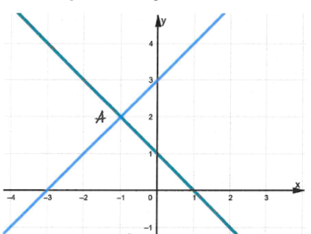 | $\color{blue}{x=-1}$ |
| **(2)** | 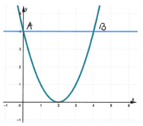 | $\color{blue}{x=0,\quad x=4}$ |
| **(3)** | 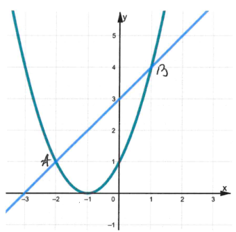 | $\color{blue}{x=-2,\quad x=1}$ |
| **(4)** | 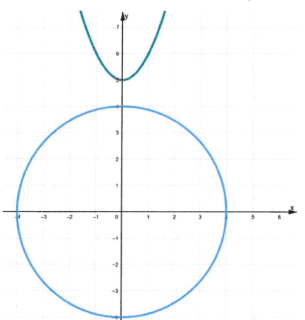 | $\color{blue}{\varnothing}$ |
| **(5)** | 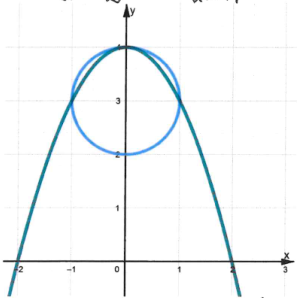 | $\color{blue}{x=-1,\quad x=0,\quad x=1}$ |
| **(6)** | 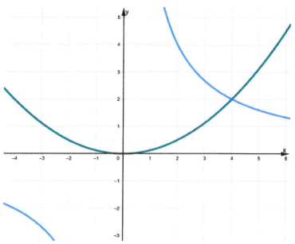 | $\color{blue}{x=4}$ |

_(2. LAPA)_

## 2. Izmantojot funkciju grafikus, atrisini vienādojumu!

|---|---|---|---|
| **(1)** | 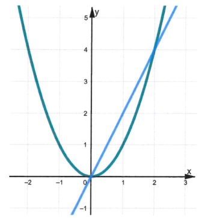 | $x^2=2x$ | $\color{blue}{x=0,\quad x=2}$ |
| **(2)** | 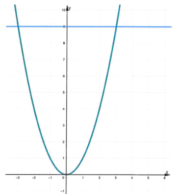 | $x^2=9$ | $\color{blue}{x=-3,\quad x=3}$ |
| **(3)** | 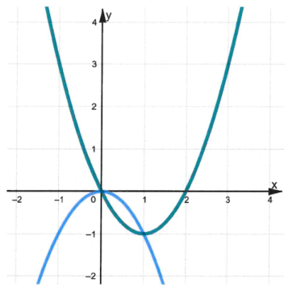 | $x^2-2x=-x^2$ | $\color{blue}{x=0,\quad x=1}$ |
| **(4)** | 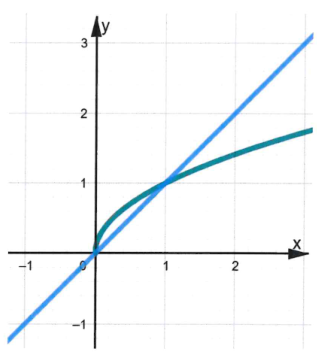 | $\sqrt{x}=x$ | $\color{blue}{x=0,\quad x=1}$ |

_(3. LAPA)_

|---|---|---|---|
| **(5)** | 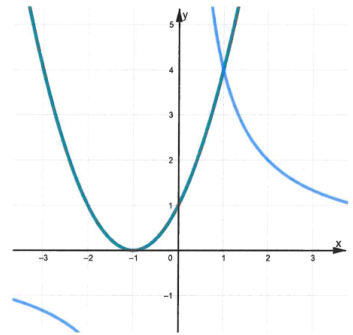 | $(x+1)^2=\dfrac{4}{x}$ | $\color{blue}{x=1}$ |
| **(6)** | 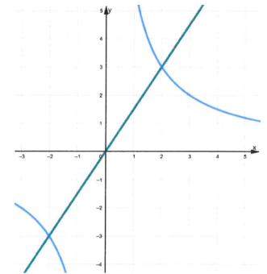 | $\dfrac{6}{x}=\dfrac{3}{2}x$ | $\color{blue}{x=-2,\quad x=2}$ |
| **(7)** | 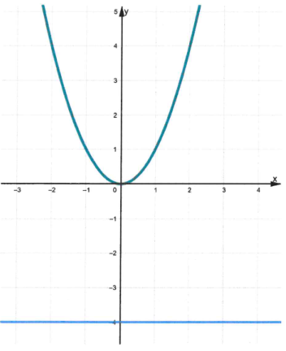 | $x^2=-4$ | $\color{blue}{\varnothing}$ |

