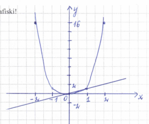
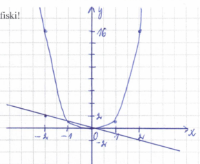

_(1.LAPA)_

# 1.temats. Pārbaudes darbs (atrisinājumi)

## 1. variants

### **(1)** _(8 punkti)_ Sadali reizinātājos!

|---|---|---|
| **(1.1.)** | (1 p.) $5a^3b^2-15ab^3=$ | $\color{blue}{5ab^2(a^2-3b)}$ |
| **(1.2.)** | (2 p.) $2y(3x-5)-9x+15=$ | $\color{blue}{2y(3x-5)-3(3x-5)=(3x-5)(2y-3)}$ |
| **(1.3.)** | (2 p.) $1-64a^3=$ | $\color{blue}{1^3-(4a)^3=(1-4a)(1+4a+16a^2)}$ |
| **(1.4.)** | (3 p.) $3x^2-7x+2=$ | $\color{blue}{3(x-2)\left(x-\frac{1}{3}\right)=(x-2)(3x-1)}$  $\color{blue}{D=(-7)^2-4\cdot3\cdot2=49-24=25}$  $\color{blue}{x_1=\frac{7+5}{2\cdot3}=\frac{12}{6}=2;\qquad x_2=\frac{7-5}{6}=\frac{2}{6}=\frac{1}{3}}$ |

### **(2)** _(9 punkti)_ Atrisini vienādojumus!

|---|---|---|
| **(2.1.)** | (2 p.) $x(x-1)(x+3)=0$ | $\color{blue}{x=0\ \text{vai}\ x-1=0\ \text{vai}\ x+3=0}$  $\color{blue}{x_1=0 \qquad x_2=1 \qquad x_3=-3}$ |
| **(2.2.)** | (3 p.) $x^3-3x^2-10x=0$ | $\color{blue}{x(x^2-3x-10)=0}$  $\color{blue}{x_1=0\ \text{vai}\ x^2-3x-10=0}$  $\color{blue}{\text{pēc vijeta t.}\ \begin{cases}x_2\cdot x_3=-10\\x_2+x_3=3\end{cases}}$  $\color{blue}{x_2=5;\qquad x_3=-2}$ |
| **(2.3.)** | (4 p.) $x^4-5x^2+4=0$ | $\color{blue}{x^2=t}$  $\color{blue}{t^2-5t+4=0}$  $\color{blue}{\text{pēc vijeta t.}\ \begin{cases}t_1\cdot t_2=4\\t_1+t_2=5\end{cases}}$  $\color{blue}{t_1=1;\qquad t_2=4}$  $\color{blue}{x^2=1 \qquad x^2=4}$  $\color{blue}{x_{1,2}=\pm1 \qquad x_{3,4}=\pm2}$ |

_(2.LAPA)_

### **(3)** _(/4 punkti)_ Atrisini doto vienādojumu $x^4-x=0$ grafiski!

$\color{blue}{\begin{aligned}
x^4-x&=0\\
x^4&=x
\end{aligned}}$

$\color{blue}{y=x^4 \qquad ; \qquad y=x}$

$\color{blue}{
\begin{array}{c|ccccc}
x & -2 & -1 & 0 & 1 & 2\\
\hline
y & 16 & 1 & 0 & 1 & 16
\end{array}
}$

$\color{blue}{
\begin{array}{c|ccc}
x & -2 & 0 & 2\\
\hline
y & -2 & 0 & 2
\end{array}
}$

$\color{blue}{\text{Atbilde: } x_1=0;\ x_2=1}$

---

## **(4)** _(/3 punkti)_ Atrisini vienādojumu!

$(x^2+2x)^2-14x^2-28x-15=0$

$\color{blue}{(x^2+2x)^2-14(x^2+2x)-15=0}$

$\color{blue}{x^2+2x=t}$

$\color{blue}{t^2-14t-15=0}$

$\color{blue}{\text{pēc vijeta t.}\quad
\begin{cases}
t_1\cdot t_2=-15\\
t_1+t_2=14
\end{cases}}$

$\color{blue}{t_1=15;\quad t_2=-1}$

$\color{blue}{
\begin{aligned}
x^2+2x&=15\\
x^2+2x-15&=0\\
x_1&=-5;\quad x_2=3
\end{aligned}
\qquad
\begin{aligned}
x^2+2x&=-1\\
x^2+2x+1&=0\\
x_{3;4}&=-1
\end{aligned}
}$

---

## **(5)** _(/2 punkti)_ Sadali izteiksmi $m^8-n^8$ vismaz trijos reizinātājos!

$\color{blue}{
\begin{aligned}
m^8-n^8
&=(m^4-n^4)(m^4+n^4)\\
&=(m^2-n^2)(m^2+n^2)(m^4+n^4)\\
&=(m-n)(m+n)(m^2+n^2)(m^4+n^4)
\end{aligned}
}$

_(3.LAPA)_

# 2. variants

## **(1)** _(___/8 punkti)_ Sadali reizinātājos!

|---|---|---|
| **(1.1.)** | (1 p.) $18xy^4-6x^2y^2=$ | $\color{blue}{6xy^2(3y^2-x)}$ |
| **(1.2.)** | (2 p.) $3a(2b-1)-4b+2=$ | $\color{blue}{3a(2b-1)-2(2b-1)=(2b-1)(3a-2)}$ |
| **(1.3.)** | (2 p.) $8a^3-1=$ | $\color{blue}{(2a)^3-1^3=(2a-1)(4a^2+2a+1)}$ |
| **(1.4.)** | (3 p.) $4x^2+x-3=$ | $\color{blue}{4\left(x-\frac{3}{4}\right)(x+1)=(4x-3)(x+1)}$  $\color{blue}{D=1^2-4\cdot4\cdot(-3)=1+48=49}$  $\color{blue}{x_1=\frac{-1+7}{2\cdot4}=\frac{6}{8}=\frac{3}{4};\qquad x_2=\frac{-1-7}{8}=\frac{-8}{8}=-1}$ |

## **(2)** _(___/9 punkti)_ Atrisini vienādojumus!

|---|---|---|
| **(2.1.)** | (2 p.) $x(x+2)(x-3)=0$ | $\color{blue}{x=0\ \text{vai}\ x+2=0\ \text{vai}\ x-3=0}$  $\color{blue}{x_1=0 \qquad x_2=-2 \qquad x_3=3}$ |
| **(2.2.)** | (3 p.) $x^3+3x^2-10x=0$ | $\color{blue}{x(x^2+3x-10)=0}$  $\color{blue}{x_1=0\ \text{vai}\ x^2+3x-10=0}$  $\color{blue}{\text{pēc vijeta t.}\ \begin{cases}x_2\cdot x_3=-10\\x_2+x_3=-3\end{cases}}$  $\color{blue}{x_1=-5;\qquad x_2=2}$ |
| **(2.3.)** | (4 p.) $x^4-17x^2+16=0$ | $\color{blue}{x^2=t}$  $\color{blue}{t^2-17t+16=0}$  $\color{blue}{\text{pēc vijeta t.}\ \begin{cases}t_1\cdot t_2=16\\t_1+t_2=17\end{cases}}$  $\color{blue}{t_1=1;\qquad t_2=16}$  $\color{blue}{x^2=1 \qquad x^2=16}$  $\color{blue}{x_{1;2}=\pm1 \qquad x_{3;4}=\pm4}$ |

_(4.LAPA)_

## **(3)** _(___/4 punkti)_ Atrisini doto vienādojumu $x^4+x=0$ grafiski!

$\color{blue}{\begin{aligned}
x^4+x&=0\\
x^4&=-x
\end{aligned}}$

$\color{blue}{y=x^4 \qquad ; \qquad y=-x}$

$\color{blue}{
\begin{array}{c|ccccc}
x & -2 & -1 & 0 & 1 & 2\\
\hline
y & 16 & 1 & 0 & 1 & 16
\end{array}
}$

$\color{blue}{
\begin{array}{c|ccc}
x & -2 & 0 & 2\\
\hline
y & 2 & 0 & -2
\end{array}
}$

$\color{blue}{\text{Atbilde: } x_1=-1;\ x_2=0}$

---

## **(4)** _(___/3 punkti)_ Atrisini vienādojumu!

$(x^2-2x)^2-14x^2+28x-15=0$

$\color{blue}{(x^2-2x)^2-14(x^2-2x)-15=0}$

$\color{blue}{x^2-2x=t}$

$\color{blue}{t^2-14t-15=0}$

$\color{blue}{\text{pēc Vjeta t.}\quad
\begin{cases}
t_1\cdot t_2=-15\\
t_1+t_2=14
\end{cases}}$

$\color{blue}{t_1=15;\quad t_2=-1}$

$\color{blue}{
\begin{aligned}
x^2-2x&=15\\
x^2-2x-15&=0\\
x_1&=5;\quad x_2=-3
\end{aligned}
\qquad
\begin{aligned}
x^2-2x&=-1\\
x^2-2x+1&=0\\
x_{3,4}&=1
\end{aligned}
}$

---

## **(5)** _(___/2 punkti)_ Sadali izteiksmi $a^8-b^8$ vismaz trijos reizinātājos!

$\color{blue}{
\begin{aligned}
a^8-b^8
&=(a^4-b^4)(a^4+b^4)\\
&=(a^2-b^2)(a^2+b^2)(a^4+b^4)\\
&=(a-b)(a+b)(a^2+b^2)(a^4+b^4)
\end{aligned}
}$
