**6. Planimetrija** (23 stundas)

Metodiskais komentārs

Šajā tematā vairāk uzsvars ir uz formulu lietošanu, bet kādu formulu vai
teorēmu ieteicams pierādīt, lai veidotu ieradumu kritiski skatīties uz
dažādām sakarībām, formulām un dažus piemērus neuztvertu kā vispārīgu
pierādījumu.

Temata sākumā ir atkārtojums no pamatskolas par sakarībām taisnleņķa
trijstūrī. Pēc tam dots neliels ieskats leņķa jēdziena paplašinājumā
(uzsvars uz sinusa un kosinusa vērtībām platiem leņķiem), kas būs
nepieciešams, lai apgūtu sinusu un kosinusa teorēmu. Tematu var apgūt
pēc 8. temata, kurā apgūst trigonometrisko funkciju definīcijas.

**!!!** Eiklīda teorēma un trijstūra laukuma aprēķināšana nav optimālā
līmeņa saturs, bet šīs zināšanas ir nepieciešamas tematā par
daudzskaldņiem, lai aprēķinātu ķermeņu (piramīdas ar vienādām sānu
šķautnēm un piramīdas ar vienādiem divplakņu kakta leņķiem pie pamata)
elementus.

Materiālu apraksts

Metodiskā materiāla sākumā ir dots temata sadalījums pa stundām vai
stundu grupām, attiecīgi norādot stundas tēmu un skolēnam sasniedzamos
rezultātus.

Katrai stundai vai stundu grupai dots svarīgākais par nepieciešamo
teoriju, norāde uz darba lapām vai uzdevumu atrisinājumu paraugi,
ilustrācijas. Teksts, kas ir *slīprakstā pelēkā krāsā*, ir ieteikumi
skolotājam, kādus jautājumus uzdot skolēniem, kam pievērst uzmanību,
dažas iespējas darba organizēšanai. Par piemērotāko metodi lemj
skolotājs atbilstoši skolēnu vajadzībām un iespējām (dažādi metodiskie
ieteikumi darba organizācijai un metodēm ir pieejami *Skola2030*
izstrādātajā Matemātika I programmas paraugā). Saturs, kas pārsniedz
standarta sasniedzamos rezultātus, ir pelēkā rāmī un apzīmēts Nav
standarta SR, to skolotājs var dot apgūt papildus, īpaši tiem skolēniem,
kas plāno studēt STEM jomā.

Materiālā ir norādes uz darba lapām, ko skolotājs var dot skolēniem
drukātā formātā vai arī elektroniski kā pdf, ja skolēni pierakstiem
lieto planšetes. Darba lapas var pārveidot par uzdevumu lapām, izdzēšot
risināšanai paredzēto vietu, kā arī uzdevumus var salikt prezentācijas
slaidos un risināt uz interaktīvās tāfeles. Darba lapās iekļauts vairāk
uzdevumu nekā mācību stundas laikā var paspēt atrisināt, tāpēc skolotājs
var darba lapu pielāgot pēc vajadzības, kādu piemēru izlaižot vai
dzēšot. Ja darba lapā uzdevumi izkārtoti divās kolonnās, tad pirmās
kolonnas uzdevumus var risināt kopīgi, bet otrās kolonnas uzdevumus var
izmantot atgriezeniskās saites iegūšanai vai kā formatīvās vērtēšanas
darbu stundas beigās, izvēloties, kurus piemērus katrs skolēns risina.
Visām darba lapām ir doti atrisinājumi.

Materiālā ir piedāvāti arī daži rakstiski formatīvās vērtēšanas darbi,
kas iekļauj vairākus sasniedzamos rezultātus, doti arī atrisinājumi un
vērtēšanas kritēriji, skolotājs tos var pielāgot pēc savām un skolēnu
vajadzībām.

Temata plānojumā ir paredzēta mācību stunda temata kopsavilkumam, tiek
piedāvāta uzdevumu lapa ar dažādiem uzdevumiem. Skolotājs to var
pielāgot gatavojoties temata nobeiguma darbam, šādu stundu var arī
neiekļaut plānā, bet papildu stundu veltīt kāda sasniedzamā rezultāta
nostiprināšanai vai temata padziļinājumam.

Temata nobeiguma darbam piedāvāti divi līdzvērtīgi varianti ar
atrisinājumiem un vērtēšanas kritērijiem. Noslēguma pārbaudes darbi
pārsvarā paredzēti 40 minūtēm, bet skolotājs var papildināt piedāvāto
darbu ar uzdevumiem un darbu sagatavot 80 minūtēm. Temata beigās ir
paredzēta stunda noslēguma pārbaudes darba analīzei, šo stundu var
izmantot uzdevumu analīzei vai kā otro stundu, ja darbu plāno 80
minūtēm. Vērtējumu ballēs skolotājs liek atbilstoši skolas vērtēšanas
kārtības nolikumam.

Materiāla beigās norādīta literatūra un citi noderīgi avoti, kur var
atrast teoriju vai papildu uzdevumus.**\**

**Temata plānojums**

+------+----------------------------+-----------------------------------------+
| Nr.  | Stundu grupas tēma         | Sasniedzamie rezultāti                  |
+:====:+============================+:========================================+
| 1\.  | Sakarības taisnleņķa       | Veido apkopojumu par sakarībām          |
|      | trijstūrī                  | taisnleņķa trijstūrī.                   |
| 2\.  |                            |                                         |
|      |                            | Aprēķina nezināmos lielumus taisnleņķa  |
|      |                            | trijstūrī.                              |
|      |                            |                                         |
|      |                            | *1. darba lapa*                         |
|      |                            |                                         |
|      |                            | *2. darba lapa*                         |
+------+----------------------------+-----------------------------------------+
| 3\.  | Eiklīda teorēma            | Pierāda un lieto Eiklīda teorēmu.       |
|      |                            |                                         |
| 4\.  |                            | *3. darba lapa*                         |
|      |                            |                                         |
|      |                            | *4. darba lapa*                         |
+------+----------------------------+-----------------------------------------+
| 5\.  | Leņķa jēdziena             | Zina pagrieziena leņķa jēdzienu un      |
|      | paplašinājums              | trigonometrisko funkciju (sinusa un     |
| 6\.  |                            | kosinusa) definīcijas vienības riņķī.   |
|      |                            |                                         |
|      |                            | Nosaka sinusa un kosinusa vērtību       |
|      |                            | platam leņķim gan lietojot              |
|      |                            | trigonometrisko riņķi, gan kalkulatoru. |
|      |                            |                                         |
|      |                            | *5. darba lapa*                         |
+------+----------------------------+-----------------------------------------+
| 7\.  | Trijstūra laukuma          | Aprēķina trijstūra laukumu, ja dotas    |
|      | aprēķināšana               | divas malas un leņķis starp tām.        |
|      |                            |                                         |
|      |                            | Pamato trijstūra laukuma aprēķināšanas  |
|      |                            | formulu, ja dotas divas malas un leņķis |
|      |                            | starp tām.                              |
|      |                            |                                         |
|      |                            | *6. darba lapa*                         |
|      |                            |                                         |
|      |                            | *7. darba lapa*                         |
+------+----------------------------+-----------------------------------------+
| 8\.  | Sinusu teorēma             | Pierāda sinusu teorēmu.                 |
|      |                            |                                         |
| 9\.  |                            | Lieto sinusu teorēmu, lai aprēķinātu    |
|      |                            | nezināmos lielumus trijstūrī situācijās |
| 10\. |                            | ar matemātisku vai praktisku kontekstu. |
|      |                            |                                         |
|      |                            | Lieto kalkulatoru, lai noteiktu leņķa   |
|      |                            | lielumu, ja dota sinusu vērtība.        |
|      |                            |                                         |
|      |                            | *8. darba lapa*                         |
|      |                            |                                         |
|      |                            | *9. darba lapa*                         |
|      |                            |                                         |
|      |                            | *10. darba lapa*                        |
+------+----------------------------+-----------------------------------------+
| 11\. | Kosinusu teorēma           | Skaidro kosinusu teorēmas pierādījuma   |
|      |                            | soļus.                                  |
| 12\. |                            |                                         |
|      |                            | Lieto kosinusu teorēmu, lai aprēķinātu  |
| 13\. |                            | trijstūra nezināmos lielumus            |
|      |                            | matemātiskos, praktiskos un citu jomu   |
| 14\. |                            | kontekstos.                             |
|      |                            |                                         |
|      |                            | Pierāda, ka paralelograma diagonāļu     |
|      |                            | kvadrātu summa ir vienāda ar tā malu    |
|      |                            | kvadrātu summu.                         |
|      |                            |                                         |
|      |                            | Lieto sakarību starp paralelograma      |
|      |                            | malām un diagonālēm.                    |
|      |                            |                                         |
|      |                            | *11. darba lapa*                        |
|      |                            |                                         |
|      |                            | *12. darba lapa*                        |
|      |                            |                                         |
|      |                            | *13. darba lapa*                        |
+------+----------------------------+-----------------------------------------+
| 15\. | Hērona formula             | Lieto Hērona formulu trijstūra laukuma  |
|      |                            | un trijstūra elementu aprēķināšanai.    |
| 16\. |                            |                                         |
|      |                            | *14. darba lapa*                        |
+------+----------------------------+-----------------------------------------+
| 17\. | Trijstūrī ievilkta un      | Aprēķina ievilkta un apvilkta trijstūra |
|      | trijstūrim apvilkta riņķa  | elementus vai riņķa līnijas rādiusu,    |
| 18\. | līnija                     | lietojot laukuma aprēķināšanas formulas |
|      |                            | $S_{\mathrm{\Delta}} = pr$ un           |
| 19\. |                            | $S_{\mathrm{\Delta}} = \frac{abc}{4R}$. |
|      |                            |                                         |
| 20\. |                            |                                         |
+------+----------------------------+-----------------------------------------+
| 21\. | Kopsavilkums               | *Kopsavilkums*                          |
+------+----------------------------+-----------------------------------------+
| 22\. | Noslēguma pārbaudes darbs  | *NPD*                                   |
+------+----------------------------+-----------------------------------------+
| 23\. | Noslēguma pārbaudes darba  |                                         |
|      | analīze                    |                                         |
+------+----------------------------+-----------------------------------------+

 

**1., 2. stunda. Sakarības taisnleņķa trijstūrī**

**Sasniedzamie rezultāti**

- Veido apkopojumu par sakarībām taisnleņķa trijstūrī.

- Aprēķina nezināmos lielumus taisnleņķa trijstūrī.

Temata sākumā kopīgi ar skolēniem var izveidot kopsavilkumu vai formulu
lapu par zināmiem faktiem un formulām par taisnleņķa trijstūri. Var
veidot formulu lapu, kuru papildina temata apguves laikā un kura ietver
faktus ne tikai par taisnleņķa trijstūri.

Formulu lapas paraugs (skat. OL_6_formulu_lapa_Geometrija). *Skolotājs
var dot formulu lapu ar attēliem vai bez, var papildināt ar citiem
nepieciešamiem attēliem.*

*Svarīgi, lai skolēni prot lietot Pitagora teorēmu un trigonometriskās
sakarības taisnleņķa trijstūrī, jo tas ir pamats šī temata apguvei un
jaunu faktu pamatošanā*.

Lieto Pitagora teorēmu un trigonometriskās sakarības taisnleņķa
trijstūrī vienkāršās situācijās (skat. [OL_6_dl_1]{.mark}).

Lieto Pitagora teorēmu un trigonometriskās sakarības taisnleņķa
trijstūrī (skat. [OL_6_dl_2]{.mark}). *Uzdevumu lapu var izdrukāt A5
formātā un skolēns atbilstošā uzdevuma tekstu izgriež un ielīmē
pierakstos, lai vienkopus ir gan uzdevuma teksts, gan risinājums.*

**\**

**3., 4. stunda. Eiklīda teorēma**

**Sasniedzamais rezultāts**

- Pierāda un lieto Eiklīda teorēmu.

*Stundu var sākt ar uzdevumu, kura risinājums ietver Eiklīda teorēmas
pierādījuma ideju.*

Taisnleņķa trijstūrī no taisnā leņķa virsotnes novilkts augstums, kas
sadala hipotenūzu 1 cm un 3 cm garos nogriežņos. Aprēķini šī augstuma
garumu!

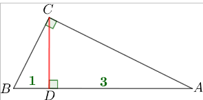

1) $\mathrm{\Delta}ADC\ \sim\ \mathrm{\Delta}CDB$ pēc pazīmes $\mathcal{ll}$, 
jo  $\sphericalangle ADC = \sphericalangle BDC = 90{^\circ}$ un 
$\sphericalangle A = 90^{\circ} - \sphericalangle B = \sphericalangle BCD$. 

2) $\frac{AD}{CD} = \frac{CD}{BD}\ \ \ \  \Rightarrow \ \ \ \ \ \frac{3}{CD} = \frac{CD}{1}\ \ \ \ \  \Rightarrow \ \ \ \ \ CD^{2} = 3$

3) $CD = \sqrt{3}$ cm. 

*Skolotājs var uzdot skolēniem patstāvīgi pierādīt Eiklīda teorēmu, var
dot pierādījuma plānu vai arī iedot pierādījumu, lai skolēni to izpēta
un skaidro.*

**Eiklīda teorēma.** Taisnleņķa trijstūra augstums, kas novilkts no
taisnā leņķa, ir vidējais proporcionālais starp katešu projekcijām uz
hipotenūzas.

Taisnleņķa trijstūra katete ir vidējais proporcionālais starp hipotenūzu
un šīs katetes projekciju uz hipotenūzas.

*Izrunāt apzīmējumus un kopīgi uzrakstīt formulas ar apzīmējumiem.*

*Proporcionālais vidējais jeb ģeometriskais vidējais ir vidējās vērtības
veids, ko iegūst, skaitļus reizinot (atšķirībā no aritmētiskā vidējā,
kurā skaitļus saskaita). Piemēram, ja skaitlis* $t$ *ir skaitļu* $x$
*un* $y$ *vidējais proporcionālais, tad* $t = \sqrt{xy}$*.*

*Var dot skolēniem abus formulu veidus vai arī tikai vienu no tiem.*

+---------------------------------------------------+--------------------------------------+-----------------------------------+
| 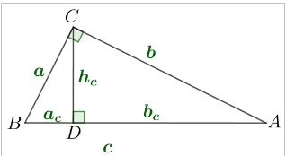{width="2.741930227471566in" | $$h_{c} = \sqrt{a_{c} \cdot b_{c}}$$ | $$h_{c}^{2} = a_{c} \cdot b_{c}$$ |
| height="1.4960629921259843in"}                    |                                      |                                   |
|                                                   | $$a = \sqrt{a_{c} \cdot c}$$         | $$a^{2} = a_{c} \cdot c$$         |
|                                                   |                                      |                                   |
|                                                   | $$b = \sqrt{b_{c} \cdot c}$$         | $$b^{2} = b_{c} \cdot c$$         |
+===================================================+======================================+===================================+

Pierādījums

1\) $\mathrm{\Delta}ADC\ \sim\ \mathrm{\Delta}CDB$ pēc pazīmes
$\mathcal{ll}$, jo
$\sphericalangle ADC = \sphericalangle BDC = 90{^\circ}$ un
$\sphericalangle A = 90^{\circ} - \sphericalangle B = \sphericalangle BCD$

2\)
$\frac{AD}{CD} = \frac{CD}{BD}\ \ \ \ \ \  \Rightarrow \ \ \ \ \ \ \frac{b_{c}}{h_{c}} = \frac{h_{c}}{a_{c}}\ \ \ \ \ \  \Rightarrow \ \ \ \ \ {h_{c}}^{2} = a_{c} \bullet b_{c}\ \ \ \ \ \ \ \  \Rightarrow \ \ \ \ \ \ \ h_{c} = \sqrt{a_{c} \cdot b_{c}}$

3\) $\mathrm{\Delta}ADC\ \sim\ \mathrm{\Delta}ACB$ pēc pazīmes
$\mathcal{ll}$, jo
$\sphericalangle ADC = \sphericalangle ACB = 90{^\circ}$ un
$\sphericalangle A$ -- kopīgs

4\)
$\frac{AD}{AC} = \frac{AC}{AB}\ \ \ \ \ \  \Rightarrow \ \ \ \ \ \ \frac{b_{c}}{b} = \frac{b}{c}\ \ \ \ \ \  \Rightarrow \ \ \ \ \ b^{2} = b_{c} \bullet c\ \ \ \ \ \ \ \  \Rightarrow \ \ \ \ \ \ \ b = \sqrt{b_{c} \cdot c}$

5\) Analogi pierāda, ka $a = \sqrt{a_{c} \cdot c}$ *(var likt skolēniem
pašiem iegūt šo formulu)*

*Skolēniem uzsvērt pierādījuma ideju par līdzīgiem trijstūriem un ka to
var vienmēr lietot.*

**Nav standarta SR**

Proporcionālais vidējais jeb ģeometriskais vidējais ir vidējās vērtības
veids, ko iegūst, skaitļus reizinot (atšķirībā no aritmētiskā vidējā,
kurā skaitļus saskaita).

Par $n$ nenegatīvu skaitļu $a_{1},\ a_{2},\ \ldots,\ a_{n}$ vidējo
ģeometrisko sauc lielumu
$\sqrt[n]{a_{1} \cdot a_{2} \cdot \ldots \cdot a_{n}}$.

Ģeometrisko vidējo var interpretēt arī ģeometriski -- divu skaitļu $a$
un $b$ ģeometriskais vidējais ir tāda kvadrāta malas garums, kura
laukums ir vienāds ar taisnstūra, kura malu garumi ir $a$ un $b$,
laukumu.

**Nevienādība starp vidējo aritmētisko un vidējo ģeometrisko**

Ja $a_{1},\ a_{2},\ \ldots,\ a_{n}$ ir nenegatīvi skaitļi, tad

$$\frac{a_{1} + a_{2} + \ldots + a_{n}}{n} \geq \sqrt[n]{a_{1} \cdot a_{2} \cdot \ldots \cdot a_{n}},$$

tas ir, skaitļu vidējais aritmētiskais ir lielāks vai vienāds ar šo
skaitļu vidējo ģeometrisko, turklāt vienādība ir tad un tikai tad, ja
visi skaitļi ir vienādi.

Lieto Eiklīda teorēmu taisnleņķa trijstūrī vienkāršās situācijās (skat.
[OL_6_dl_3]{.mark}).

Lieto Eiklīda teorēmu taisnleņķa trijstūrī (skat. [OL_6_dl_4]{.mark}).
*Uzdevumu lapu var izdrukāt A5 formātā un skolēns atbilstošā uzdevuma
tekstu izgriež un ielīmē pierakstos, lai vienkopus ir gan uzdevuma
teksts, gan risinājums.*

Ieteicams formatīvās vērtēšanas darbs par Eiklīda teorēmu (skat.
[OL_6_fvd_1]{.mark}). *Vērtēšana notiek atbilstoši skolotāja ieskatiem
un skolas vērtēšanas nolikumam.***\**

**5., 6. stunda. Leņķa jēdziena paplašinājums**

**Sasniedzamie rezultāti**

- Zina pagrieziena leņķa jēdzienu un trigonometrisko funkciju (sinusa un
  kosinusa) definīcijas vienības riņķī.

- Nosaka sinusa un kosinusa vērtību platam leņķim gan lietojot
  trigonometrisko riņķi, gan kalkulatoru.

*Šajās stundās ir dots leņķa paplašinājumu īss ievads, lai varētu
aprēķināt trigonometrisko funkciju (sinusa un kosinusa) vērtības platam
leņķim un lietot tās, risinot ģeometrijas uzdevumus. Tematā lieto tikai
grādus, radiāni tiks apgūti 8. tematā.*

**Pagrieziena leņķis**

Plaknē atliek brīvi izraudzītu punktu $O$ un no tā novelk staru $OA$,
kuru uzskata par fiksētu staru. Aplūko otru staru $OB$, un par
pagrieziena leņķi nosauc leņķi, kuru veido stari $OA$ un $OB$.

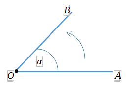

Divi sakrītoši stari veido leņķi, kura lielums ir skaitlis nulle.

Ja viens stars paliek nekustīgs, bet otrs tiek pagriezts, veidojas
pagrieziena leņķis.

Kustīgais stars pēc pilna apgrieziena var turpināt rotācijas kustību,
tāpēc tā lielums var būt jebkurš reāls skaitlis no intervāla
$( - \infty; + \infty$).

Plaknē staru ap savu sākumpunktu var griezt divos dažādos virzienos --
par pozitīvo virzienu (tam atbilst pozitīvs leņķa lielums) pieņem
virzienu pretēji pulksteņa rādītāju kustības virzienam , bet par
negatīvo virzienu (tam atbilst negatīvs leņķa lielums) -- pulksteņa
rādītāju kustības virzienā.

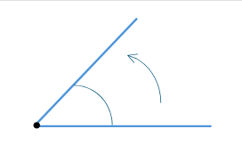

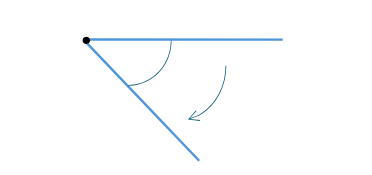

*Šajā tematā uzmanība tiek pievērsta platam leņķim.*

Pagrieziena leņķu attēlošanai izmanto vienības riņķa līniju.

Aplūko riņķa līniju ar centru koordinātu sākumpunktā $O(0;0)$ un rādiusu
$R = 1$. Šādu riņķa līniju sauc par trigonometrisko riņķa līniju (TRL)
jeb vienības riņķa līniju. Lieto arī jēdzienu trigonometriskais vienības
riņķis (TVR).

Par nekustīgo staru pieņemot $x$ ass pozitīvo virzienu, var aplūkot
pagrieziena leņķus uz vienības riņķa līnijas.

Katrs punkts uz vienības riņķa līnijas atbilst kādam pagrieziena leņķim.

Atlikt biežāk lietots leņķus uz trigonometriskās riņķa līnijas. *Pēc
skolotāja ieskaitiem var atlikt visus leņķus no* $0{^\circ}$ *līdz*
$360{^\circ}$ *vai arī tikai I un II kvadranta leņķus. Šo riņķi varēs
papildināt 8. tematā, kad tiks apgūti radiāni.*

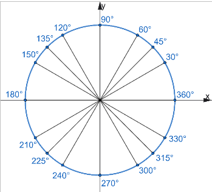{width="3.0347222222222223in"
height="2.7461996937882764in"}

**Sinusa un kosinusa definīcija trigonometriskajā vienības riņķī**

Brīvi atliek leņķi $\alpha$, kas atrodas TVR pirmajā kvadrantā un
atbilst pagrieziena leņķim $\sphericalangle AOB$. Punkts $B$ atrodas uz
riņķa līnijas un tā koordinātas ir attiecīgi $B(x;y)$. Aplūkojot
taisnleņķa trijstūri $BCO$, var uzrakstīt trigonometriskās sakarības:

$$\sin\alpha = \frac{BC}{OB};\ \ \ \ \ \ \ \cos{\alpha =}\frac{OC}{OB}.$$

+-----------------------------------------------------+-----------------------------------+
| Tā kā TVR rādiuss ir 1, tad $OB = 1$. Bet nogriežņu | 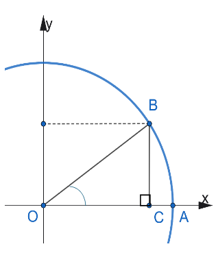             |
| $OC$ un $BC$ garumi sakrīt ar punkta $B$            |                                   |
| attiecīgajām koordinātām ($OC = x$ un $BC = y$),    |                                   |
| tad iegūst:                                         |                                   |
|                                                     |                                   |
| $$\sin\alpha = \frac{y}{1} = y;$$                   |                                   |
|                                                     |                                   |
| $$\cos{\alpha =}\frac{x}{1} = x.$$                  |                                   |
|                                                     |                                   |
| Tātad leņķa $\alpha$ trigonometrisko funkciju       |                                   |
| vērtības TVR ir punkta $B$ attiecīgās koordinātas:  |                                   |
|                                                     |                                   |
| $$B(x;y) = B\left( \cos\alpha;\sin\alpha \right),$$ |                                   |
|                                                     |                                   |
| jo $OC = \cos\alpha$ un $BC = \sin\alpha$.          |                                   |
+=====================================================+===================================+

Ja leņķis $\alpha$ ir lielāks nekā $90{^\circ}$, tad arī attiecīgā
punkta koordinātas uz vienības riņķa līnijas ir $\cos\alpha$ un
$\sin\alpha$ vērtības.

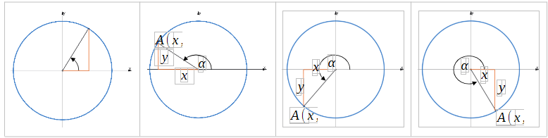

Sinusa un kosinusa vērtību noteikšanai dažiem leņķiem var lietot
trigonometrisko vienības riņķi un simetriju pret koordinātu asīm.

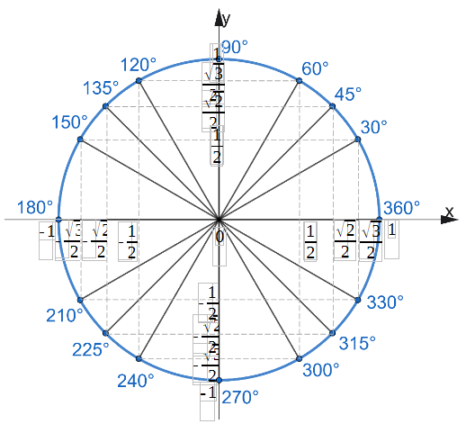

*Skolēni jau pamatskolā apguvuši trigonometrisko funkciju vērtību
aptuvenu aprēķināšanu šauram leņķim, lietojot kalkulatoru vai IT.
Uzsvērt, ka aptuveno vērtību var aprēķināt arī citiem leņķiem.*

Nosaka vai salīdzina sinusa un kosinusa vērtības dažādiem leņķiem (skat.
[OL_6_dl_3]{.mark}).

**7. stunda. Trijstūra laukuma aprēķināšana**

**Sasniedzamie rezultāti**

- Aprēķina trijstūra laukumu, ja dotas divas malas un leņķis starp tām.

- Pamato trijstūra laukuma aprēķināšanas formulu, ja dotas divas malas
  un leņķis starp tām.

*Stundu var sākt ar uzdevumu, kura risinājums ietver trijstūra laukuma
aprēķināšanas formulas\*
$S_{\mathrm{\Delta}} = \frac{1}{2}\ ab\sin\gamma$ *pierādījuma ideju.
Pamatskolas standarts šo formulu neietver.*

Trijstūra malu garumi ir 4 cm un 6 cm, bet leņķis starp šīm malām ir
$60{^\circ}$. Aprēķini trijstūra laukumu.

+-----------------------------------------------------+-------------------------------------------------------------------------------------------------------------------------------------------------------------------------------+
| 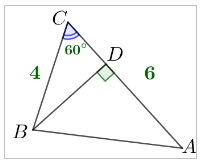{width="1.6978696412948382in" | 1\) Novelk $BD\bot AC$                                                                                                                                                        |
| height="1.354313210848644in"}                       |                                                                                                                                                                               |
|                                                     | 2\) $\mathrm{\Delta}BDC$                                                                                                                                                      |
|                                                     |                                                                                                                                                                               |
|                                                     | $$\sin{60{^\circ}} = \frac{BD}{BC}\ \ \ \ \  \Rightarrow \ \ \ \ \frac{\sqrt{3}}{2} = \frac{BD}{4}\ \ \ \  \Rightarrow \ \ \ \ \ BD = \frac{4\sqrt{3}}{2} = 2\sqrt{3}\ (cm)$$ |
|                                                     |                                                                                                                                                                               |
|                                                     | 3\) $S_{ABC} = \frac{1}{2}AC \cdot BD = \frac{1}{2} \cdot 6 \cdot 2\sqrt{3} = 6\sqrt{3}\ (cm^{2})$                                                                            |
+=====================================================+===============================================================================================================================================================================+

*Var sākt ar teorēmas formulējumu un pēc tam pierādīt formulu vai arī
apskatīt dažādos gadījumus (šaurleņķu, platleņķa, taisnleņķa trijstūris)
vispārīgā gadījumā un pēc tam formulēt teorēmu. Pēc tam jauno formulu
var ierakstīt formulu lapā, ja tādu veido.*

**Teorēma.** Trijstūra laukums ir vienāds ar pusi no divu malu un to
ietvertā leņķa sinusa reizinājuma:

$$S_{\mathrm{\Delta}} = \frac{1}{2}ab\sin\gamma.$$

Pierādījums

+-----------------------------------------------------+------------------------------------------------------------------------------------------+
| 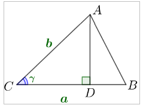{width="1.9824168853893263in" | $\mathrm{\Delta}ABC$ -- šaurleņķu trijstūris                                             |
| height="1.4960629921259843in"}                      |                                                                                          |
|                                                     | 1\) Novelk $AD\bot BC$                                                                   |
|                                                     |                                                                                          |
|                                                     | 2\) $\mathrm{\Delta}ADC$                                                                 |
|                                                     |                                                                                          |
|                                                     | $$\sin\gamma = \frac{AD}{AC}\ \ \  \Rightarrow \ \ \ \ AD = AC\sin\gamma = b\sin\gamma$$ |
|                                                     |                                                                                          |
|                                                     | 3\) $S_{ABC} = \frac{1}{2}BC \cdot AD = \frac{1}{2}ab\sin\gamma$                         |
+=====================================================+:=========================================================================================+
| 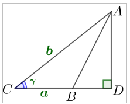{width="1.8558038057742783in" | $\mathrm{\Delta}ABC$ -- platleņķa trijstūris                                             |
| height="1.4960629921259843in"}                      |                                                                                          |
|                                                     | 1\) Novelk $AD\bot BC$                                                                   |
|                                                     |                                                                                          |
|                                                     | 2\) $\mathrm{\Delta}ADC$                                                                 |
|                                                     |                                                                                          |
|                                                     | $$\sin\gamma = \frac{AD}{AC}\ \ \  \Rightarrow \ \ \ \ AD = AC\sin\gamma = b\sin\gamma$$ |
|                                                     |                                                                                          |
|                                                     | 3\) $S_{ABC} = \frac{1}{2}BC \cdot AD = \frac{1}{2}ab\sin\gamma$                         |
+-----------------------------------------------------+------------------------------------------------------------------------------------------+
| 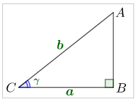{width="1.9607250656167978in" | $\mathrm{\Delta}ABC$ -- taisnleņķa trijstūris                                            |
| height="1.4173228346456692in"}                      |                                                                                          |
|                                                     | 1\) $\mathrm{\Delta}ABC$                                                                 |
|                                                     |                                                                                          |
|                                                     | $$\sin\gamma = \frac{AB}{AC}\ \ \  \Rightarrow \ \ \ \ AB = AC\sin\gamma = b\sin\gamma$$ |
|                                                     |                                                                                          |
|                                                     | 2\) $S_{ABC} = \frac{1}{2}BC \cdot AB = \frac{1}{2}ab\sin\gamma$                         |
+-----------------------------------------------------+------------------------------------------------------------------------------------------+

Aprēķina trijstūra laukumu vienkāršās situācijās (skat.
[OL_6_dl_6]{.mark}).

Lieto Eiklīda teorēmu taisnleņķa trijstūrī (skat. [OL_6_dl_7]{.mark}).
*Uzdevumu lapu var izdrukāt A5 formātā un skolēns atbilstošā uzdevuma
tekstu izgriež un ielīmē pierakstos, lai vienkopus ir gan uzdevuma
teksts, gan risinājums.*

**Nav standarta SR.** Izliekta četrstūra diagonāļu garumi ir $d_{1}$ un
$d_{2}$, bet šaurais leņķis starp diagonālēm ir $\beta$. Pierādi, ka
četrstūra laukums ir $\frac{1}{2}d_{1}d_{2}\sin\beta$.

**Pierādījums.** Apskatām četrstūri $ABCD$.

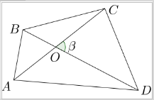

Izmantojot vienādību $\sin(180{^\circ} - \alpha) = \sin\alpha$ un
trijstūra laukuma formulu
$S_{\mathrm{\Delta}} = \frac{1}{2}ab\sin\gamma$, iegūstam

$$S_{ABCD} = S_{AOB} + S_{BOC} + S_{COD} + S_{DOA} =$$

$$= \frac{1}{2}\left( AO \bullet BO \bullet \sin\beta + BO \bullet CO \bullet \sin(180{^\circ} - \beta) + CO \bullet DO \bullet \sin\beta + DO \bullet AO \bullet \sin(180{^\circ} - \beta) \right) =$$

$$= \frac{1}{2}\sin\beta(AO \bullet BO + BO \bullet CO + CO \bullet DO + DO \bullet AO) =$$

$$= \frac{1}{2}\sin\beta\left( BO \bullet (AO + CO) + DO \bullet (CO + AO \right)) =$$

$$= \frac{1}{2}\sin\beta\left( AO + CO) \bullet (BO + DO \right) = \frac{1}{2}d_{1}d_{2}\sin\beta.$$

**\**

**8.--10. stunda. Sinusu teorēma**

**Sasniedzamie rezultāti**

- Pierāda sinusu teorēmu.

- Lieto sinusu teorēmu, lai aprēķinātu nezināmos lielumus trijstūrī
  situācijās ar matemātisku vai praktisku kontekstu.

- Lieto kalkulatoru, lai noteiktu leņķa lielumu, ja dota sinusu vērtība.

*Individuāli vai pāros var risināt uzdevumu, kura risinājums ietver
spriedumus, kas ļaus pamatot sinusu teorēmu.*

Trijstūra $ABC$ malas $AB$ garums ir 8 cm, leņķis $A$ ir 45°, bet leņķis
$C$ ir 30° liels. Aprēķini malas $BC$ garumu.

+-----------------------------------------------------+----------------------------------------------------------------------------------------------------------------------------------------+
| 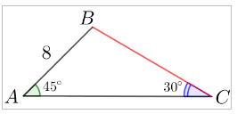{width="2.2493985126859144in" | 1\)                                                                                                                                    |
| height="1.0249070428696414in"}                      | $S_{ABC} = \frac{1}{2}AB \cdot AC \cdot \sin{45{^\circ}} = \frac{1}{2} \cdot 8 \cdot AC \cdot \frac{\sqrt{2}}{2} = 2\sqrt{2} \cdot AC$ |
|                                                     |                                                                                                                                        |
|                                                     | 2\) $S_{ABC} = \frac{1}{2}AC \cdot BC \cdot \sin{30{^\circ}} = \frac{1}{2}AC \cdot BC \cdot \frac{1}{2} = \frac{1}{4}AC \cdot BC$      |
|                                                     |                                                                                                                                        |
|                                                     | 3\) Tā kā rēķināts viens un tas pats lielums, tad                                                                                      |
|                                                     |                                                                                                                                        |
|                                                     | $$2\sqrt{2} \cdot AC = \frac{1}{4}AC \cdot BC$$                                                                                        |
|                                                     |                                                                                                                                        |
|                                                     | $BC = 8\sqrt{2}$ cm                                                                                                                    |
+=====================================================+========================================================================================================================================+

*Skolotājs pieņem lēmumu par skolēniem nepieciešamo atbalstu un pieeju
sinusu teorēmas pierādīšanā, piemēram, ja skolēni kopumā nav gatavi
patstāvīgi veidot pierādījumu, tad var dot uzdevumu izpētīt, izlasīt un
komentēt sinusu teorēmas pierādījumu, demonstrējot izpratni par tajā
iekļautajiem jēdzieniem, pieņemto simbolu, apzīmējumu un matemātikai
raksturīgo izteikumu formu lietojumu. Cita pieeja -- sakārtot dotā
sinusu teorēmas pierādījuma etapus loģiskā secībā, ja nepieciešams,
papildinot pierādījumu ar saviem spriedumiem.*

**Sinusu teorēma.** Trijstūra malas ir proporcionālas pretleņķu
sinusiem.

$$\frac{a}{\sin\alpha} = \frac{b}{\sin\beta} = \frac{c}{\sin\gamma}$$

Pierādījums

+-----------------------------------------------------+-------------------------------------------------------------------------------+
| 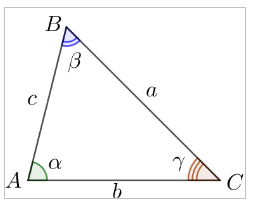{width="2.1131496062992126in" | 1\)                                                                           |
| height="1.671758530183727in"}                       | $S_{ABC} = \frac{1}{2}AB \cdot AC \cdot \sin\alpha = \frac{1}{2}bc\sin\alpha$ |
|                                                     |                                                                               |
|                                                     | 2\)                                                                           |
|                                                     | $S_{ABC} = \frac{1}{2}AC \cdot BC \cdot \sin\gamma = \frac{1}{2}ab\sin\gamma$ |
|                                                     |                                                                               |
|                                                     | 3\)                                                                           |
|                                                     | $S_{ABC} = \frac{1}{2}AB \cdot BC \cdot \sin\beta = \frac{1}{2}ac\sin\beta$   |
|                                                     |                                                                               |
|                                                     | 4\) Ievērojam, ka neviena sinusa vērtība nav 0                                |
|                                                     |                                                                               |
|                                                     | 5\) No 1) un 2) iegūstam:                                                     |
|                                                     |                                                                               |
|                                                     | $$\frac{1}{2}bc\sin\alpha = \frac{1}{2}ab\sin\gamma$$                         |
|                                                     |                                                                               |
|                                                     | $$c\sin\alpha = a\sin\gamma$$                                                 |
|                                                     |                                                                               |
|                                                     | $$\frac{c}{\sin\gamma} = \frac{a}{\sin\alpha}$$                               |
|                                                     |                                                                               |
|                                                     | 6\) No 2) un 3) iegūstam:                                                     |
|                                                     |                                                                               |
|                                                     | $$\frac{1}{2}ab\sin\gamma = \frac{1}{2}ac\sin\beta$$                          |
|                                                     |                                                                               |
|                                                     | $$b\sin\gamma = c\sin\beta$$                                                  |
|                                                     |                                                                               |
|                                                     | $$\frac{b}{\sin\beta} = \frac{c}{\sin\gamma}$$                                |
|                                                     |                                                                               |
|                                                     | 7\) Tātad                                                                     |
|                                                     |                                                                               |
|                                                     | $$\frac{a}{\sin\alpha} = \frac{b}{\sin\beta} = \frac{c}{\sin\gamma}$$         |
+=====================================================+===============================================================================+

*Tiek pieņemts, ka trijstūrī* $ABC$ *leņķu* $A$*,* $B$*,* $C$ *lielumus
attiecīgi apzīmē ar* $\alpha$*,* $\beta$*,* $\gamma$ *un malas* $AB$*,*
$BC$*,* $AC$ *attiecīgi apzīmē* $c$*,* $a$*,* $b$*.*

Kopīgi var formulēt situācijas, kad varētu lietot sinusu teorēmu:

- ja dotas divas trijstūra malas un vienas šīs malas pretējais leņķis;

- ja dota mala un divi leņķi.

Sinusu teorēmu var lietot arī taisnleņķa trijstūrī, izmantojot, ka
$\sin{90{^\circ}} = 1$.

*Aprēķināt sinusa vērtību dotam leņķim jau apguva pamatskolā. Kā
aprēķināt leņķi, ja dota leņķa sinusa vērtība? Piemēram,*
$\sin M = \frac{1}{2}$*,* $\sin K = 0,9$*. Saistīt leņķa noteikšanu ar
trigonometrisko riņķi un kalkulatorā funkciju arcsin.*

*Pievērst uzmanību, vai kalkulatorā ir grādi vai radiāni.*

*Kā pārbaudīt, vai atbildi dod grādos? Ievada* $\arcsin{0,5}$ *vai*
$\sin^{- 1}{0,5}$ *, tad atbildei jābūt 30.*

Vingrinās lietot sinusu teorēmu uzdevumos ar matemātisku kontekstu
(skat. [OL_6_dl_8]{.mark} un [OL_6_dl_9]{.mark}).

Lieto sinusu teorēmu uzdevumi ar citu saturu (skat. [OL_6_dl_10]{.mark})
*1. uzdevums (OL eksāmens, 2024), 2. uzdevums (OL eksāmens, 2022), 4.
uzdevums (OL eksāmena paraugs, 2022).*

Ieteicams formatīvās vērtēšanas darbs par sinusu teorēmu (skat.
[OL_6_fvd_2]{.mark}). *Vērtēšana notiek atbilstoši skolotāja ieskatiem
un skolas vērtēšanas nolikumam.*

Var izmantot arī Skola2030 materiālu par triangulācijas metodi.

Informācijas avoti: *Ilustrētā pasaules vēsture* maijs 2018(124),
60.--69. lpp. (mapē papildmateriāli)
[https://thonyc.wordpress.com/2012/05/25/mapping-the-history-of-triangulation/](https://thonyc.wordpress.com/2012/05/25/mapping-the-history-of-triangulation/%20)
(skatīts 2019. gada 14. augustā)

**\**

**11.--14. stunda. Kosinusa teorēma**

**Sasniedzamie rezultāti**

- Skaidro kosinusa teorēmas pierādījuma soļus.

- Lieto kosinusa teorēmu, lai aprēķinātu trijstūra nezināmos lielumus
  matemātiskos, praktiskos un citu jomu kontekstos.

- Pierāda, ka paralelograma diagonāļu kvadrātu summa ir vienāda ar tā
  malu kvadrātu summu.

- Lieto sakarību starp paralelograma malām un diagonālēm.

*Stundu var sākt ar uzdevumu, kura risinājums ietver kosinusu teorēmas
pierādījuma ideju, vai arī dot ar kosinusa teorēmas formulējumu un
pierādījuma plānu, kas skolēniem jārealizē, vai arī dot teorēmas
pierādījumu, lai skolēni skaidro pierādījuma soļus.*

**Kosinusa teorēma.** Trijstūrī malas kvadrāts ir vienāds ar pārējo divu
malu kvadrātu summu, no kuras atņemts divkāršots šo malu reizinājums ar
kosinusu no leņķa starp tām.

+-----------------------------------------------------+-------------------------------------------+
| 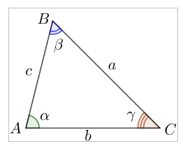{width="2.1131496062992126in" | $$a^{2} = b^{2} + c^{2} - 2bc\cos\alpha$$ |
| height="1.671758530183727in"}                       |                                           |
|                                                     | $$b^{2} = a^{2} + c^{2} - 2ac\cos\beta$$  |
|                                                     |                                           |
|                                                     | $$c^{2} = a^{2} + b^{2} - 2ab\cos\gamma$$ |
+=====================================================+===========================================+

*Var dot skolēniem literatūrā (piemēram, B. Āboltiņa, D. Kriķis, K.
Šteiners "Matemātika 10. klasei", Zvaigzne ABC, 2021, 120. lpp.) atrast
kosinusa teorēmas pierādījumu un skaidrot tajā veiktos spriedumus un
darbības.*

*\*

*Kosinusa teorēmu var pierādīt, lietojot vektoru skalāro reizinājumu.*

**Nav standarta SR**

Apskata vektorus $\overrightarrow{CB}$ un $\overrightarrow{CA}$.

{width="1.515748031496063in"
height="1.4173228346456692in"}

Izsaka
$\overrightarrow{AB} = \overrightarrow{AC} + \overrightarrow{CB} = \overrightarrow{CB} - \overrightarrow{CA}$.

Izmanto vektora skalāro kvadrātu, jo tas ir vienāds ar vektoram
atbilstošā nogriežņa garumu:

$${\overrightarrow{AB}}^{2} = \left| \overrightarrow{AB} \right|^{2} = AB^{2}.$$

Aprēķina skalāro kvadrātu citā veidā, izmantojot 2) punktā iegūto
sakarību:

$${\overrightarrow{AB}}^{2} = \left( \overrightarrow{CB} - \overrightarrow{CA} \right) \bullet \left( \overrightarrow{CB} - \overrightarrow{CA} \right) = {\overrightarrow{CB}}^{2} - \overrightarrow{CB} \bullet \overrightarrow{CA} - \overrightarrow{CA} \bullet \overrightarrow{CB} + {\overrightarrow{CA}}^{2} =$$

$$= CB^{2} + CA^{2} - 2 \bullet \overrightarrow{CB} \bullet \overrightarrow{CA} = CB^{2} + CA^{2} - 2 \bullet \left| \overrightarrow{CB} \right| \bullet \left| \overrightarrow{CA} \right| \bullet \cos{\sphericalangle ACB} =$$

$$= CB^{2} + CA^{2} - 2 \bullet CB \bullet CA \bullet \cos{\sphericalangle ACB}.$$

Tātad
${AB}^{2} = BC^{2} + AC^{2} - 2 \bullet BC \bullet AC \bullet \cos{\sphericalangle ACB}.$

Kosinusa teorēma apraksta sakarības starp trijstūra malu garumiem un
leņķu lielumiem; tā ir Pitagora teorēmas vispārinājums (jo
$\cos{90{^\circ}} = 0$).

Kopīgi vai pāros var formulēt situācijas, kad varētu lietot kosinusu
teorēmu:

- ja dotas divas trijstūra malas un leņķis starp šīm malām, tad var
  aprēķināt trešo malu;

- ja dotas visas malas, tad var aprēķināt trijstūra leņķus (var
  noskaidrot trijstūra veidu pēc leņķa).

Vingrinās lietot kosinusu teorēmu uzdevumos ar matemātisku saturu (skat.
[OL_6_dl_11]{.mark}).

Lieto kosinusu teorēmu praktiskos un citu jomu kontekstos (skat.
[OL_6_dl_12]{.mark}). *3. uzd. (OL eksāmens, 2023) Ja skolēni nav
apguvuši tēmu par vektoriem, tad šo uzdevumu var atstāt pie vektoru
tēmas vai dot norādi, ka rezultējošais spēks būs vienāds ar
paralelograma diagonāli, kas iziet no tā paša punkta. 4. uzd. (AL
programmas paraugs, Skola2030).*

Ieteicams formatīvās vērtēšanas darbs par kosinusu teorēmu (skat.
[AL_6_fvd_3]{.mark}). *Vērtēšana notiek atbilstoši skolotāja ieskatiem
un skolas vērtēšanas nolikumam.*

*Jau iepriekš bija uzdevumu, kurā bija jāaprēķina paralelograma
diagonāles garums. Var jautāt skolēniem, kas īpašs diagonāļu garumu
izteiksmēm? Sagaidāmā atbilde -- atšķiras tikai zīme starp
saskaitāmajiem.*

*Risinājuma ideju izmanto, lai pamatotu sakarību starp paralelograma
diagonālēm un malām.*

**Paralelograma diagonāļu īpašība.** Paralelograma diagonāļu kvadrātu
summa ir vienāda ar tā malu kvadrātu summu.

$$d_{1}^{2} + d_{2}^{2} = 2\left( a^{2} + b^{2} \right)$$

Pierādījums

+-----------------------------------------------------+-----------------------------------------------------------------------------------------------+
| 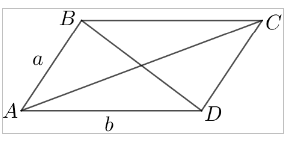{width="2.4502734033245845in" | 1\) $\mathrm{\Delta}ABD$                                                                      |
| height="1.1023622047244095in"}                      |                                                                                               |
|                                                     | $$BD^{2} = AB^{2} + AD^{2} - 2AB \cdot AD \cdot \cos{\sphericalangle A}$$                     |
|                                                     |                                                                                               |
|                                                     | $$BD^{2} = a^{2} + b^{2} - 2ab\cos{\sphericalangle A}$$                                       |
|                                                     |                                                                                               |
|                                                     | 2\) $\mathrm{\Delta}ABC$                                                                      |
|                                                     |                                                                                               |
|                                                     | $${AC}^{2} = AB^{2} + {BC}^{2} - 2AB \cdot BC \cdot \cos{(180{^\circ} - \sphericalangle A)}$$ |
|                                                     |                                                                                               |
|                                                     | $${AC}^{2} = a^{2} + b^{2} + 2ab\cos{\sphericalangle A}$$                                     |
|                                                     |                                                                                               |
|                                                     | Izmantots fakts, ka $\cos{(180{^\circ} - \alpha)} = - \cos\alpha$                             |
+=====================================================+===============================================================================================+

3\) Saskaita abas iegūtās vienādības:

$$BD^{2} + AC^{2} = a^{2} + b^{2} - 2ab\cos{\sphericalangle A} + a^{2} + b^{2} + 2ab\cos{\sphericalangle A};$$

$$BD^{2} + AC^{2} = 2a^{2} + 2b^{2}.$$

Lieto paralelograma diagonāļu īpašību, lai aprēķinātu prasītos lielumus
(skat. [OL_6_dl_13]{.mark})

**Nav standarta SR.** Mediānas garuma aprēķināšana. Ja $a$, $b$ un $c$
ir trijstūra malas, tad pret malu $b$ vilktās mediānas garums ir
$m_{b} = \frac{1}{2}\sqrt{2a^{2} + 2c^{2} - b^{2}}$.

Formulas pierādījums ir kā 7. uzdevuma risinājums.

**\**

**15., 16. stunda. Hērona formula**

**Sasniedzamais rezultāts**

- Lieto Hērona formulu trijstūra laukuma un trijstūra elementu
  aprēķināšanai.

*Pēc skolotāja ieskatiem var sākt ar uzdevumu, kura pamatā ir ideja par
Hērona formulas pierādījumu, vai arī likt skolēniem atrast informāciju
par trijstūra laukuma aprēķināšanu, ja doti visu malu garumi.*

*Vai var izrēķināt trijstūra augstumu?*

Aprēķini trijstūra laukumu, ja trijstūra malu garumi ir 13 cm, 14 cm un
15 cm!

*Vai var aprēķināt trijstūra augstumu?*

+----------------------------------------------------+---------------------------------------------------+
| 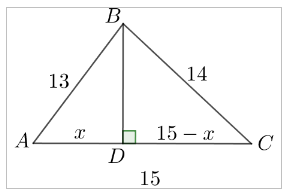{width="2.401187664041995in" | 1\) Novelk $BD\bot AC$                            |
| height="1.5748031496062993in"}                     |                                                   |
|                                                    | 2\) Apzīmē $AD = x$ un $CD = 15 - x$              |
|                                                    |                                                   |
|                                                    | 3\) $\mathrm{\Delta}ADB$                          |
|                                                    |                                                   |
|                                                    | $$BD^{2} = AB^{2} - AD^{2} = 169 - x^{2}$$        |
|                                                    |                                                   |
|                                                    | 4\) $\mathrm{\Delta}BDC$                          |
|                                                    |                                                   |
|                                                    | $$BD^{2} = BC^{2} - CD^{2} = 196 - (15 - x)^{2}$$ |
+====================================================+===================================================+

5\) Tā kā kreisās puses ir vienādas, tad iegūst vienādojumu:

$$169 - x^{2} = 196 - (15 - x)^{2}$$

$$169 - x^{2} = 196 - 225 + 30x - x^{2}$$

$$30x = 198\ \ \ \ \  \Rightarrow \ \ \ \ x = 6,6$$

6\) No 3) iegūst, ka
$BD = \sqrt{169 - {6,6}^{2}} = \sqrt{125,44} = 11,2$ (cm)

7\)
$S_{ABC} = \frac{1}{2}AC \cdot BD = \frac{1}{2} \cdot 15 \cdot 11,2 = 84$
(cm^2^)

*Apspriest, ka šāda risināšana ir laikietilpīga. Var likt atrast formulu
uzziņu literatūrā un, ja kāds skolēns vēlas, tad var pierādīt formulu
līdzīgi kā uzdevuma risinājumā (bet pierādījumā ir daudz algebrisku
pārveidojumu).*

**Hērona formula.** Ja $a$, $b$ un $c$ ir trijstūra malas, tad laukums
ir $S_{\mathrm{\Delta}} = \sqrt{p(p - a)(p - b)(p - c)}$, kur
$p = \frac{a + b + c}{2}$ ir pusperimetrs.

Lieto Hērona formulu trijstūra laukuma un nezināmo lielumu aprēķināšanai
(skat. darba lapu [OL_6_dl_14]{.mark}). *4. uzdevumu var dot kā
uzdevumu, kuram ir divi algebriski risināšanas veidi (2. un 3. veids),
bet viens ir veids, kurā jāizdomā, kā trijstūri precīzi uzzīmēt uz
rūtiņu lapas (1. veids).*

**\**

**17.--20. stunda. Trijstūra laukuma aprēķināšana**

**Sasniedzamais rezultāts**

- Aprēķina ievilkta un apvilkta trijstūra elementus vai riņķa līnijas
  rādiusu, lietojot laukuma aprēķināšanas formulas
  $S_{\mathrm{\Delta}} = pr$ un $S_{\mathrm{\Delta}} = \frac{abc}{4R}$.

*Atkārto jau zināmās trijstūra laukuma aprēķināšanas formulas.*

**Jautājumi**

*Vai katrā trijstūrī var ievilkt riņķa līniju?*

> *Jā.*

*Kur atrodas ievilktās riņķa līnijas centrs?*

> *Bisektrišu krustpunktā.*

*Kā to atcerēties?*

> *Veidojas vienādi trijstūri* $ADO$ *un* $AEO$ *pēc pazīmes* $mmm$*.*

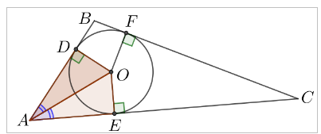

*Vai katram trijstūrim var apvilkt riņķa līniju?*

> *Jā.*

*Kur atrodas apvilktās riņķa līnijas centrs?*

> *Vidusperpendikulu krustpunktā.*

*Kā to atcerēties?*

> *Trijstūris* $AOC$ *ir vienādsānu, jo* $AO = OC = R$*. Punkts* $O$
> *atrodas vienādā attālumā no nogriežņa* $AC$ *galapunktiem, tātad tas
> atrodas uz nogriežņa* $AC$ *vidusperpendikula.*

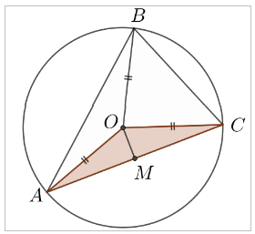

*Kā aprēķināt ievilktās un apvilktās riņķa līnijas rādiusu?*

> *Ja trijstūris ir regulārs, tad*
> $r = \frac{1}{3}h = \frac{1}{3} \cdot \frac{a\sqrt{3}}{2} = \frac{a\sqrt{3}}{6}$
> *un*
> $R = \frac{2}{3}h = \frac{2}{3} \cdot \frac{a\sqrt{3}}{2} = \frac{a\sqrt{3}}{3}$*.
> Šajos spriedumos izmantota mediānas īpašība, ka mediānas krustpunktā
> dalās attiecībā* $2\ :1$*, skaitot no virsotnes.*
>
> *Ja trijstūris ir taisnleņķa, tad* $R = \frac{1}{2}c$*.*

*Vai ir kāda formula patvaļīgam trijstūrim?*

> *Var likt, lai skolēni paši meklē informāciju. Pārrunāt atslēgas
> vārdus, kas jāievada meklētājā.*

Formulas

+------------------------------------------+-----------------------------+
| $$S_{\mathrm{\Delta}} = pr$$             | $p$ -- trijstūra            |
|                                          | pusperimetrs                |
|                                          |                             |
|                                          | $r$ -- ievilktās riņķa      |
|                                          | līnijas rādiuss             |
+==========================================+=============================+
| $$S_{\mathrm{\Delta}} = \frac{abc}{4R}$$ | $a,\ b,\ c$ -- trijstūra    |
|                                          | malas                       |
|                                          |                             |
|                                          | $R$ -- apvilktās riņķa      |
|                                          | līnijas rādiuss             |
+------------------------------------------+-----------------------------+

*Formulas* $S_{\mathrm{\Delta}} = pr$ *pierādījumā jāizmanto tikai
trijstūra laukuma formula* $S_{\mathrm{\Delta}} = \frac{1}{2}ah_{a}$*,
skolēni kopā ar skolotāju var kopīgi pierādīt formulu.*

Pierādījums

1\) Apzīmē $OD = OE = OF = r$.

2\) Trijstūra $ABC$ laukumu aprēķināsim kā trīs trijstūru laukumu summu.

3\) $S_{ABC} = S_{AOB} + S_{BOC} + S_{AOC}$

4\)
$S_{ABC} = \frac{1}{2}OD \cdot AB + \frac{1}{2}OF \cdot BC + \frac{1}{2}OE \cdot AC = \frac{1}{2}r(AB + BC + AC) = \frac{1}{2}r \cdot P_{ABC}$

5\) Ja apzīmē $\frac{1}{2}P_{ABC} = p$, tad $S_{ABC} = pr$.

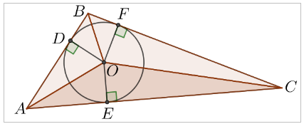

*Formulas* $S_{\mathrm{\Delta}} = \frac{abc}{4R}$ *pierādījumā jālieto
sinusu teorēmas paplašinājums* $\frac{a}{\sin\alpha} = 2R$*. Formulu var
dot patstāvīgai pierādīšanai pēc skolotāja ieskatiem un skolēnu
iespējām.*

Lieto trijstūra laukuma aprēķināšanas formulas, lai aprēķinātu prasītos
lielumus (skat. [OL_6_dl_15]{.mark}).

**\**

**21. stunda. Kopsavilkums**

**Sasniedzamais rezultāts**

- Sistematizē zināšanas un nostiprina prasmes planimetrijā.

Risina dažādus uzdevumus un sistematizē zināšanas par planimetriju
(skat. [OL_6_kopsavilkums]{.mark}).

**22., 23. stunda. Noslēguma pārbaudes darbs un tā analīze**

**Sasniedzamie rezultāti**

- Pārbauda zināšanas un prasmes planimetrijā.

- Analizē noslēguma pārbaudes darba kļūdas.

Temata noslēguma pārbaudes darbs (skat. [OL_6_npd]{.mark}, attēls
veidots ar mākslīgo intelektu).

Darbam piedāvāti divi varianti, pievienoti atrisinājumi un vērtēšanas
kritēriji. Plānotais izpildes laiks ir 40 minūtes.

Ņemot vērā skolēnu spējas, skolotājs pēc saviem ieskatiem var mainīt gan
uzdevumu skaitu, gan grūtības pakāpi, gan risināšanas laiku.

Pāreju no punktiem uz ballēm veic skolotājs, ievērojot skolas vērtēšanas
nolikumu.

Ieteicama temata noslēguma pārbaudes darba kļūdu analīze. Skolotājs to
organizē pēc saviem ieskatiem.

**\**

**Temata apguvei izmantojamā literatūra un avoti**

1.  B. Āboltiņa, D. Kriķis, K. Šteiners "Matemātika 10. klasei",
    Zvaigzne ABC, 2021,\
    109.--132. lpp.

2.  E. Slokenberga, I. France, I. France "Matemātika 10. klasei",
    Lielvārds, 2009, 104.--123. lpp.

3.  B. Āboltiņa, P. Čepuls "Ģeometrija vidusskolai", Zvaigzne ABC, 2000,
    3.--15., 21.--23.,\
    31.--33. lpp.

4.  D. Kriķis, P. Zariņš, V. Ziobrovskis "Diferencēti uzdevumi
    matemātikā 2. daļa", Zvaigzne ABC, 1995, 5.--30. lpp.

5.  Uzdevumi.lv Matemātika I 7. temats "Sinusa un kosinusa funkcijas"
    <https://www.uzdevumi.lv/p/matematika-pec-skola2030-paraugprogrammas/matematika-i/sinusa-un-kosinusa-funkcijas-79267/sinusu-un-kosinusu-teorema-79282>

6.  uzdevumi.lv Matemātika II 10. temats "Planimetrija II"
    <https://www.uzdevumi.lv/p/matematika-pec-skola2030-paraugprogrammas/matematika-ii/planimetrija-ii-79330>
