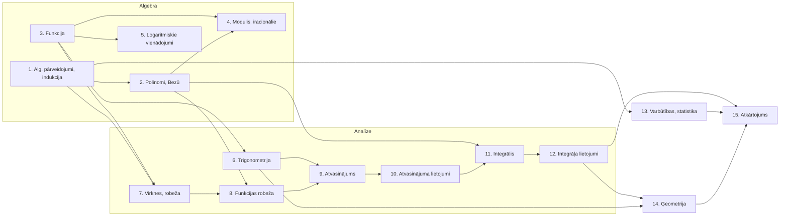

# Atsauksme par mācību priekšmeta programmas paraugu "Matemātika II"

**Vērtējamais dokuments:** `MATEMATIKA_2_programmas_paraugs.md` (padziļinātais kurss, augstākais apguves līmenis, 280 st.)
**Atsauces dokumenti:** `vidusskolas_standarts.md` (MK not. Nr. 416, kolonna "Augstākais apguves līmenis", kodi M.A.x.y.z), `MATEMATIKA_1_programmas_paraugs_19_maijs.md` (optimālais līmenis, 420 st.)
**Sagatavots:** 2026. gada 22. jūlijā

**Prioritāšu apzīmējumi:** 🔴 kritisks · 🟠 svarīgs · 🟡 ieteikts · ⚪ redakcionāls

---

## 1. Kopsavilkums

Programmas parauga **stiprā puse ir matemātiskās analīzes mugurkauls** (7.–12. temats: virknes → funkcijas robeža → atvasinājums → lietojumi → integrālis → lietojumi) — priekšzināšanu ķēde ir loģiska, motivējama un atbilst starptautiskajai praksei. Labi izdevusies arī agrīnā indukcijas un polinomu algebras ievietošana (1.–2. temats), kuras "atmaksājas" vēlāk (rekurentās virknes, slīpās asimptotas, daļu sadalīšana integrēšanai).

Galvenās problēmas, kas jārisina pirms publicēšanas:

1. 🔴 **Standarta pārklājums nav pilnīgs.** No 79 augstākā līmeņa (M.A.) sasniedzamajiem rezultātiem programmā **nav citēti 11**, un vēl **2 ir citēti, bet tiem neatbilst neviena satura rinda**. Lielākie robi: **kompleksie skaitļi** (M.A.3.1.2., 3.1.3., 3.2.2., 4.5.11.) un **stereometrijas konstrukciju bloks** (šķēlumi, paralēlā projicēšana, ķermeņu kombinācijas — M.A.6.3.2., 6.3.3., 6.3.7.), kā arī vektoru bāzes/projekcijas un ģeometrisko vietu saturs (M.A.6.2.1., 6.2.4.).
2. 🔴 **Ievada solījumi neatbilst tematu saturam.** Kursa satura aprakstā (ievadā) solīti kompleksie skaitļi, daudzskaldņu šķēlumi, attāluma formula no punkta līdz taisnei un punktu ģeometriskās vietas — tematos neviena no šīm vienībām neparādās.
3. 🟠 **Stundu skaits tematu plānojuma tabulā nesakrīt ar tematu virsrakstiem** 6 tematos; virsrakstu summa ir 278, nevis 280 stundas.
4. 🟠 **13. un 14. temats ir pārslogoti** (attiecīgi ~15 un ~10 atšķirīgas SR grupas 24/20 stundās), turklāt tieši 14. tematā būtu jāievieto vēl trūkstošie stereometrijas SR. Ieteikums: pārdalīt stundas no Atkārtojuma un sadalīt 14. tematu divos.
5. 🟠 **Vērtēšanas sadaļa ir vispārīga** (daļēji pat pamatskolas teksta pārpalikums) un neapraksta kursam specifisko: pierādījumu vērtēšanu, individuālo izpētes darbu (tabulā minēts bez stundām un apraksta), tematu noslēguma darbu plānu.
6. 🟡 **Paralēlai mācīšanai ar "Matemātiku I" nav priekšzināšanu kartes.** Tā ir kritiska, ja kursus māca paralēli un/vai divi skolotāji (sk. 9. sadaļu — piedāvāta gatava atkarību tabula un "gaidu" saraksts).

---

## 2. Vērtējuma metode

Salīdzināti trīs avoti: (a) visi standarta M.A. kodi (79 vienības sešās lielajās idejās), (b) visi programmas tematos citētie kodi un satura rindas, (c) "Matemātikas I" tematu saraksts un saturs (lai noteiktu, kas jau apgūts optimālajā līmenī un ko "Matemātika II" drīkst pieņemt kā priekšzināšanas). Papildus pārbaudīta iekšējā konsekvence (ievads ↔ tematu tabula ↔ tematu virsraksti ↔ satura rindas), matemātiskā korektība piemēros un apzīmējumu vienotība.

---

## 3. Standarta pārklājuma pārskats

### 3.1. Kopaina pa lielajām idejām

| Lielā ideja | M.A. kodi standartā | Citēti programmā | Nesegti (nav citēti) | Piezīmes |
|---|---:|---:|---|---|
| Li.1. Matemātikas valoda | 7 | 7 | — | Pilns pārklājums, kodi izvietoti jēgpilni |
| Li.2. Spriešana, pierādīšana | 9 | 9 | — | Pilns pārklājums; indukcija (2.3.4.) un pierādījums no pretējā (2.3.2.) ar konkrētu saturu |
| Li.3. Skaitļi | 6 | 2 | 3.1.2., 3.1.3., 3.1.4., 3.2.2. | 🔴 **Kompleksie skaitļi pilnībā iztrūkst**; 3.1.4. (skaitīšanas sistēmas) iztrūkst |
| Li.4. Algebra un funkcijas | 33 | 29 | 4.5.8., 4.5.9., 4.5.10., 4.5.11. | 🟠 Veselo skaitļu vienādojumi/dalāmība un nevienādību pierādīšana iztrūkst |
| Li.5. Dati, varbūtības | 11 | 11 | — | Kodi citēti, bet 3 no tiem ar nepilnu saturu (sk. 3.4.) |
| Li.6. Ģeometrija | 13 | 10 | 6.3.2., 6.3.3., 6.3.7. | 🔴 Stereometrijas konstrukcijas iztrūkst; 6.2.1. un 6.2.4. citēti bez satura |
| **Kopā** | **79** | **68** | **11** | + 2 citēti bez satura rindām |

### 3.2. Pilnībā nesegtie sasniedzamie rezultāti

| Prio | Kods | Standarta prasības būtība | Ieteikums, kur ievietot |
|---|---|---|---|
| 🔴 | M.A.3.1.2. | Kompleksa skaitļa pieraksts algebriskā, eksponenciālā, trigonometriskā formā; pāreja starp formām | Jauns temats "Kompleksie skaitļi" (~10–12 st.) pēc 6. temata — dabiski turpina trigonometriju (trigonometriskā forma) un sagatavo 4.5.11. |
| 🔴 | M.A.3.1.3. | Kompleksā skaitļa attēlošana kompleksajā plaknē, modulis | Turpat |
| 🔴 | M.A.3.2.2. | Darbības ar kompleksiem skaitļiem, formas izvēle | Turpat |
| 🔴 | M.A.4.5.11. | Vienādojumu atrisināšana komplekso skaitļu kopā | Turpat; sasaiste ar 2. tematu (kvadrātvienādojums ar D<0, polinoma saknes) |
| 🔴 | M.A.6.3.3. | Daudzskaldņu šķēlumi ar plakni (paralēlā un centrālā projicēšana), konstrukcijas pamatošana | 14. temats (vai jauns "Stereometrija" temats) — ievadā tas jau ir solīts |
| 🟠 | M.A.6.3.2. | Plaknes figūru attēlošana zīmējuma plaknē ar paralēlo projicēšanu, pamatojot konstrukciju | Turpat, pirms šķēlumiem (tehniskais priekšnosacījums) |
| 🟠 | M.A.6.3.7. | Ķermeņu kombināciju (ievilkts/apvilkts) eksistences pamatošana, attēlošana, sakarības | Turpat; sasaiste ar Mat1 18. tematu |
| 🟠 | M.A.4.5.8. | Vienādojumi ar diviem mainīgajiem kopās ℕ, ℤ (piem., x²−y²=4) | Loģiski der 2. tematā (sadalīšana reizinātājos) vai 1. tematā |
| 🟠 | M.A.4.5.9. | Dalāmība (kongruences) izteiksmju īpašību noteikšanai, vienādojumiem ℕ, ℤ | Kopā ar 4.5.8.; papildina 1. temata dalāmības pierādījumus |
| 🟡 | M.A.4.5.10. | *Nevienādību pierādīšana spriežot*; dalāmības pierādīšana ar indukciju | Dalāmība ar indukciju 1. tematā jau ir (kods gan nav citēts!); nevienādību pierādīšana jāpievieno — dabiska vieta 1. temats vai 7. temats (virkņu monotonitāte/ierobežotība) |
| 🟡 | M.A.3.1.4. | Algoritmi pārejai starp skaitīšanas sistēmām | Neliels modulis 1. tematā vai starpdisciplināri (datorika); ja apzināti izlaists, tas jāpamato programmas ievadā |

### 3.3. Kodi, kas citēti, bet bez atbilstoša satura

| Prio | Kods | Kur citēts | Problēma | Ieteikums |
|---|---|---|---|---|
| 🔴 | M.A.6.2.4. | 3. temats, bloks "Inversā funkcija" | Kods ir par **punktu ģeometriskajām vietām** un līniju vienādojumiem (piem., x²−y²=1) — inverso funkciju blokā tam nav satura seguma; ģeometrisko vietu saturs programmā vispār neparādās (lai gan ievadā solīts) | Izveidot satura rindas (piem., 14. tematā vai atjaunotā "koordinātu metodes" blokā); no 3. temata kodu izņemt |
| 🟠 | M.A.6.2.1. | 6. temats, bloks "Trigonometriskās sakarības" | Kods prasa vektora **projekciju uz ass** un vektora izteikšanu kā **lineāru kombināciju** (bāzes ideja) — 6. tematā šādu rindu nav | Pievienot rindas 6. tematā pirms skalārā reizinājuma vai pārcelt uz ģeometrijas tematu |
| 🟠 | M.A.6.2.3. (daļēji) | 6. temats | "Aprēķina leņķi starp vektoriem un taisnēm" ✔, bet **formula attālumam no punkta līdz taisnei** (pamatošana un lietošana) iztrūkst, lai gan ievadā solīta | Pievienot rindu (dabiska vieta: pēc skalārā reizinājuma vai ģeometrijas tematā) |
| 🟡 | M.A.5.3.2. | 13. temats, bloks "Statistika" | Nav rindas par **pamatotu raksturlielumu pāra izvēli** (vidējais+standartnovirze pret mediānu+starpkvartiļu amplitūdu atkarībā no sadalījuma simetrijas) | Pievienot rindu pirms normālsadalījuma rindām |

### 3.4. Daļēji segtie sasniedzamie rezultāti

| Prio | Kods | Kas ir | Kā iztrūkst | Ieteikums |
|---|---|---|---|---|
| 🟠 | M.A.4.4.6. | 6. tematā redukcijas formulas un viena argumenta sakarības tiek **lietotas** | Standarts prasa tās **pierādīt** | SR formulējumā "Lieto" aizstāt ar "Pierāda un lieto" (analoģiski, kā tas izdarīts summas formulām) |
| 🟠 | M.A.3.2.1. (trig. daļa) | Sakņu un pakāpju īpašību pierādīšana 4. tematā ✔ | Sakarību starp sin, cos, tg, ctg **pierādīšana** nav izcelta | Tas pats labojums 6. temata 1. rindā |
| 🟠 | M.A.4.2.4. (tg/ctg daļa) | log-funkcijas īpašības (3. temats) ✔; asimptotas vispārīgi (8. temats) ✔ | Funkciju **f(x)=a·tg(kx+b), a·ctg(kx+b) īpašību raksturošana un pamatošana** (t. sk. asimptotas, periods) nav nevienā tematā | Pievienot rindu 6. tematā (funkciju grafiki) vai 3. tematā |
| 🟡 | M.A.3.1.1. | Skaitlis e caur virknes robežu (7. temats) ✔ | "**Definē un lieto naturāllogaritmu**" — ln parādās tikai 9. temata atvasināšanas formulās bez definēšanas | 7. temata noslēgumā pievienot rindu "Definē naturāllogaritmu ln x = log_e x un lieto to" |
| 🟡 | M.A.5.1.1. | Apakškopu skaits 2ⁿ, kombināciju identitātes ✔ | **Permutāciju un variāciju skaita formulu pierādīšana** nav izcelta | Pievienot rindu 13. temata 1. blokā |
| 🟡 | M.A.5.2.4. | Bernulli formula ✔, normālsadalījums (5.3.1.) ✔ | **Vienmērīgais sadalījums** un **saistība starp binomiālo un normālo sadalījumu** rindās neparādās (ievadā solīts) | Pievienot 1–2 rindas; saistību var demonstrēt ar IT (Galtona dēlis / simulācija) |

### 3.5. Saturs virs standarta prasībām

Padziļinātā kursā bagātināšana ir pieļaujama un pat vēlama, taču to vērts apzināti marķēt (lai skolotājs zina, ko drīkst izlaist, un lai vērtēšanā to nešķirotu kā obligātu):

| Prio | Vienība | Vieta | Komentārs |
|---|---|---|---|
| ⚪ | Reizinājuma pārveidošana par summu (trig.) | 6. temats | Standartā nav; noder integrēšanai — ja saglabā, norādīt saiti uz 11. tematu |
| ⚪ | Hornera shēma | 2. temats | Laba bagātināšana, atstāt |
| ⚪ | Gadījuma lieluma **standartnovirze** | 13. temata mērķī un jēdzienos | Standartā prasīta tikai sagaidāmā vērtība; satura rindās standartnovirzes tāpat nav → vai nu pievienot rindu, vai izņemt no mērķa/jēdzieniem (pašlaik iekšēja pretruna) |
| ⚪ | Nenoteiktība 1^∞ | 7. temats | Atbilst M.A.4.1.3. kontekstam, atstāt |

### 3.6. Ievada ("Mācību satura īss apraksts") solījumi, kam tematos nav seguma

Šī neatbilstība ir bīstamākā lasītājam — skolotājs, izlasot ievadu, sagaida saturu, kura programmā nav:

| Prio | Ievadā solīts | Tematos |
|---|---|---|
| 🔴 | "Veido priekšstatu par kompleksajiem skaitļiem²" (turklāt vēres zīme "2" ved uz neesošu piezīmi) | Nav neviena temata vai rindas |
| 🔴 | "Veido un pamato daudzskaldņu šķēlumu ar plakni" | 14. tematā šķēlumu nav (tikai jēdziens "normālšķēlums" slīpās prizmas kontekstā) |
| 🟠 | "…formulu attāluma no punkta līdz taisnei noteikšanai" | Nav rindas |
| 🟠 | "Nosaka dažādu analītiski uzdotu sakarību punktu ģeometrisko vietu un otrādi" | Nav rindas |
| 🟡 | "Skaidro saistību starp binomiālo sadalījumu un normālo sadalījumu"; "aprēķina … sagaidāmo vērtību **un standartnovirzi**" | 13. tematā rindu nav |

**Ieteikums:** pēc satura robu novēršanas pievienot programmai pielikumu — **pārklājuma matricu "M.A. kods → temats"** (kā šīs atsauksmes A pielikumā), kas turpmāk ļaus šādas neatbilstības pamanīt automātiski.

---

## 4. Kursa plūdums (flow)

### 4.1. Stiprās priekšzināšanu ķēdes (saglabāt un izcelt)

Programmā ir vairākas apzināti veidotas "ieguldījums → atmaksāšanās" ķēdes, kuras vērts tematu ievados nosaukt tieši (tas palīdz motivēt skolēnus un koordinēt darbu, ja tematus māca dažādi skolotāji):

| Ieguldījums | Kur atmaksājas |
|---|---|
| 1. temats: indukcija | 7. temats: rekurento virkņu vispārīgā locekļa formulas, progresiju formulu pierādīšana |
| 2. temats: polinomu dalīšana, Bezū teorēma | 8. temats: slīpās asimptotas; 10. temats: funkciju pētīšana; 2. temats pats: augstāko pakāpju vienādojumi |
| 2. temats: nenoteikto koeficientu metode | 11. temats: ∫(cx+d)/((x−a)(x−b))dx |
| 3. temats: inversā funkcija, arcsin | 5. temats: logaritmiskā funkcija un vienādojumi; 6. temats: trigonometrisko vienādojumu vispārīgais atrisinājums |
| 6. temats: skalārais reizinājums | turpat: cos(α−β) pierādījums (skaists starpnozaru pierādījums, M.A.2.3.1.!); 14. temats: triju perpendikulu teorēmas pierādījums |
| 7. temats: skaitlis e | 9. temats: (eˣ)′, (ln x)′ |
| 7.→8.→9.→10.→11.→12. temats | Klasiskā analīzes ķēde: virknes robeža → funkcijas robeža → atvasinājums → lietojumi → integrālis → lietojumi (t. sk. rotācijas ķermeņu tilpumi ↔ 14. temats, M.A.6.3.6. abos) |

### 4.2. Tematu atkarību diagramma

### 4.3. Plūduma riski

| Prio | Risks | Apraksts | Ieteikums |
|---|---|---|---|
| 🟠 | **Skalārā reizinājuma "vientulība"** | Skalāro reizinājumu ievieš 6. tematā (lai pierādītu cos(α−β)) — ideja lieliska, bet nākamais lietojums ir tikai 14. tematā, t. i., ~8 tematus (≈130 st.) vēlāk. Turklāt Mat1 vektoru tematā (11. t.) skalārā reizinājuma nav, tātad tas skolēnam ir pilnīgi jauns rīks | 14. temata sākumā paredzēt īsu atsvaidzināšanu; vai pārstrukturēt: izveidot atsevišķu vienumu "Vektori un koordinātu metode" (kur ievietot arī trūkstošos M.A.6.2.1., 6.2.3., 6.2.4.) |
| 🟠 | **14. temats — pārslodze un pierādīšanas prasmju "aukstā palaišana"** | 20 stundās: riņķa līnijas leņķi un nogriežņi (ar pierādījumiem), mediānas/bisektrises īpašības, ģeometriskie pārveidojumi kā funkcijas, aksiomātiskā stereometrija, šķērsās taisnes, slīpā prizma, rotācijas ķermeņi. Planimetrijas pierādīšanas prasmes pēdējoreiz sistemātiski trenētas Mat1 6. tematā — iespējams, pirms 1,5–2 gadiem | Sadalīt divos tematos ("Planimetrija: pierādīšana jaunās situācijās" + "Stereometrija"), pievienot trūkstošos SR (6.3.2., 6.3.3., 6.3.7.) un palielināt stundu skaitu uz šī rēķina samazinot Atkārtojumu (piem., 24→16) |
| 🟡 | **13. temats — pārslodze** | 24 stundās: kombinatorikas formulu pierādījumi, Ņūtona binoms, nosacītā varbūtība, pilnā varbūtība, Bernulli, sadalījumi, normālsadalījums, regresija UN pilna cikla patstāvīgs pētījums (M.A.5.3.4.) | Sadalīt "Varbūtību teorija" / "Statistika un izpētes darbs"; izpētes darbam piešķirt eksplicītas stundas (sk. 7. sadaļu) |
| 🟡 | **Parametru uzdevumu izkliede bez kulminācijas** | M.A.4.5.6. (vienādojumi/nevienādības/sistēmas ar parametru) apzināti "izsmērēts" pa 4., 5., 6. tematu (spirālveida pieeja — labi!), bet nekur nav apkopojoša posma, kur skolēns pats izvēlas pieeju dažāda tipa parametru uzdevumiem | 15. tematā (Atkārtojums) paredzēt parametru moduli kā vienu no obligātajiem blokiem |
| 🟡 | **ln ķēdes pārrāvums** | e definē 7. tematā, ln pirmoreiz parādās 9. temata formulās bez definēšanas | Sk. 3.4. — pievienot ln definēšanas rindu 7. tematā |
| ⚪ | 12. un 14. temata darba dalījums pie rotācijas ķermeņiem (M.A.6.3.6. abos) | Dubultcitēšana ir laba spirāle, bet nav pateikts, ko dara katrs temats | Precizēt: 12. temats — tilpums caur integrāli; 14. temats — zīmējums, virsmas laukums, kombinētie ķermeņi |

---

## 5. Stundu skaita un struktūras neatbilstības

### 5.1. Tematu plānojuma tabula pret tematu virsrakstiem 🟠

| Nr. | Temats | Tabulā (st.) | Virsrakstā (st.) | Starpība |
|---|---|---:|---:|---:|
| 1. | Algebriskie pārveidojumi, indukcija | 16 | 16 | — |
| 2. | Polinomu dalīšana un augstākas pakāpes vienādojumi | 18 | **20** | +2 |
| 3. | Funkcija | 20 | 20 | — |
| 4. | Vienādojumi un nevienādības ar moduli, iracionāli vienādojumi | 17 | **19** | +2 |
| 5. | Logaritmiskie vienādojumi un nevienādības. Jauktas sistēmas | 18 | **20** | +2 |
| 6. | Trigonometrija | 24 | 24 *(rakstīts "stunda")* ⚪ | — |
| 7. | Virknes, virknes robeža | 16 | 16 | — |
| 8. | Funkcijas robeža, nepārtrauktība | 16 | 16 | — |
| 9. | Atvasinājums / *Funkcijas atvasinājums* ⚪ | 17 | **15** | −2 |
| 10. | Atvasinājuma lietojumi | 20 | **18** | −2 |
| 11. | Integrālis | 16 | 16 | — |
| 12. | Integrāļa lietojumi | 14 | 14 | — |
| 13. | Varbūtību teorija un statistika | 24 | 24 | — |
| 14. | Ģeometrija | 20 | 20 | — |
| 15. | Atkārtojums | 24 | **20** | −4 |
| | **Kopā** | **280** | **278** | **−2** |

Tabula noslēdzas ar rindu "*Individuālās izpētes darbs*" **bez stundu skaita** — jāizlemj: vai nu darbam piešķir stundas (ieteicams, sk. 7. sadaļu), vai rindu svītro.

### 5.2. Citas struktūras problēmas

| Prio | Vieta | Problēma |
|---|---|---|
| 🟠 | Ievads, sadaļa "Mācību priekšmeta programmas struktūra" | Teikts, ka saturs veidots "atbilstoši standartā noteiktajiem … rezultātiem **optimālajā līmenī**" — jābūt **augstākajā līmenī** (pārcelts no Mat1 teksta) |
| 🟠 | Vērtēšanas tabula, rinda "Vērtējuma izteikšanas veids" | Palicis pamatizglītības teksts par vērtēšanu "1.–3. klasē … 4.–9. klasē" — vidusskolas programmā neatbilst; jāapraksta vidusskolas kārtība |
| 🟡 | 15. temats "Atkārtojums" | Ir tikai mērķis, nav SR un satura — vienīgais temats bez struktūras; ieteicams aprakstīt vismaz blokus (jauktā vingrināšanās, parametru modulis, pierādījumu portfelis, eksāmena formāta treniņi) |
| 🟡 | Ievads (2. rindkopa) | "programmas paraugs **Matemātika I** ir veidots…" — jābūt Matemātika II |
| ⚪ | Visi temati | Tabulās ir tukša otrā kolonna (konvertācijas artefakts no 4 kolonnu parauga) — jāiztīra |
| ⚪ | 13. temats | Attēla atsauce `media/image1.jpeg` (koka diagramma) — jāpārbauda, ka gala dokumentā attēls ir |
| ⚪ | 4. temats, kodu saraksts | "(M.A.2.1.3., M.A.4.5.6., M.A.4.5.7.,)" — lieks komats; vietām kodi bez noslēdzošā punkta ("M.A.5.1.1,") — jāunificē |

---

## 6. Matemātiskās korektības un apzīmējumu konsekvences piezīmes

| Prio | Vieta | Citāts / apraksts | Problēma un ieteikums |
|---|---|---|---|
| 🟠 | 4. temats, nevienādības ar moduli | "Nevienādība \|f(x)\|>a … ir ekvivalenta ar nevienādību f(x)>a **un** f(x)<−a" | Loģiskais saiklis nepareizs: atrisinājums ir abu gadījumu **apvienojums** ("vai"). Tā kā tieši šeit māca ekvivalences loģiku, "un/vai" jauceklis ir kaitīgs — rakstīt "f(x)>a **vai** f(x)<−a" (vai kopu apvienojuma pierakstu) |
| 🟠 | 3. temats, inversās trig. funkcijas | "D(arcsin)=E(sin) un **E(arcsin)=D(sin)**" | Otrs vienādojums tāds nav patiess: D(sin)=ℝ, bet E(arcsin)=[−π/2; π/2]. Jāprecizē, ka runa par sin **sašaurinājumu** intervālā [−π/2; π/2] |
| 🟡 | 7. temats, punkta apkārtne | "Punkta A ε-apkārtne ir intervāls (a−ε; A+ε)" | Sajaukti apzīmējumi a/A — jābūt (A−ε; A+ε); tekstā tālāk a lietots citā nozīmē |
| 🟡 | 6. temats, 1. rinda | "Lieto sakarības …, t.sk. redukcijas formulas" | Standarts (M.A.4.4.6.) prasa *pierādīt* — sk. 3.4. |
| ⚪ | 7. temats | "gan +∞, **han** −∞" | Drukas kļūda |
| ⚪ | 13. temats | "Aprēķina **savienojumu** notikumu apvienojuma…" | Jābūt "savienojamu" |
| ⚪ | 6. temats | "(24 **stunda**)" | "stundas"; tas pats Mat1 7., 13., 17. tematā |
| ⚪ | Viscaur | ${tg}\,x$ pieraksts te ar `\operatorname`, te bez; P(A∩B) un P(A·B) paralēli | Izvēlēties vienu pierakstu un pieturēties (ieteikums: `\operatorname{tg}`, P(A∩B), otru minot vienreiz kā sinonīmu — kā tas jau korekti izdarīts 13. tematā) |
| ⚪ | 9./10. temats | Tabulā temats saukts "Atvasinājums", virsrakstā "Funkcijas atvasinājums" | Saskaņot nosaukumus |

---

## 7. Mācību gaita un zināšanu pārbaudes formas — ieteikumi

Vērtēšanas sadaļa pašlaik ir vispārīga standarta principu atreferēšana. Padziļinātajam kursam ar izteiktu pierādīšanas un pētniecības komponenti ieteicams pievienot kursam specifisku vērtēšanas ietvaru:

1. 🟠 **Individuālais izpētes darbs** (M.A.2.2.1., M.A.5.3.4., M.A.1.1.2.) jāapraksta kā pilnvērtīga programmas sastāvdaļa: mērķis, apjoms, norises laiks (ieteicams izsludināt 13. temata laikā, aizstāvēšana pirms 15. temata), vērtēšanas kritēriji (pētāmā jautājuma kvalitāte, matemātiskās modelēšanas soļi, datu apstrāde, komunikācija zinātniskā valodā, refleksija). Labs starptautisks paraugs kritēriju struktūrai — IB Diploma programmas "Mathematics: Internal Assessment (Exploration)" rubrika.
2. 🟠 **Pierādījumu vērtēšanas kritēriji.** Kurss prasa pierādīt ~20 dažādus apgalvojumus (indukcija, logaritmu īpašības, trigonometrijas formulas, ģeometrija). Ieteicams programmas pielikumā dot vienotu pierādījuma vērtēšanas rubriku (struktūra; loģisko pāreju pamatotība; atsaukšanās uz iepriekš pierādīto; pieraksta korektums) — tā nodrošina vērtēšanas objektivitātes principu un mazina atšķirības starp skolotājiem.
3. 🟡 **Tematu noslēguma darbu plāns.** "Matemātikas I" atbalsta materiālos katram tematam ir formatīvās vērtēšanas darbi ar kritērijiem (FVD + KRIT) un noslēguma pārbaudes darbi (NPD) — programmas paraugā ieteicams tieši norādīt, ka analoģisks komplekts tiek/tiks izstrādāts arī "Matemātikai II", un katram tematam nosaukt plānoto summatīvo darbu skaitu un formu (t. sk. vismaz vienu darbu ar pierādījuma uzdevumu un vienu ar "jaunas situācijas" uzdevumu — atbilstoši M.A.2.1.1.).
4. 🟡 **Kumulatīvā jauktā vingrināšanās.** Pētījumi par jauktu (interleaved) vingrināšanos un izkliedētu atkārtošanu (Rohrer; Roediger & Karpicke) rāda būtisku noturības ieguvumu — ieteikums katrā tematā paredzēt nelielu iepriekšējo tematu uzdevumu devu, nevis visu atkārtošanu koncentrēt 15. tematā. 15. tematu strukturēt (sk. 5.2.).
5. 🟡 **Diagnostika kursa sākumā** ievadā jau pieminēta — ieteicams to konkretizēt: diagnosticējošais darbs par Mat1 1.–5. un 13.–15. temata prasmēm (algebra, pakāpes, logaritmi), jo tieši tās ir Mat2 1.–5. temata priekšnosacījumi.
6. ⚪ **Valsts pārbaudījuma sasaiste.** Norādīt, ka 15. temats ietver augstākā līmeņa eksāmena formāta treniņus, un dot atsauci uz aktuālo eksāmena programmu.

---

## 8. Stundu "sasniedzamo rezultātu" tvērums (scope)

Vairums SR formulējumu ir labi (darbības vārds + objekts + nosacījumi, ar dziļuma ierobežojumiem, piem., "n nepārsniedz 4" polinomu dalīšanā). Sistemātiski uzlabojumi:

| Prio | Problēma | Piemēri programmā | Ieteikums |
|---|---|---|---|
| 🟠 | **Nenovērojami / procesa formulējumi** | "Veido izpratni par matemātiskās indukcijas principu" (1. t.); "Zina, kas ir…" (daudzviet) | SR formulēt kā novērojamu skolēna darbību: "Skaidro indukcijas principu un tā soļu lomu, atšķir hipotēzi no pierādījuma"; "Zina" → "definē / formulē / raksturo / atpazīst". "Veidot izpratni" atstājams temata mērķim, ne SR |
| 🟡 | **Vairākas prasmes vienā SR** | "Raksturo, pamato un uzzīmē, tai skaitā ar IT, pakāpes funkcijas … grafiku un nosaka funkcijas īpašības" (3. t.) | Sadalīt: viena rinda = viena vērtējama prasme; tas atvieglo arī kritēriju izstrādi (2. vērtēšanas princips) |
| 🟡 | **Nevienmērīgi dziļuma ierobežojumi** | "Atrisina jauktas vienādojumu sistēmas" (5. t.) — piemēri ir, bet robeža (cik vienādojumu, kādas kombinācijas) nav formulēta SR tekstā; sal. ar precīzo "kopsaucēja pakāpe nepārsniedz trešo" standartā | Robežnosacījumus rakstīt SR tekstā, ne tikai piemēros — piemēri ir ilustrācija, nevis tvēruma definīcija |
| 🟡 | **Temata mērķa un vienumu neatbilstība** | 1. temata mērķis min tikai indukciju, lai gan pusi temata veido algebriskie pārveidojumi; 13. temata mērķis sola standartnovirzi, kuras rindās nav; 8. temata mērķis formulēts skolēna darbības formā ("nosaka vai aprēķina…"), pārējie — infinitīvā | Saskaņot mērķus ar vienumiem un unificēt gramatisko formu |
| ⚪ | **IT lietojuma konsekvence** | "tai skaitā lietojot IT" parādās neregulāri | Vienoties, kur IT ir obligāta SR daļa (piem., regresija, sadalījumi, funkciju pētīšanas pārbaude) un kur — metodiska izvēle |

---

## 9. Paralēlā mācīšana ar "Matemātiku I": priekšnosacījumi un gaidas

Programmā nav norādīts, kuras Mat1 zināšanas katrs Mat2 temats pieņem kā apgūtas. Ja kursus māca paralēli (vai divi skolotāji), tas ir lielākais praktiskais risks. Ieteikums: pievienot programmas paraugam šo (vai līdzīgu) tabulu kā normatīvu sadaļu **"Priekšzināšanas no kursa Matemātika I"**.

### 9.1. Atkarību tabula

| Mat2 temats | Nepieciešamie Mat1 temati (priekšnosacījumi) | Kritiskākais priekšnosacījums |
|---|---|---|
| 1. Algebriskie pārveidojumi, indukcija | 1. (sadalīšana reizinātājos), 13. (pakāpes) | Saīsinātās reizināšanas formulas, darbības ar pakāpēm |
| 2. Polinomu dalīšana | 1., 2. (algebriskās daļas) | Kvadrāttrinoma sadalīšana, Vjeta teorēma |
| 3. Funkcija | 7. (funkcija, pārbīdes), 8. (trig. funkcijas), 13.–14. (pakāpe, **eksponentfunkcija un logaritms**) | 🔴 Logaritma definīcija un eksponentfunkcijas īpašības — bez tām nevar definēt logaritmisko funkciju kā inverso; sin x īpašības — bez tām nevar definēt arcsin |
| 4. Modulis, iracionālie vienādojumi | 1., 5. (nevienādības, intervālu metode), 7. | Kvadrātnevienādības, intervālu metode |
| 5. Logaritmiskie vienādojumi | 14., 15. (eksponentvienādojumi) | 🔴 Logaritma definīcija, eksponentvienādojumu risināšanas pieredze |
| 6. Trigonometrija | 8.–10. (trig. funkcijas, izteiksmes, vienādojumi), 11. (vektori) | 🟠 Vienības riņķis, pamatvienādojumi sin x=a, cos x=a; vektoru darbības ģeometriskā formā (skalārais reizinājums Mat1 NAV — to ievieš Mat2) |
| 7. Virknes, robeža | 13. (progresijas) | Aritmētiskā un ģeometriskā progresija |
| 8. Funkcijas robeža | Mat2 3., 7.; Mat1 7. | — |
| 9.–12. Analīzes bloks | Mat2 6.–8.; Mat1 14. (e bāzes kontekstam) | Trigonometrisko funkciju īpašības pirms (sin x)′ |
| 13. Varbūtības, statistika | 19.–21. (kopas un kombinatorika, varbūtības, statistika) | 🟠 Kombināciju/variāciju formulas, nosacītās varbūtības jēdziens, aprakstošā statistika |
| 14. Ģeometrija | 6. (planimetrija), 11. (vektori), 16.–18. (stereometrija) | 🟠 Sinusu/kosinusu teorēma, taišņu un plakņu savstarpējais novietojums, ķermeņu lielumi |

### 9.2. Sinhronizācijas ieteikumi paralēlai mācīšanai

- 🟠 Mat1 **13.–15. temats (pakāpes, eksponentfunkcija, logaritmi) jāpabeidz pirms Mat2 3. temata** — pretējā gadījumā Mat2 3. un 5. temats "karājas gaisā". Ja abus kursus sāk 10. klasē paralēli, Mat2 1., 2., 4. tematu var mācīt agri, bet 3. un 5. temats jāatliek; alternatīva — Mat1 gaitā logaritmus pārcelt agrāk.
- 🟠 Mat1 8.–10. temats pirms Mat2 6. temata; Mat1 19.–21. pirms Mat2 13.; Mat1 16.–18. pirms Mat2 14.
- 🟡 Ieteicams programmā dot **paraugu 2 gadu (11.–12. kl.) kalendāram**, kurā Mat1 atlikušie un Mat2 temati ir sapludināti vienā secībā — tas ir reālais lietošanas scenārijs lielā daļā skolu.

### 9.3. Ja kursus māca divi skolotāji: rakstiski fiksējamās gaidas

Ieteikums programmā iekļaut īsu "līguma" sadaļu, piemēram:

> *Mat2 skolotājs pieņem, ka pirms attiecīgā temata skolēni: (3. t.) definē logaritmu un skicē y=aˣ grafiku; (6. t.) atrisina sin x=a, cos x=a noteiktā intervālā ar vienības riņķi un veic darbības ar vektoriem ģeometriskā formā; (13. t.) lieto C(n,k), V(n,k), P(n) formulas un aprēķina nosacīto varbūtību no biežuma tabulas; (14. t.) formulē sinusu un kosinusu teorēmu un raksturo taisnes un plaknes novietojumu telpā.*
>
> *Savukārt Mat1 skolotājs var pieņemt, ka Mat2 no sava 1.–2. temata nodrošina: padziļinātu sadalīšanu reizinātājos (aⁿ−bⁿ), polinomu dalīšanu — tās Mat1 tematos atkārtoti nav jāmāca.*

Šāda abpusēja saskaņošana atbilst arī programmas pašas ieteikumam "plānot darbu kopā ar kolēģi", bet padara to operacionālu.

---

## 10. Atbilstība starptautiskajai programmu veidošanas labajai praksei

| Prakses princips | Vērtējums | Komentārs |
|---|---|---|
| **Atpakaļvērstā plānošana** (backward design; Wiggins & McTighe, 2005) | Daļēji | Temati atvasināti no standarta SR ✔, bet vērtēšanas "pierādījumi" (kā tieši pārliecināsimies par apguvi) nav aprakstīti temata līmenī — sk. 7. sadaļu |
| **Konstruktīvā salāgotība** (constructive alignment; Biggs & Tang, 2011) | Daļēji | SR ↔ piemēru kolonnas salāgotība laba; SR ↔ vērtēšanas salāgotība nav parādīta; dažiem SR darbības vārds neatbilst standarta prasītajam izziņas līmenim ("lieto" pret "pierāda") |
| **Spirālveida saturs** (Bruner, 1960) | Labi | Parametri, indukcija, rotācijas ķermeņi, ekvivalences jautājumi atgriežas vairākos tematos — apzināti saglabāt un tabulās marķēt atkārtotās atgriešanās |
| **Satura koherence** (Schmidt, Wang & McKnight, 2005) | Labi analīzē, vāji ģeometrijā | Analīzes ķēde priekšzīmīga; ģeometrijas saturs sadrumstalots (6. un 14. temats, robi 6.2./6.3. blokos) |
| **Salīdzinājums ar IB DP "Mathematics: AA HL" un Anglijas A-level (Further) Mathematics** | Robs | Abās atsauces programmās augstākajam līmenim ir kompleksie skaitļi un pilns vektoru bloks (t. sk. skalārais reizinājums, attālumi) — Latvijas standarts tos prasa, bet programmas paraugs kompleksos skaitļus un daļu vektoru satura nav iekļāvis; robu novēršana uzlabos arī starptautisko salīdzināmību |
| **Mācīšanās zinātne atkārtošanā** (Rohrer, 2012; Roediger & Karpicke, 2006; Dunlosky et al., 2013) | Nav izmantots | Atkārtošana koncentrēta kursa beigās; ieteikta jauktā/izkliedētā vingrināšanās — sk. 7.4. |
| **Skaidras priekšzināšanu deklarācijas** (piem., IB "prior learning topics", A-level "assumed knowledge") | Nav | Sk. 9. sadaļu — ieteikts pievienot |

**Literatūra:** Wiggins, G., McTighe, J. (2005). *Understanding by Design.* ASCD. · Biggs, J., Tang, C. (2011). *Teaching for Quality Learning at University.* · Bruner, J. (1960). *The Process of Education.* · Schmidt, W., Wang, H., McKnight, C. (2005). Curriculum coherence: an examination of US mathematics and science content standards. *Journal of Curriculum Studies, 37*(5). · Rohrer, D. (2012). Interleaving helps students distinguish among similar concepts. *Educational Psychology Review, 24*. · Roediger, H., Karpicke, J. (2006). Test-enhanced learning. *Psychological Science, 17*(3). · Dunlosky, J. u. c. (2013). Improving students' learning with effective learning techniques. *Psychological Science in the Public Interest, 14*(1). · IBO (2019). *Mathematics: Analysis and Approaches Guide.* · DfE (2017). *GCE AS and A level subject content for mathematics / further mathematics.* · MK 03.09.2019. noteikumi Nr. 416.

---

## 11. Prioritizēts rīcību saraksts programmas parauga veidotājiem

1. 🔴 Pievienot tematu **"Kompleksie skaitļi"** (M.A.3.1.2., 3.1.3., 3.2.2., 4.5.11.; ieteicams pēc 6. temata, ~10–12 st.) vai — ja ir oficiāls lēmums tos neiekļaut — pievienot trūkstošo vēri un pamatojumu, vienlaikus apzinoties, ka tad programma standarta prasības nesedz.
2. 🔴 Papildināt ģeometrijas saturu ar **šķēlumiem, paralēlo projicēšanu, ķermeņu kombinācijām, ģeometriskajām vietām, vektora projekciju/lineāro kombināciju un attāluma formulu** (M.A.6.3.2., 6.3.3., 6.3.7., 6.2.1., 6.2.3.(daļa), 6.2.4.); 14. tematu sadalīt divos un palielināt stundas uz Atkārtojuma rēķina.
3. 🟠 Pievienot 1./2. tematam **veselo skaitļu vienādojumu un dalāmības** saturu (M.A.4.5.8., 4.5.9.) un **nevienādību pierādīšanu spriežot** (M.A.4.5.10.).
4. 🟠 Saskaņot **stundu skaitus** (tabula ↔ virsraksti; summa 280) un izlemt "Individuālās izpētes darba" stundas.
5. 🟠 Izlabot no Mat1 pārceltās teksta kļūdas ievadā ("Matemātika I", "optimālajā līmenī") un vērtēšanas tabulā (1.–3./4.–9. klases teksts).
6. 🟠 Izlabot matemātiskās neprecizitātes: \|f(x)\|>a saiklis "un"→"vai"; E(arcsin)=D(sin) precizējums; ε-apkārtnes pieraksts.
7. 🟠 SR darbības vārdus salāgot ar standartu tur, kur prasīts "pierāda" (redukcijas formulas, viena argumenta sakarības).
8. 🟡 Papildināt 13. tematu (raksturlielumu izvēle M.A.5.3.2., permutāciju/variāciju formulu pierādīšana, vienmērīgais sadalījums, binomiālā↔normālā saistība) un atrisināt standartnovirzes pretrunu starp mērķi un rindām.
9. 🟡 Pievienot sadaļas **"Priekšzināšanas no Matemātikas I"** (9.1. tabula) un ieteicamo apvienoto kalendāru paralēlai mācīšanai.
10. 🟡 Aprakstīt izpētes darbu, pierādījumu vērtēšanas rubriku un tematu noslēguma darbu plānu (7. sadaļa); strukturēt 15. tematu.
11. ⚪ Redakcionālā tīrīšana: tukšā tabulu kolonna, drukas kļūdas ("han", "savienojumu", "stunda"), apzīmējumu unifikācija (tg, P(A∩B)), tematu nosaukumu saskaņošana, attēla atsauce 13. tematā.

---

## A pielikums. Pilna pārklājuma matrica: M.A. kods → temats → statuss

Statusi: ✔ segts · △ daļēji segts / citēts bez pilna satura · ✖ nav segts

| Kods | Temats(-i) | Statuss | Piezīme |
|---|---|---|---|
| M.A.1.1.1. | 1., 7. | ✔ | |
| M.A.1.1.2. | 13. | ✔ | Pētījuma apraksts zinātniskā valodā |
| M.A.1.2.1. | 4., 7. | ✔ | |
| M.A.1.2.2. | 4. | ✔ | |
| M.A.1.2.3. | 3., 7. | ✔ | |
| M.A.1.2.4. | 6., 12. | ✔ | Trig.+vektori; integrālis+ģeometrija |
| M.A.1.2.5. | 9., 10., 12. | ✔ | |
| M.A.2.1.1. | 1., 3. | ✔ | |
| M.A.2.1.2. | 1., 9., 13. | ✔ | |
| M.A.2.1.3. | 4., 6. | ✔ | Parametri spirālveidā arī 5. tematā |
| M.A.2.2.1. | 13. | ✔ | Nepieciešams izpētes darba apraksts |
| M.A.2.2.2. | 1., 2., 3., 12. | ✔ | |
| M.A.2.3.1. | 14. | ✔ | T. sk. cos(α−β) caur vektoriem 6. tematā (kodu tur vērts pievienot) |
| M.A.2.3.2. | 7., 14. | ✔ | |
| M.A.2.3.3. | 9., 14. | ✔ | |
| M.A.2.3.4. | 1., 7. | ✔ | |
| M.A.3.1.1. | 7. | △ | ln definēšana nav eksplicīta |
| M.A.3.1.2. | — | ✖ | Kompleksie skaitļi |
| M.A.3.1.3. | — | ✖ | Kompleksie skaitļi |
| M.A.3.1.4. | — | ✖ | Skaitīšanas sistēmas |
| M.A.3.2.1. | 4., 5. | △ | Trig. sakarību pierādīšana 6. tematā tikai "lieto" |
| M.A.3.2.2. | — | ✖ | Kompleksie skaitļi |
| M.A.4.1.1. | 7. | ✔ | |
| M.A.4.1.2. | 7. | ✔ | |
| M.A.4.1.3. | 7. | ✔ | |
| M.A.4.2.1. | 3., 8. | ✔ | |
| M.A.4.2.2. | 3. | ✔ | |
| M.A.4.2.3. | 3. | ✔ | |
| M.A.4.2.4. | 3., 8. | △ | a·tg(kx+b), a·ctg(kx+b) īpašību nav |
| M.A.4.2.5. | 3. | ✔ | |
| M.A.4.3.1.–4.3.7. | 8.–12. | ✔ | Pilna analīzes ķēde |
| M.A.4.4.1. | 1., 2. | ✔ | |
| M.A.4.4.2. | 1. | ✔ | |
| M.A.4.4.3. | 2. | ✔ | |
| M.A.4.4.4. | 4., 5. | ✔ | |
| M.A.4.4.5. | 6. | ✔ | |
| M.A.4.4.6. | 6. | △ | "Lieto" → jābūt "pierāda un lieto" |
| M.A.4.4.7. | 6. | ✔ | |
| M.A.4.5.1. | 5. | ✔ | |
| M.A.4.5.2. | 6. | ✔ | |
| M.A.4.5.3. | 2., 4., 6. | ✔ | |
| M.A.4.5.4. | 2. | ✔ | |
| M.A.4.5.5. | 5. | ✔ | |
| M.A.4.5.6. | 4., 5., 6. | ✔ | Ieteikta kulminācija 15. tematā |
| M.A.4.5.7. | 4. | ✔ | |
| M.A.4.5.8. | — | ✖ | |
| M.A.4.5.9. | — | ✖ | |
| M.A.4.5.10. | (1.) | △ | Dalāmība ar indukciju ir (kods nav citēts); nevienādību pierādīšanas nav |
| M.A.4.5.11. | — | ✖ | Kompleksie skaitļi |
| M.A.5.1.1. | 13. | △ | P un V formulu pierādīšana nav izcelta |
| M.A.5.1.2. | 13. | ✔ | |
| M.A.5.1.3. | 13. | ✔ | |
| M.A.5.2.1. | 13. | ✔ | |
| M.A.5.2.2. | 13. | ✔ | |
| M.A.5.2.3. | 13. | ✔ | |
| M.A.5.2.4. | 13. | △ | Vienmērīgais sadalījums; binomiālā↔normālā saistība nav rindās |
| M.A.5.3.1. | 13. | ✔ | |
| M.A.5.3.2. | 13. | △ | Kods citēts, rindas nav |
| M.A.5.3.3. | 13. | ✔ | |
| M.A.5.3.4. | 13. | ✔ | Nepieciešams izpētes darba apraksts |
| M.A.6.1.1. | 14. | ✔ | Mediānas, bisektrises, krustiskās hordas — atbilst standarta piemēriem |
| M.A.6.1.2. | 14. | ✔ | |
| M.A.6.2.1. | (6.) | ✖ | Kods citēts, satura nav (projekcija, lineāra kombinācija) |
| M.A.6.2.2. | 6. | ✔ | |
| M.A.6.2.3. | 6. | △ | Leņķis ✔; attālums no punkta līdz taisnei ✖ |
| M.A.6.2.4. | (3.) | ✖ | Kods citēts nepiemērotā vietā; ģeometrisko vietu satura nav |
| M.A.6.3.1. | 14. | ✔ | |
| M.A.6.3.2. | — | ✖ | |
| M.A.6.3.3. | — | ✖ | Ievadā solīts |
| M.A.6.3.4. | 14. | ✔ | |
| M.A.6.3.5. | 14. | ✔ | |
| M.A.6.3.6. | 12., 14. | ✔ | Precizēt darba dalījumu |
| M.A.6.3.7. | — | ✖ | |
