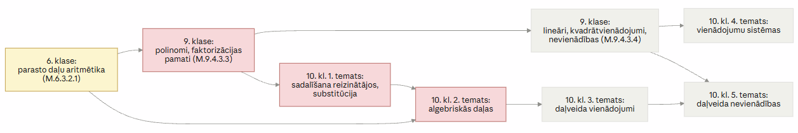

# Atsauksme par pamatskolas_standartu

**Matemātikas mācību jomas plānotie sasniedzamie rezultāti pamatizglītībā (MK noteikumi Nr. 747) kā priekšnoteikums kursa "Matemātika I" (10.–12. klase) apguvei**

*Atsauksme sagatavota 2026. gada 8. jūlijā, balstoties uz projekta materiāliem: "pamatskolas_standarts.md", "MATEMATIKA_1_programmas_paraugs_19_maijs.md" un kursa "Matemātika I" tematu metodiskajiem materiāliem (OL_1–OL_12).*

---

## 1. Kopsavilkums

Vērtētais dokuments apkopo Ministru kabineta 2018. gada 27. novembra noteikumu Nr. 747 matemātikas mācību jomas plānotos skolēnam sasniedzamos rezultātus (turpmāk – SR), beidzot 3., 6. un 9. klasi. Kopvērtējumā standarts ir **konceptuāli mūsdienīgs, iekšēji konsekvents un labi savietojams ar pasaules labo praksi**: tas skaidri nodala matemātikas procesus (valoda, spriešana, modelēšana, pierādīšana) no satura laukiem (skaitļi, algebra un funkcijas, dati un varbūtība, ģeometrija) un veido pārskatāmu vertikālo progresiju trijos kontrolpunktos.

Vienlaikus, skatoties no kursa "Matemātika I" perspektīvas, standartam ir **trīs sistēmiskas vājās vietas**, kas tieši ietekmē 10. klases sākumu:

1. **Algebriskās tehnikas "griesti" 9. klasē ir zemi un daļēji nenoteikti.** Standarts garantē tikai kopīgā reizinātāja iznešanu un divas saīsinātās reizināšanas formulas; kvadrāttrinoma sadalīšana reizinātājos ir formulēta tikai izpratnes ("skaidro"), ne prasmes līmenī. Kursa "Matemātika I" pirmie pieci temati (85 stundas) ir tieši atkarīgi no šīs tehnikas.
2. **Formulējumi "izvēlas sev piemērotāko paņēmienu" rada lielu apgūto prasmju izkliedi** starp skolām un klasēm – to atklāti atzīst arī paši kursa metodiskie materiāli, kas 10. klases sākumā iesaka diagnosticējošo darbu, jo "iespējams, daļa skolēnu prasmi būs apguvusi jau pamatskolā".
3. **Procedurālās raituma (fluency) prasības nav eksplicītas.** Standarts ļoti labi apraksta izpratni un pārnesi, bet nenosaka mērāmus automatizācijas sliekšņus (piemēram, darbības ar parastajām daļām bez digitāliem rīkiem), no kuriem kritiski atkarīga algebrisko daļu un daļveida vienādojumu apguve 10. klasē.

Ieteikumu būtība: **nevis palielināt saturu vai stundu skaitu, bet pārdalīt akcentus** – precizēt dažus 9. klases algebras SR, noteikt raituma sliekšņus, ieviest valsts līmeņa diagnostiku 10. klases sākumā un pievienot standartam vertikālās saskaņošanas karti ar vidusskolas kursiem.

---

## 2. Vērtējuma priekšmets un metode

**Vērtētais dokuments.** "pamatskolas_standarts.md" satur matemātikas mācību jomas SR tabulas trijos griezumos (beidzot 3., 6. un 9. klasi), strukturētas atbilstoši sešām mācību jomas lielajām idejām (Li):

| Lielā ideja | Saturs | Apakštemati |
|---|---|---|
| M.Li.1. | Matemātikas valoda | 1.1. simboli un apzīmējumi; 1.2. attēlojumi (reprezentācijas) |
| M.Li.2. | Problēmrisināšana, spriešana, pierādīšana | 2.1. spriešana; 2.2. matemātiskā modelēšana; 2.3. apgalvojumi un pierādīšana |
| M.Li.3. | Skaitļi un darbības | 3.1. pieraksts un salīdzināšana; 3.2. darbības un algoritmi; 3.3. darbības kā modeļi |
| M.Li.4. | Algebriskie modeļi un funkcijas | 4.1. sakārtojumi; 4.2. sakarības un funkcija; 4.3. pārveidojumi, vienādojumi, nevienādības; 4.4. modelēšana |
| M.Li.5. | Dati un varbūtība | 5.1. dati; 5.2. varbūtība; 5.3. mērīšana |
| M.Li.6. | Figūras un telpa | 6.1. figūras un īpašības; 6.2. novietojums; 6.3. vienādība un līdzība; 6.4. figūru lielumi |

**Salīdzināšanas etalons.** Kursa "Matemātika I" programmas paraugs (420 stundas, 6 stundas nedēļā, 22 temati ar noteiktu stundu skaitu katram) un tam pakārtotie tematu metodiskie materiāli. Programmas ievadā ir uzskaitītas septiņas pieredzes, kādām skolēnam "būtu bijis jābūt" pamatskolā, un ieteikts pārejas periodā diagnosticēt sagatavotību – tas pats par sevi ir netiešs signāls, ka programmas autori pārejas vietu uzskata par riskantu.

**Metode.** (1) Dokumenta iekšējās uzbūves analīze; (2) salīdzinājums ar starptautiski atzītiem ietvariem (NCTM procesu standarti, ASV Common Core matemātiskās prakses standarti, Singapūras matemātikas mācību programma, PISA matemātiskās pratības ietvars); (3) sistemātiska 9. klases SR pretstatīšana katram "Matemātika I" tematam, izmantojot arī metodiskajos materiālos tieši nosauktās pārejas problēmas; (4) secinājumu un ieteikumu formulēšana pie nemainīga stundu skaita pamatskolā.

---

## 3. Iekšējās struktūras konsekvence

### 3.1. Stiprās puses

**Konsekventa matricas arhitektūra.** Visas sešas lielās idejas ir izklāstītas pēc viena parauga: apakštemats → trīs kontrolpunktu tabula → kodēti SR (M.\<klase\>.\<Li\>.\<apakštemats\>.\<numurs\>). Kodu sistēma ir viennozīmīga un ērti izmantojama pēctecības analīzei – to apliecina fakts, ka vidusskolas programmas paraugs un metodiskie materiāli uz šiem kodiem atsaucas tieši (piemēram, M.9.4.3.4 citēts kursa 1. temata materiālos).

**Reāla vertikālā progresija katrā rindā.** Lielākajā daļā tabulu viena rinda apraksta vienu un to pašu ideju trijos brieduma līmeņos, un progresija ir jēgpilna gan satura, gan kognitīvās darbības ziņā. Piemērs (Li.2.3, pierādīšana): 3. klasē "nosaka atsevišķa apgalvojuma patiesumu, paskaidrojot" → 6. klasē "veido spriedumu formā '.., jo ..'" → 9. klasē "pierāda vispārīgus apgalvojumus, loģiski saistot 2–3 spriedumus". Šāda "viena ideja – trīs pakāpes" uzbūve atbilst spirālveida mācību programmas principam un ievērojami atvieglo skolotāja darbu ar dažādas sagatavotības skolēniem.

**Procesu un satura nodalījums bez to atraušanas.** Li.1 un Li.2 (valoda, spriešana) ir formulētas kā patstāvīgas, bet to SR konsekventi izmanto satura lauku piemērus – tas novērš risku, ka "kompetences" tiek mācītas tukšumā.

### 3.2. Vājās vietas

**Nevienmērīga SR granularitāte.** Dažviet viens SR ietver ļoti lielu jēdzienu apjomu. Izteiktākais piemērs – M.9.6.1.1, kurā vienā teikumā uzskaitītas ~20 plaknes figūru un to elementu definīcijas un īpašības (no krustleņķiem līdz regulāram daudzstūrim). Blakus tam pastāv ļoti šauri SR (piemēram, M.9.3.2.8 par noapaļošanu). Nevienmērīga granularitāte apgrūtina gan vērtēšanas plānošanu, gan satura apjoma objektīvu novērtēšanu.

**"Izzūdošas" satura līnijas.** Dažas 6. klases līnijas 9. klases ailē paliek tukšas bez norādes, kur tās turpinās: koordinātu plakne (M.6.6.2.1) formāli turpinās tikai netieši caur funkciju grafikiem Li.4; mērogs (M.6.4.2.7) un aptuvenā laukuma noteikšana dabā (M.6.6.4.4) turpinājuma nesaņem vispār. Lasītājam bez šķērsatsaucēm nav redzams, vai līnija ir apzināti noslēgta vai pārcelta.

**Grūti verificējami "ieradumu" formulējumi.** SR tipa "Izveidojies ieradums ģeometriskā zīmējumā lietot burtu simbolus" (M.9.1.1.5) vai "Atbildīgi un ieinteresēti izvēlas pētījuma mērķi" (M.9.5.1.1) ir pedagoģiski vērtīgi, bet standarta (t. i., pārbaudāmu prasību) valodā tiem trūkst operacionalizācijas – nav norādes, kā ieradumu vai attieksmi konstatēt. Tas nav unikāli Latvijas standartam, bet ir apzināti risināms (sk. 8. sadaļas 6. ieteikumu).

**Kopvērtējums par struktūru: augsts.** Dokuments ir viens no strukturāli konsekventākajiem šāda tipa tekstiem; konstatētās nepilnības ir lokālas un labojamas bez arhitektūras maiņas.

---

## 4. Atbilstība pasaules labajai praksei (matemātikas mācīšana 7–15 gadu vecumā)

### 4.1. Kur standarts atbilst vai apsteidz labo praksi

**Procesu dimensijas integrācija.** Li.1 un Li.2 gandrīz precīzi atbilst NCTM (2000) pieciem procesu standartiem (problēmrisināšana, spriešana un pierādīšana, komunikācija, sakarības, reprezentācijas) un ASV Common Core astoņām matemātiskajām praksēm. Reti kurā nacionālajā standartā reprezentācijām (Li.1.2) ir atvēlēta patstāvīga, cauri visām klasēm izsekojama līnija – tas sasaucas ar Singapūras CPA (konkrētais–attēliskais–abstraktais) pieeju, kas starptautiski uzskatāma par etalonu vecumposmā līdz 12 gadiem.

**Agrīna un nepārtraukta datu un varbūtības līnija.** Datu pratība no 1.–3. klases (datu ieguve, tabulas, diagrammas) līdz 9. klasei (moda, mediāna, amplitūda, biežumi, izklājlapas, pilns pētījuma cikls, datu ticamības un mediju kritika – M.9.5.1.6, M.9.3.2.5) atbilst PISA matemātiskās pratības ietvara akcentam uz "nenoteiktību un datiem" un ir spēcīgāka nekā daudzu ES valstu pamatskolas programmās.

**Matemātiskā modelēšana kā eksplicīts mācību objekts.** Pilns modelēšanas cikls (reāla problēma → modelis → atrisinājums → interpretācija) ar pakāpenisku patstāvības pieaugumu (M.3.2.2.1 → M.6.2.2.1 → M.9.2.2.3) atbilst gan PISA ietvaram, gan, piemēram, Vācijas izglītības standartu (Bildungsstandards) kompetenču modelim.

**Digitālo rīku līdzsvarots lietojums.** Rīki paredzēti izpratnes veidošanai un pārbaudei (ne aizstāšanai), kas atbilst mūsdienu konsensam par tehnoloģiju lomu.

**Pierādīšanas kultūras pakāpeniska izaugsme.** Pretpiemērs, pilnā pārlase, atsevišķa/vispārīga apgalvojuma nošķiršana, aksiomas un teorēmas jēdziens – šī līnija ir metodiski pārdomāta un atbilst pētniecībā balstītiem ieteikumiem par argumentācijas attīstību pusaudžu vecumā.

### 4.2. Kur standarts no labās prakses atpaliek

**Procedurālā raituma (procedural fluency) prasību trūkums.** Kilpatrika u. c. (2001) klasiskajā matemātiskās kompetences modelī raitums ir viens no pieciem vienlīdz nepieciešamiem pavedieniem. Augstas veiktspējas sistēmas (Singapūra, Igaunija, Anglijas 2014. gada programma) blakus izpratnei nosaka konkrētus, pārbaudāmus automatizācijas sliekšņus. Latvijas standartā raitums parādās tikai netieši ("ieradums vienkāršus aprēķinus izpildīt galvā" – M.6.3.2.3), bez apjoma un tempa kritērijiem. Sekas kļūst redzamas tieši 10. klasē, kur algebrisko daļu temats pilnībā balstās uz parasto daļu aritmētikas automatizāciju.

**Salīdzinoši sekls algebras "griestu" līmenis 9. klasē.** Igaunijas pamatskolas beigās un Singapūras O-līmeņa trajektorijā līdz 15–16 gadu vecumam skolēni apgūst arī algebrisko daļu vienkāršošanu un pilnvērtīgu kvadrāttrinoma faktorizāciju. Latvijas standartā faktorizācija prasmes līmenī aprobežojas ar kopīgā reizinātāja iznešanu un divām saīsinātās reizināšanas formulām (M.9.4.3.3). Tas nav kļūdaini kā apzināta atslogošana, bet pārceļ ievērojamu tehnikas apjomu uz 10. klasi (sk. 7. sadaļu).

**Neviennozīmīgie "izvēlas sev piemērotāko paņēmienu" formulējumi.** Šī konstrukcija (piemēram, M.9.4.3.4) dod skolotājam brīvību, bet valsts standarta funkcijā – garantēt vienādu minimumu – tā rada izpildes izkliedi: divi skolēni ar formāli izpildītu standartu var būt apguvuši būtiski atšķirīgus paņēmienu komplektus. Starptautiskā prakse (piemēram, Common Core) šādos gadījumos nosauc obligātos paņēmienus un atstāj izvēli virs minimuma.

**Kontekstam.** Latvijas skolēnu rezultāti starptautiskajos mērījumos (TIMSS 2019 4. klasē – virs skalas viduspunkta; PISA matemātikā – ap OECD vidējo līmeni) liecina, ka pamatskolas posma sākums ir salīdzinoši spēcīgs, bet priekšrocība līdz 15 gadu vecumam daļēji izlīdzinās. Tas netieši atbalsta šīs atsauksmes tēzi, ka galvenā riska zona ir tieši vēlīnā pamatskolas algebra un tās savienojums ar vidusskolu.

---

## 5. Satura apjoms un tam atvēlētās stundas

Vērtētais dokuments pats stundu skaitu nenosaka – tas izriet no MK noteikumu Nr. 747 pielikuma, kur matemātikai paredzētas aptuveni **420 stundas 1.–3. klasē, 525 stundas 4.–6. klasē un 525 stundas 7.–9. klasē** (orientējoši 4–5 stundas nedēļā; skolai ir tiesības apjomu ierobežoti mainīt), tātad kopā ap 1470 stundām deviņos gados. Salīdzinājumam: "Matemātika I" trijos vidusskolas gados paredz 420 stundas jeb 6 stundas nedēļā – relatīvā slodze vidusskolā ir lielāka nekā pamatskolā.

**Vērtējums: apjoms kopumā ir reālistisks, bet ar nevienmērīgu spiedienu 7.–9. klasē.**

- Standarts, salīdzinot ar iepriekšējo (2014. gada) mācību priekšmeta standartu, ir apzināti atslogots: uz vidusskolu pārceltas algebriskās daļas, kubu formulas, sinusu un kosinusu teorēmas, trijstūra laukums ar sinusu u. c. Tas atbrīvo laiku izpratnes veidošanai un modelēšanai – atbilstoši deklarētajai pieejai.
- Vienlaikus kompleksie SR (izpratne + prasme + pārnese jaunā situācijā + ieradums) ir laikietilpīgāki par tradicionālajiem "prot atrisināt" formulējumiem. Pie nemainīga stundu skaita tas nozīmē, ka **izpratnes veidošana un prasmju automatizācija savstarpēji konkurē par laiku**; ja skolotājs abus mērķus nespēj apvienot, praksē parasti cieš automatizācija (to netieši apstiprina vidusskolas metodisko materiālu daudzās piezīmes "jāpārliecinās par pamatskolas prasmēm").
- Blīvākais posms ir 7.–9. klase: reālie skaitļi, pilna pamatskolas algebra, funkciju ievads, planimetrijas deduktīvais kurss ar pierādījumiem, trigonometrijas ievads, statistika un varbūtība. Ģeometrijas SR blīvums (sk. M.9.6.1.1) liek domāt, ka tieši šeit apjoma un stundu attiecība ir saspringtākā.

Secinājums: stundu skaits ļauj standartu īstenot, taču tikai tad, ja programmas līmenī tiek disciplinēti aizsargāts laiks pamattehnikas nostiprināšanai. Standarta teksts pats šo aizsardzību nenodrošina, jo raituma prasības nav eksplicītas (sk. 4.2.).

---

## 6. Tematu loģiskā secība un sasniedzamo rezultātu mērāmība

### 6.1. Loģiskā secība

Standarts apzināti nenosaka mācīšanas secību – tikai trīs kontrolpunktus. Tas ir starptautiski ierasts risinājums, un dokumenta uzbūve ļauj no tā **korekti atvasināt loģisku secību**: katrā līnijā jaunais saturs balstās uz iepriekšējo (naturālie → racionālie → reālie skaitļi; vienādības ar nezināmo → lineāri vienādojumi → kvadrātvienādojumi un sistēmas; praktiska figūru izpēte → mērīšana un aprēķini → deduktīvi pierādījumi). Skola2030 programmu paraugi pamatizglītībā šo secību arī realizē.

Divas piezīmes:

1. **Starplīniju atkarības ir implicītas.** Piemēram, kvadrātfunkcijas grafika lasīšana (Li.4) balstās uz koordinātu plakni (Li.6.2), bet dokumentā šī saikne nav norādīta. Programmu autoriem tas ir atrisināms, tomēr vertikālās un horizontālās saskaņošanas karte celtu dokumenta lietojamību.
2. **Dažas līnijas beidzas "pusvārdā"** (mērogs, aptuvenā mērīšana dabā – sk. 3.2.), kas loģiskās secības ziņā ir vienīgās vietas, kur pēctecība faktiski pārtrūkst.

### 6.2. Mērāmība

Lielākā daļa SR ir formulēti ar pārbaudāmiem darbības vārdiem (aprēķina, atrisina, pieraksta, konstruē, pierāda, salīdzina) un ir tieši pārvēršami vērtēšanas kritērijos – to praksē apliecina 3. un 6. klases valsts diagnosticējošie darbi un 9. klases eksāmens, kas visi ir kartējami pret SR kodiem. Vidusskolas materiālos redzamā kritēriju kultūra (katram formatīvajam un noslēguma darbam pievienoti vērtēšanas kritēriji) ir dabiski turpināma uz pamatskolu.

Mērāmības problēmzonas ir trīs: (a) ieradumu un attieksmju SR (sk. 3.2.); (b) daudzdarbību SR, kur vienā formulējumā apvienoti 3–6 pārbaudāmi elementi (M.9.4.3.3, M.9.4.3.4, M.9.6.4.1) – tie ir mērāmi tikai pēc dekompozīcijas, ko standarts atstāj skolotājam; (c) "izvēlas sev piemērotāko paņēmienu" formulējumi, kur nav skaidrs, kurš paņēmiens eksāmenā drīkst tikt prasīts obligāti.

---

## 7. Plaisu (gap) analīze pret kursa "Matemātika I" programmas paraugu

Kursa "Matemātika I" pirmie pieci temati (1. Sadalīšana reizinātājos, 2. Algebriskās daļas, 3. Daļveida vienādojumi, 4. Vienādojumu sistēmas, 5. Daļveida nevienādības; kopā **85 stundas jeb ~20 % kursa**) veido nepārtrauktu algebras bloku, kura panākumi gandrīz pilnībā nosakāmi ar pamatskolas algebras un daļu aritmētikas kvalitāti. Tāpēc plaisu analīzes smaguma centrs ir tieši šeit.

### 7.1. Kas 10. klasē tiek sagaidīts, bet pamatskolā nav pietiekami uzsvērts

| "Matemātika I" temats | Kas tiek sagaidīts no pamatskolas | Segums standartā (beidzot 9. klasi) | Riska pakāpe |
|---|---|---|---|
| 1. Sadalīšana reizinātājos (17 st.) | Kopīgā iznešana, saīsinātās reizināšanas formulas, kvadrāttrinoma faktorizācija, kvadrātvienādojumu raita risināšana | Kopīgā iznešana un kvadrātu starpība, summas/starpības kvadrāts – **ir** (M.9.4.3.3); kvadrāttrinoma sadalīšana – tikai izpratnes līmenī "skaidro, ko nozīmē sadalīt reizinātājos" (M.9.4.3.1); grupēšanas paņēmiens un kubu formulas – **nav** | **Augsta**. Metodiskais materiāls tieši norāda: "iespējams, daļa skolēnu prasmi sadalīt kvadrāttrinomu reizinātājos būs apguvusi jau pamatskolā" – t. i., prasme nav garantēta nevienam |
| 2. Algebriskās daļas (17 st.) | Raita parasto daļu aritmētika, pakāpju īpašības, faktorizācija | Parasto daļu darbības – **ir** (M.6.3.2.1), bet bez raituma sliekšņa; algebriskās daļas kā objekts – **nav** (apzināti pārceltas uz vidusskolu) | **Augsta**. Viss temats ir "pārnese no parastajām daļām"; ja daļu aritmētika nav automatizēta, temats 17 stundās nav apgūstams |
| 3. Daļveida vienādojumi (18 st.) | Vienādojums a/x = b, proporcijas, lineāro un kvadrātvienādojumu tehnika | a/x = b un proporcijas nezināmā locekļa aprēķināšana – **ir** (M.9.4.3.4, M.9.4.3.5); vienādojuma definīcijas kopas un ekvivalences jēdzieni – **nav** (metodiskajā materiālā skaidrots, kāpēc pamatskolā sakņu "vienīgumu" nepamato) | **Vidēja** |
| 4. Vienādojumu sistēmas (15 st.) | Lineāru sistēmu risināšana ar ievietošanas un saskaitīšanas paņēmienu | **Ir** (M.9.4.3.4); temats programmā apzināti veidots kā atkārtojums un padziļinājums | **Zema** |
| 5. Daļveida nevienādības (18 st.) | Lineāras un kvadrātnevienādības, intervālu pieraksts | Lineāras un kvadrātnevienādības – **ir** (M.9.4.3.4); intervālu metode – **nav** (jauns saturs); atrisinājuma kopas pieraksts ar intervāliem standartā tikai netieši caur kopu simboliku (M.9.1.1.1) | **Vidēja** |
| 6. Planimetrija, leņķa paplašinājums (23 st.) | Taisnleņķa trijstūra sakarības, šaurā leņķa trigonometrija, laukumu aprēķini, līdzība | Šaurā leņķa sin/cos/tg un Pitagora teorēma – **ir** (M.9.1.1.3, M.9.6.4.1); plats leņķis, vienības riņķis, formula S = ½·a·b·sin γ, sinusu/kosinusu teorēmas – **nav** (metodiskais materiāls: "Pamatskolas standarts šo formulu neietver") | **Vidēja**: jaunais saturs ir paredzēts, bet tā apguves ātrums pieņem drošu taisnleņķa trijstūra tehniku |
| 7. Funkcija, īpašības, pārbīdes (21 st.) | Elementāro funkciju grafiki un terminoloģija (DK, VK, nulles, augoša/dilstoša) | Terminoloģija un funkciju saime (lineāra, kvadrātfunkcija, k/x, x³, √x) – **ir** un ir laba (M.9.4.2.2, M.9.4.2.3); simbolika f(x), pāra/nepāra, transformācijas – **nav** (metodiskais materiāls: pamatskolā lieto y, ne f(x)) | **Vidēja**: konceptuālā bāze laba, simboliskais lēciens paliek 10. klasei |
| 8.–10. Trigonometrija (51 st.) | Šaurā leņķa trigonometrija, funkciju izpratne | Tikai šaurā leņķa sakarības taisnleņķa trijstūrī | **Vidēja**: apjomīgs pilnīgi jauns saturs; risks nevis "plaisā", bet tempā |
| 13. Pakāpes, progresijas (22 st.) | Pakāpju īpašības, aritmētiskās progresijas priekšstats | Pakāpes ar veselu kāpinātāju un aritmētiskās progresijas saskatīšana formulas veidā – **ir** (M.9.3.1.2, M.9.4.1.1) | **Zema**, bet starp 9. klasi un 11. klasi līnija ~2 gadus netiek lietota |
| 19.–21. Kombinatorika, varbūtība, statistika (59 st.) | Kopu valoda, klasiskā varbūtība, vidējie lielumi, pētījuma cikls | **Ir** un ir spēcīgi (M.9.2.1.3, M.9.5.1.4, M.9.5.2.2) | **Zema** plaisas ziņā, bet augsta *aizmiršanas* riska ziņā (sk. 7.2.) |

**Šķērsgriezuma plaisas** (neattiecas uz vienu tematu):

- **Pierādīšanas kultūras lēciens.** Pamatskolā pierādījums ir 2–3 loģiski saistīti spriedumi (M.9.2.3.6); 10. klasē skolēnam jāseko un jāatveido daudzsoļu teorēmu pierādījumi (sinusu, kosinusu teorēma, Eiklīda sakarības). Pats lēciens ir pieņemams, bet standarta pusē būtu vēlams vismaz viens SR par garāku pierādījumu *lasīšanu un analīzi*.
- **Vienādojuma teorētiskais ietvars.** Jēdzieni "definīcijas kopa", "ekvivalenti pārveidojumi", "visas saknes un citu nav" pamatskolā apzināti netiek lietoti; 10. klasē tie kļūst centrāli uzreiz trīs tematos (1., 3., 5.).
- **Algebriskā raituma izkliede.** Formulējumu "izvēlas sev piemērotāko paņēmienu" dēļ klasē 10. klases sākumā sēdēs skolēni ar būtiski atšķirīgu apgūto paņēmienu komplektu – programmas paraugs to kompensē ar diagnostiku un 1. tematu kā atkārtojumu, taču 17 stundas vienlaikus atkārtošanai *un* jaunam saturam (kubu formulas, grupēšana, substitūcija, grafiskais paņēmiens) ir maz, ja pamatskolas bāze ir nepilnīga.

### 7.2. Kas pamatskolā tiek apgūts, bet vidusskolā netiek pietiekami nostiprināts

| Pamatskolas līnija | Stāvoklis "Matemātika I" kursā | Risks |
|---|---|---|
| Dati, statistika, pētījuma cikls (Li.5.1) | Atgriežas tikai 21. tematā (kursa pašās beigās, faktiski 12. klasē) | ~2,5 gadu pauze; 9. klasē sasniegtais pētnieciskais briedums daļēji jāatjauno no jauna |
| Varbūtība (Li.5.2) | Atgriežas 20. tematā | Tāda pati ilgstoša pauze |
| Procenti, finanšu pratība (M.9.3.2.4, M.9.3.2.5) | Tieša turpinājuma nav; parādās tikai kā konteksts (piem., eksponentfunkcijā) | Praktiskā rēķinpratība, kas ir viens no pamatskolas standarta spēcīgākajiem elementiem, vidusskolā "izbalē" |
| Konstruēšana ar cirkuli un lineālu, ķermeņu izklājumi un skati (M.9.6.1.6, M.9.6.1.9, M.9.6.1.10) | Kursā gandrīz netiek lietoti; stereometrijā dominē aprēķini | Telpiskās iztēles praktiskā komponente netiek uzturēta |
| Mērvienības, mērīšanas precizitāte (Li.5.3) | Tikai kā konteksts | Zems risks, bet līnija formāli beidzas |
| Datu ticamības un mediju kritika (M.9.5.1.6) | Atgriežas tikai statistikas tematā | Pilsoniskās pratības komponentei rodas pārrāvums |

Jāuzsver: šī tabula lielākoties raksturo *vidusskolas programmas tematu secības* īpatnību (algebra → ģeometrija/funkcijas → dati), nevis pamatskolas standarta defektu. Tomēr izglītības politikas skatījumā abi dokumenti jāvērtē kā viena sistēma: pamatskolas ieguldījums datu pratībā atmaksājas tikai tad, ja vidusskolā līnija netiek "iesaldēta" divus gadus.

### 7.3. Ko tas nozīmē skolēniem ar atšķirīgu sagatavotību 10. klasē

**Skolēns, kurš pamatskolas standartu apguvis labi,** 10. klasē saņem komfortablu startu: 1. un 4. temats viņam lielā mērā ir atkārtojums, funkciju un datu bāze ir moderna un plaša, un galvenais izaicinājums ir jaunā abstrakcijas pakāpe (definīcijas kopa, f(x), vienības riņķis) un pierādījumu garums – tas ir normāls, attīstošs slogs.

**Skolēns, kurš standartu apguvis formāli vai daļēji,** sastopas ar "dubultu rēķinu": viņam vienlaikus (a) jālikvidē parasto daļu un algebrisko pārveidojumu raituma iztrūkums, ko pamatskolas standarts nemērīja eksplicīti, un (b) jāapgūst jauns, blīvs saturs 6 stundas nedēļā. Tā kā pirmie pieci temati ir secīgi atkarīgi (faktorizācija → daļas → daļveida vienādojumi → nevienādības), iztrūkums nevis izlīdzinās, bet uzkrājas – tas ir klasisks "Metjū efekta" scenārijs, kurā plaisa starp abām grupām pirmajā semestrī paplašinās.

Atkarību ķēdi ilustrē shēma (algebras līnija):

*Sarkanie mezgli – vietas, kur pamatskolas standarta segums ir nepilnīgs vai negarantēts; dzeltenais – prasme, kurai standarts nenosaka raituma slieksni, lai gan uz tās balstās viss bloks.*

---

## 8. Ieteikumi izglītības politikas veidotājiem

Visi ieteikumi formulēti, **nemainot matemātikas stundu skaitu pamatskolā** – tie paredz akcentu pārdali, formulējumu precizēšanu un sistēmas saskaņošanu, nevis satura palielināšanu.

**1. Precizēt 9. klases algebras SR, pārdalot apjomu no ģeometrijas jēdzienu uzskaitījuma.**
M.9.4.3.3 papildināt ar kvadrāttrinoma sadalīšanu reizinātājos (vismaz gadījumam, kad saknes ir racionālas) un elementāru algebriskas daļas saīsināšanu ar vienlocekļa reizinātājiem. Kompensācijai samazināt vai pārstrukturēt M.9.6.1.1 blīvo definīciju sarakstu (daļu jēdzienu atstājot atpazīšanas, ne pierādīšanas līmenī). Tas noņemtu "Matemātika I" 1.–2. temata galveno nenoteiktību, kuru šobrīd atzīst paši vidusskolas metodiskie materiāli.

**2. Ieviest funkcijas simboliku f(x) jau 9. klasē.**
Izmaksas ir minimālas (pieraksta konvencija pie jau esošā satura M.9.4.2.2), bet tas novērš tīri notacionālu barjeru, kas 10. klases 7. tematā patērē mācību laiku un metodiskajos materiālos ir īpaši atrunāta.

**3. Definēt procedurālā raituma sliekšņus kā standarta pielikumu.**
Neliels (10–15 pozīciju) saraksts ar mērāmiem automatizācijas kritērijiem, piemēram: "beidzot 6. klasi bez digitāliem rīkiem veic četras darbības ar parastajām daļām un decimāldaļām", "beidzot 9. klasi bez rīkiem lieto pakāpju īpašības un saīsinātās reizināšanas formulas". Tas saglabā kompetenču pieeju, bet dod skolām un valsts pārbaudes darbiem vienotu minimuma etalonu – atbilstoši Singapūras un Anglijas praksei.

**4. Nostiprināt valsts līmeņa diagnostiku pārejā uz 10. klasi.**
Programmas paraugs diagnostiku tikai iesaka; sistēmiski efektīvāk ir vienots, SR kodiem kartēts diagnosticējošais darbs, uzsākot 10. klasi (analoģiski esošajiem darbiem, uzsākot 3., 4., 5. un 7. klasi), ar publiski pieejamu pārejas atbalsta moduli tiem skolēniem, kuriem konstatēts algebras raituma iztrūkums.

**5. Pievienot standartam vertikālās saskaņošanas karti.**
Viena tabula/karte, kas katram 9. klases SR norāda, kurā vidusskolas kursa tematā tas tiek lietots tālāk (un otrādi). Tā padarītu redzamas gan "izzūdošās" līnijas (mērogs, konstruēšana), gan kritiskās atkarības, un kalpotu par instrumentu turpmākām standarta revīzijām.

**6. Operacionalizēt ieradumu un attieksmju SR.**
Ieradumu formulējumiem ("izveidojies ieradums …") pievienot novērojamu uzvedības aprakstu vai tos pārcelt uz programmas/metodikas līmeni, standartā atstājot tikai pārbaudāmas prasības. Tas uzlabo mērāmību, nemainot pedagoģisko nodomu.

**7. Aizsargāt datu un varbūtības līnijas nepārtrauktību sistēmas līmenī.**
Pamatskolas pusē – nodrošināt, ka datu pratības SR ir pilnvērtīgi pārstāvēti 9. klases eksāmenā (pretējā gadījumā tie praksē tiek marginalizēti par labu algebrai). Vidusskolas pusē – ieteikt programmu paraugos statistikas un varbūtības elementus integrēt agrāk (piemēram, datu kontekstus funkciju un procentu tematos), lai 2,5 gadu pauze nenoārda pamatskolā sasniegto.

**8. Veikt redakcionālu revīziju.**
Novērst Li.6 virsraksta dublēšanos, tukšajās tabulu šūnās pievienot norādes "līnija turpinās …/līnija noslēdzas", izlīdzināt SR granularitāti. Tas ir mazs, bet dokumenta autoritāti stiprinošs solis.

---

## 9. Kopvērtējums

| Vērtēšanas aspekts | Vērtējums | Pamatojums |
|---|---|---|
| Iekšējās struktūras konsekvence | ★★★★☆ | Vienota matrica, kodi, reāla vertikālā progresija; lokālas granularitātes un redakcionālas nepilnības |
| Atbilstība pasaules labajai praksei | ★★★★☆ | Procesu standarti, reprezentācijas, modelēšana, datu pratība – augstā līmenī; iztrūkst raituma prasību dimensija |
| Satura apjoma atbilstība stundām | ★★★☆☆ | Kopumā reālistisks, apzināti atslogots; saspringts 7.–9. klasē, un izpratnes/automatizācijas laika konkurence nav atrisināta |
| Loģiskā secība un mērāmība | ★★★★☆ | Secība korekti atvasināma, vairums SR mērāmi; ieradumu SR un daudzdarbību SR mērāmība vāja |
| Sagatavotība kursam "Matemātika I" | ★★★☆☆ | Funkciju, datu, ģeometrijas bāze laba; algebras tehnikas segums nepilnīgs un negarantēts tieši tur, kur 10. klases kurss ir visjutīgākais |

Pamatskolas standarts ir kvalitatīvs, mūsdienīgs ietvars, kas skolēnam ar pilnvērtīgu tā apguvi nodrošina labu startu vidusskolā. Galvenā sistēmiskā problēma nav saturā, kura "trūkst", bet **garantijas pakāpē**: standarta elastīgie formulējumi algebrā nozīmē, ka "Matemātika I" pirmais, izšķirošais posms balstās uz prasmēm, kuru esamību valsts skolēnam faktiski negarantē. Šī atsauksme iesaka to labot ar mērķtiecīgiem, budžeta ziņā neitrāliem precizējumiem (1.–4. ieteikums), nevis ar satura vai stundu apjoma maiņu.

---

## 10. Izmantotie avoti

1. Ministru kabineta 2018. gada 27. novembra noteikumi Nr. 747 "Noteikumi par valsts pamatizglītības standartu un pamatizglītības programmu paraugiem". https://likumi.lv/ta/id/303768
2. Ministru kabineta 2019. gada 3. septembra noteikumi Nr. 416 "Noteikumi par valsts vispārējās vidējās izglītības standartu un vispārējās vidējās izglītības programmu paraugiem". https://likumi.lv/ta/id/309597
3. Skola2030 / VISC. *Matemātika I. Pamatkursa programmas paraugs vispārējai vidējai izglītībai* (projekta fails "MATEMATIKA_1_programmas_paraugs_19_maijs.md").
4. Skola2030 / VISC. Kursa "Matemātika I" tematu metodiskie materiāli un darba lapas (projekta faili OL_1–OL_12).
5. National Council of Teachers of Mathematics (2000). *Principles and Standards for School Mathematics.* Reston, VA: NCTM.
6. National Governors Association Center for Best Practices & Council of Chief State School Officers (2010). *Common Core State Standards for Mathematics.* Washington, DC.
7. Ministry of Education, Singapore (2020). *Mathematics Syllabuses: Secondary One to Four.* Singapore: MOE Curriculum Planning and Development Division.
8. OECD (2023). *PISA 2022 Assessment and Analytical Framework* un *PISA 2022 Results (Volume I): The State of Learning and Equity in Education.* Paris: OECD Publishing.
9. Mullis, I. V. S., Martin, M. O., Foy, P., Kelly, D. L., & Fishbein, B. (2020). *TIMSS 2019 International Results in Mathematics and Science.* Boston College, TIMSS & PIRLS International Study Center.
10. Kilpatrick, J., Swafford, J., & Findell, B. (Eds.) (2001). *Adding It Up: Helping Children Learn Mathematics.* Washington, DC: National Academy Press.
11. Bruner, J. S. (1960). *The Process of Education.* Cambridge, MA: Harvard University Press.
12. Department for Education, England (2014). *National Curriculum in England: Mathematics Programmes of Study.* London: DfE.

---

*Piezīme par metodi un ierobežojumiem. Atsauksme balstās uz projektā pieejamajām dokumentu Markdown versijām; stundu skaita dati pamatizglītībā ņemti no MK noteikumu Nr. 747 pielikuma un ir orientējoši, jo skolām ir tiesības apjomu ierobežoti mainīt. Salīdzinājums ar citu valstu programmām veikts konceptuālā, ne pa vienumam kartētā līmenī. Atsauksme pauž analītisku ekspertvērtējumu, nevis oficiālu institūcijas nostāju.*
