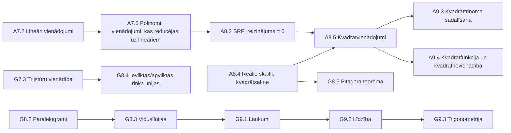

# Atsauksme par programmas parauga „Matemātika 1.–9. klasei" 7.–9. klases daļu

**Analizētais materiāls:** `programmas_paraugs_Matematika_1_9_klase.md`, sadaļa „Mācību satura apguves secība 7.–9. klasei" (no tematu pārskata tabulām līdz dokumenta beigām), tai skaitā 31 temata apraksti (A7.1–A9.6, G7.1–G9.5).
**Atskaites punkts:** `pamatskolas_standarts.md` (MK not. Nr. 747), kolonna **„Beidzot 9. klasi"** (66 SR kodi M.9.1.1.1–M.9.6.4.3).
**Prioritāšu apzīmējumi:** 🔴 kritiski · 🟠 svarīgi · 🟡 ieteicams · ⚪ redakcionāli.

> Piezīme: dokumentā sagaidāmās, bet vēl neaizpildītās vietas (saites „[Saite vai norāde uz metodiskā materiāla atbilstošo daļu]", tukšā sadaļa „Izmantojamie mācību līdzekļi") atbilstoši uzdevuma nosacījumiem **nav** uzskatītas par kļūdām, taču tur, kur to aizpildīšana ietekmē programmas lietojamību, tas ir atzīmēts.

---

## 1. Kopsavilkums

Programmas parauga 7.–9. klases daļa ir **saturiski nobriedusi un standarta prasībām kopumā atbilstoša**: visi 66 standarta „Beidzot 9. klasi" SR kodi programmā ir pieminēti vismaz vienu reizi, tematu iekšējā loģika (jēdzieni → SR → piemēri) ir konsekventa, un vairākas priekšzināšanu ķēdes ir izveidotas priekšzīmīgi (sk. 4.1.). Galvenās problēmas koncentrējas četrās vietās:

1. **Nosegums „darbības vārda līmenī".** Dažiem standarta SR programmas atsauce ir formāla — kods ir pieminēts, bet programmas SR prasa vājāku darbību, nekā standarts (spilgtākais piemērs — telpisku ķermeņu izklājumi: standarts prasa *plānot, zīmēt un izveidot*, programma — tikai *atpazīt*). Sk. 3.2.
2. **Stundu bilance 8. klasē.** Ģeometrijas tematu summa (64–74 h) pie piedāvātā dalījuma „2 stundas nedēļā" (~70 h gadā) augšējā diapazonā neiekļaujas, un visai 8. klasei pie maksimuma (176 h) nepaliek rezerves pārbaudes darbiem. Sk. 5.
3. **Plūduma pārrāvumi.** Statistika parādās tikai 7. klasē (2 gadu pauze līdz eksāmenam); proporciju prasme, kas intensīvi vajadzīga G9.2 (līdzība), pēdējoreiz sistemātiski trenēta A7.2 — abās piedāvātajās secību shēmās G9.2 nāk *pirms* proporciju atkārtojuma A9.3. Sk. 4.2.
4. **Apzīmējumu konsekvence.** Trīs dažādas standarta kodu pieraksta formas, vairākas drukas kļūdas kodos, stundu skaita nesakritības starp pārskata tabulām un tematu aprakstiem, kompetenču kodu lietojuma sistēma nav paskaidrota (un ģeometrijā MM kods nav lietots nevienu reizi). Sk. 6.–7.

---

## 2. Tematu karte un stundu skaits

| Klase | Algebra (stundas tematā) | Ģeometrija (stundas tematā) |
|---|---|---|
| **7.** | A7.1 Izteiksmes (14–16) · A7.2 Lineāri vienādojumi (15–17) · A7.3 Lineāra funkcija (20–22) · A7.4 Monomi (21–23)¹ · A7.5 Polinomi (18–20) · A7.6 Ievads statistikā (9–11) | G7.1 Taisne, stars, nogrieznis (13–15) · G7.2 Riņķa līnija un leņķi (13–15) · G7.3 Trijstūris, trijstūru vienādība (16–18) · G7.4 Sakarības trijstūrī (12–14) |
| **8.** | A8.1 Pakāpe ar veselu kāpinātāju (14–16) · A8.2 Saīsinātās reizināšanas formulas (22–24) · A8.3 Lineāru vienādojumu sistēmas (18–20)¹ · A8.4 Reālie skaitļi (19–21) · A8.5 Kvadrātvienādojumi (19–21) | G8.1 Paralelitāte, daudzstūra leņķu summa (16–18) · G8.2 Četrstūri ar pa pāriem paralēlām malām (19–21)¹ · G8.3 Trapece (10–12)¹ · G8.4 Daudzstūri un riņķa līnija (9–11) · G8.5 Pitagora teorēma (10–12) |
| **9.** | A9.1 Lineāras nevienādības un sistēmas (17–19) · A9.2 Kombinatorika un varbūtību teorija (12–14) · A9.3 Racionālu izteiksmju pārveidojumi (22–24) · A9.4 Kvadrātfunkcija un kvadrātnevienādība (20–22) · A9.5 Vienādojumu sistēmas ar diviem mainīgajiem (10–12) · A9.6 Virknes (11–13) | G9.1 Paralelograma, romba, trijstūra un trapeces laukums (11–13) · G9.2 Talesa teorēma, līdzīgi trijstūri (10–12) · G9.3 Trigonometriskās sakarības taisnleņķa trijstūrī (11–13) · G9.4 Regulāri daudzstūri un riņķa līnija (9–11) · G9.5 Stereometrijas pamati (7–9) |

¹ Stundu skaits tematu aprakstos **atšķiras** no pārskata tabulām — sk. 6.2.

Struktūra atbilst Latvijā ierastajam algebras/ģeometrijas dalījumam, un ir vērtīgi, ka piedāvātas **divas secību shēmas** (paralēlā „3+2 stundas nedēļā" un pamīšu shēma) — tas dod skolām elastību un atbilst labai praksei. Tomēr abām shēmām ir kopīgi plūduma riski (sk. 4.2.), un pamīšu shēmas apgalvojums „tiek ievērota zināšanu pēctecība" vienā vietā neiztur pārbaudi (G9.2 pirms A9.3).

---

## 3. Standarta pārklājums

### 3.1. Kopaina

Automātiska visu `M9.x.x.x` atsauču izguve (357 atsauces) pret standarta „Beidzot 9. klasi" kolonnu rāda: **katrs no 66 SR kodiem programmā ir pieminēts vismaz vienu reizi** — formāla „balta plankuma" nav. Atsauču biežums pa standarta lielajām idejām:

| Lielā ideja (Li) | Kodu skaits standartā | Atsauču kopskaits programmā | Komentārs |
|---|---|---|---|
| Li.1 Matemātikas valoda | 8 | ~104 | Ļoti blīvi (M9.1.1.5 — 21 reize) — atbilst valodas caurviju raksturam |
| Li.2 Spriešana, modelēšana, pierādīšana | 15 | ~69 | Pierādīšana (M9.2.3.6 — 13) labi; modelēšanas soļu kodi (M9.2.2.1/4/6) — pa 1 reizei |
| Li.3 Skaitļi un darbības | 13 | ~37 | Pamatdarbības blīvi; „patērētāja" SR (M9.3.2.5) — tikai formālas atsauces |
| Li.4 Algebra un funkcijas | 12 | ~86 | Visblīvāk nosegtā joma |
| Li.5 Dati, varbūtība, mērīšana | 11 | ~13 | **Katram kodam tikai 1–2 atsauces; viss datu bloks — vienā 7. klases tematā** |
| Li.6 Ģeometrija | 19 | ~93 | Plaknes ģeometrija blīvi; telpas ģeometrijas kodi (M9.6.1.7–1.10) — pa 1 reizei |

Secinājums: pārklājums ir pilnīgs *pieminēšanas* līmenī, bet nevienmērīgs *dziļuma* līmenī — Li.5 un telpas ģeometrija ir programmas šaurās vietas.

### 3.2. Padziļinātā pārbaude: kur programmas SR ir vājāks par standarta prasību

| Prior. | Standarta SR | Standarta darbības vārds | Programmā atrodamais | Ieteikums |
|---|---|---|---|---|
| 🔴 | **M.9.6.1.9** – piramīdas, cilindra, konusa izklājumi | „**Plāno, zīmē** … izklājumu plaknē un **veido** tam atbilstošo telpisko ķermeni" | G9.5: „**Atpazīst** … virsmas izklājumu" | G9.5 pievienot SR par izklājuma plānošanu/zīmēšanu un ķermeņa praktisku izveidi (vismaz cilindram un regulārai piramīdai); tas prasa arī stundu skaita pārskatīšanu (sk. 5.) |
| 🟠 | **M.9.6.1.7** – attēlojumi | „**uzzīmē** taisnstūra paralēlskaldni, zīmē … figūras ar digitālajiem rīkiem" | G9.5: „Atpazīst … no dažādiem skatiem, lietojot arī digitālos rīkus" | Pievienot SR „Zīmē taisnstūra paralēlskaldni (arī ar digitālu rīku), skaidro, kuri lielumi attēlojumā saglabājas" |
| 🟠 | **M.9.3.2.5** – procenti medijos | „**Analizē un izvērtē** procentu lietojumu ikdienā, plašsaziņas līdzekļu materiālos" | Kods pieminēts A7.1/A7.2 bloku virsrakstos, bet neviens SR šo darbību neizsaka | Pievienot eksplicītu SR (dabiska vieta — A7.6 datu analīzes blokā vai A7.1); iekļaut arī „procentuālais palielinājums/samazinājums/salīdzinājums" (M.9.3.2.4), kas pašlaik paliek piemēra līmenī („20 % atlaide") |
| 🟠 | **M.9.5.2.3** – varbūtība medijos | „Formulē pieņēmumu par varbūtības skaitlisko vērtību, **izvērtē** jēdziena lietošanu ikdienā, plašsaziņas līdzekļos" | A9.2: skaidro/aprēķina varbūtību; izvērtēšanas mediju kontekstā nav | A9.2 pievienot SR par varbūtības apgalvojumu kritisku izvērtēšanu (laika prognozes, loterijas, riski) |
| 🟠 | **M.9.6.1.6** – konstrukcijas | konstruē arī „**attālumu no punkta līdz taisnei**, perpendikulāras … taisnes" (ar cirkuli un lineālu) | G7.2: perpendikulu **zīmē ar uzstūri**; cirkuļa–lineāla konstrukcija nav SR nevienā tematā | G7.4 (pie vidusperpendikula) vai G8.1 pievienot perpendikula konstrukciju caur punktu ar cirkuli un lineālu |
| 🟡 | **M.9.5.1.4** – datu rādītāji | „izmantojot arī **izklājlapās** iebūvētās funkcijas" | A7.6: „lietojot arī digitālos rīkus" (izklājlapas nav nosauktas) | Piemēros nosaukt izklājlapu funkcijas (AVERAGE, MEDIAN, COUNTIF) — sasaiste ar datorikas mācību jomu |
| 🟡 | **M.9.1.2.2** – iracionālu skaitļu ģeometriska modelēšana | „ģeometriski modelē … iracionālus skaitļus (kvadrātsakne no naturāla skaitļa)" | A8.4 kods pieminēts, bet SR/piemēra par √2 ģeometrisku iegūšanu nav | Pēc G8.5 (Pitagora teorēmas) pievienot piemēru: √2 kā vienības kvadrāta diagonāle, tās atlikšana uz skaitļu ass |
| 🟡 | **M.9.2.3.5** – pierādījuma korektuma izvērtēšana | „Izvērtē pierādījuma korektumu, **atrod un skaidro kļūdas**" | Kods pieminēts vienreiz (G8.3), atbilstoša SR nav | Kādā no G8 tematiem pievienot uzdevumu tipu „atrodi kļūdu dotā pierādījumā" |
| 🟡 | **M.9.6.1.4** – punktu ģeometriskā vieta | „Spriež, secina par punktu ģeometrisko vietu" | Ideja ir G8.4 piemēros (bisektrise, vidusperpendikuls kā punktu kopas), bet pats jēdziens nav ne SR, ne jēdzienu sarakstos | Ieviest terminu „punktu ģeometriskā vieta" G7.4 vai G8.4 jēdzienu sarakstā |

### 3.3. Kas ir nosegts labi (izlases veidā)

- **M.9.4.2.2 funkciju saime** — visas standartā nosauktās funkcijas ir, turklāt saprātīgi izkliedētas: lineārā (A7.3), y=x², y=x³ (A7.4), y=√x (A8.4), y=k/x (A9.3), kvadrātfunkcija (A9.4); „svešas" funkcijas — A7.3 („analizē grafiski uzdotas funkcijas").
- **M.9.2.3.2 aksioma/teorēma/īpašība/pazīme** — jēdzieni ieviesti pakāpeniski un ar skaidru progresiju G7.1 → G7.3 → G8.2 (atsevišķi akcentēts, ka īpašībai apgrieztais apgalvojums ne vienmēr ir pazīme — metodiski vērtīgs piemērs).
- **M.9.6.2.1 / M.9.6.4.3 trijstūra nevienādība** — G7.3 ieviesta, A9.1 atgriežas nevienādību sistēmu kontekstā: labs starptematu (algebra↔ģeometrija) savienojums.
- **M.9.4.3.4 vienādojumu/nevienādību spektrs** — pilns: lineāri (A7.2), a/x=b un proporcijas formā (A9.3), kvadrātvienādojumi (A8.5), sistēmas (A8.3, A9.5), lineāras nevienādības un sistēmas (A9.1), kvadrātnevienādības (A9.4).

### 3.4. Kas nav nevajadzīgs, bet pārsniedz standarta minimumu (apzināti izvērtēt)

- A9.4 „Atrisina nevienādību sistēmu, ko veido lineāra nevienādība un kvadrātnevienādība" — standarts sistēmas ar kvadrātnevienādību neprasa; kā padziļinājums pieņemami, bet ieteicams marķēt kā izvēles SR.
- G8.5 taisnleņķa trijstūru vienādības pazīmes (*kk, kh, kl, hl*) — standartā tieši nav prasītas (M.9.6.3.2 prasa pierādīt vienādību pēc pazīmēm vispār); saglabājams, jo attīsta pierādīšanas prasmes, bet arī marķējams kā padziļinājums.
- A8.5 Vjeta teorēma parādās tikai piemēros („var lietot arī Vjeta teorēmu") — tas ir korekti (standarts to neprasa), taču, ja A9.3 paredzēta kvadrāttrinoma sadalīšana reizinātājos, ieteicams piemēros parādīt sadalīšanu ar sakņu formulu, lai ķēde būtu pašpietiekama.

---

## 4. Plūdums (flow) un priekšzināšanu ķēdes

### 4.1. Ķēdes, kas strādā labi

Īpaši atzīmējams: (a) kvadrātsaknes (A8.4) apzināti novietotas *pirms* kvadrātvienādojumu sakņu formulām (A8.5) un *pirms* Pitagora teorēmas (G8.5) — abās secību shēmās; (b) ideja „reizinājums vienāds ar nulli" tiek uzkrāta trīs soļos (A7.5 → A8.2 → A8.5), tāpēc sakņu formulas nav pirmā saskarsme ar kvadrātvienādojumu; (c) ģeometrijā deduktīvā aparāta ieviešana (definīcija → aksioma → teorēma → īpašība/pazīme) ir izstiepta pa visu 7. klasi, nevis sagāzta vienā tematā.

### 4.2. Plūduma riski

| Prior. | Risks | Apraksts | Ieteikums |
|---|---|---|---|
| 🟠 | **Proporciju pauze pirms līdzības** | Proporcija sistemātiski mācīta A7.2 (7. kl.); G9.2 (Talesa teorēma, līdzība) to lieto intensīvi, bet **abās** secību shēmās G9.2 sākas *pirms* A9.3 („Vienādojumi proporcijas formā"), t. i., pēc ~2 gadu pauzes bez atkārtojuma | Vai nu samainīt vietām A9.3 ↔ A9.2 pamīšu shēmā (tad proporcijas atkārtotas pirms G9.2), vai G9.2 sākumā paredzēt eksplicītu SR „atkārto proporcijas pamatīpašību un nezināmā locekļa aprēķināšanu" |
| 🟠 | **Statistika tikai 7. klasē** | Viss M.9.5.1.x bloks koncentrēts A7.6 (9–11 h); līdz 9. klases noslēgumam (eksāmenam) datu prasmes netiek uzturētas; varbūtība (A9.2) no statistikas atrauta par 2 gadiem | Minimāli — A9.2 pievienot datu rādītāju atkārtojumu (biežums ↔ varbūtības eksperimentālais novērtējums ir dabiska saikne); vēlams — 8. klasē paredzēt nelielu datu projektu (piem., A8.1 kontekstā: lielu/mazu skaitļu dati, standartpieraksts) |
| 🟡 | **Laukuma īpašības pirms to formalizācijas** | A8.2 SRF formulas iesaka iegūt „lietojot laukuma īpašības", bet laukuma jēdziens un īpašības formalizēti tikai G8.5 (pēdējais 8. kl. ģeometrijas temats); paļaušanās uz 4.–6. kl. intuīciju ir pieņemama, bet nekur nav pateikta | A8.2 piemēros pievienot norādi, ka lietojama 6. klasē veidotā izpratne par taisnstūra laukumu (vai G8.5 laukuma bloku pārcelt agrāk) |
| 🟡 | **A9.6 Virknes gada beigās** | Pamīšu shēmā A9.6 ir pēdējais temats pirms eksāmena; laika spiediena gadījumā aritmētiskā progresija (M.9.4.1.1 — tiešā standarta prasība) ir pirmais kandidāts „izkrišanai" | Apsvērt A9.6 pārcelšanu agrāk (piem., pēc A9.2 — virknes labi savienojas ar likumsakarību meklēšanu) vai vismaz pievienot piezīmi par minimāli sasniedzamo |
| 🟡 | **G9.5 stereometrija 7–9 h** | Mazākais temats programmā, bet tam kartēti 6 standarta kodi (M.9.6.1.7–1.10, M.9.6.4.1 telpas daļa, M.9.6.4.2), t. sk. praktiska ķermeņu veidošana; nesamērs starp prasību apjomu un laiku ir arī 3.2. tabulas 🔴 problēmas cēlonis | Palielināt līdz ~10–12 h (rezerve 9. klases ģeometrijā ir — sk. 5.) un/vai daļu izklājumu prakses integrēt G9.4 |
| ⚪ | A7.2 piemērā x²=4, (x−3)(x+2)=0 pirms pakāpju temata | Formāli pakāpe ar naturālu kāpinātāju ir 6. kl. saturs, tāpēc pieļaujami; ieteicams piemērā atsaukties uz 6. kl. zināšanām | Redakcionāla piezīme piemērā |

---

## 5. Stundu bilance

Programmas ievads paredz 7.–9. klasei **525 stundas** (≈175 h gadā; paralēlajā shēmā A = 3 st./ned. ≈ 105 h, G = 2 st./ned. ≈ 70 h gadā). Tematu aprakstos norādīto stundu summas:

| Klase | Algebra (min–max) | pret ~105 h | Ģeometrija (min–max) | pret ~70 h | Kopā (min–max) | pret ~175 h |
|---|---|---|---|---|---|---|
| 7. | 97–109 | 🟡 max pārsniedz par 4 h | 54–62 | ✓ rezerve 8–16 h | 151–171 | ✓ rezerve 4–24 h |
| 8. | 92–102 | ✓ | **64–74** | 🟠 **max pārsniedz par 4 h; vidēji 0–6 h rezerve** | 156–176 | 🟠 max pārsniedz; rezerve 0–19 h |
| 9. | 92–104 | 🟡 gads īsāks (eksāmeni) | 48–58 | ✓ | 140–162 | ✓ (ja ~165–170 h) |
| **Kopā** | | | | | **447–509** | rezerve 16–78 h |

Secinājumi un ieteikumi:

1. 🟠 **8. klases ģeometrija ir pārblīvēta** attiecībā pret piedāvāto „2 stundas nedēļā" ietvaru: pat vidējais plānojums (69 h) neatstāj laiku nevienam nobeiguma pārbaudes darbam. Risinājumi: samazināt G8.2 (19–21 h ir daudz aprakstošam tematam ar četrām paralēlām apakšstruktūrām paralelograms/rombs/taisnstūris/kvadrāts — daļu „pazīmju" satura var apvienot) vai pārcelt G8.5 laukuma bloku uz G9.1.
2. 🟡 Kopējā rezerve (525 − 447…509 = 16–78 h) dokumentā **nav paskaidrota**. Ieteicams tieši norādīt, ka starpība paredzēta diagnosticējošai vērtēšanai, tematu nobeiguma darbiem un atkārtošanai, un ieteikt tās orientējošu sadalījumu pa klasēm — citādi skolotāji stundas „izsmērē" tematos.
3. ⚪ Devītajā klasē tabulās der piezīme, ka mācību gads ir īsāks valsts pārbaudes darbu dēļ — pašlaik visi gadi izskatās vienādi.

---

## 6. Apzīmējumu un noformējuma konsekvence

### 6.1. Standarta kodu pieraksts

🟡 Dokumentā līdzās pastāv **trīs formas**: programmas tekstā `M9.1.2.3.`, standartā `M.9.1.2.3.`, 1. pielikuma piemērā `M 3.5.3.4.`. Automātiskai apstrādei (un lasītāju meklēšanai standartā) tas ir šķērslis — jāizvēlas viena forma (ieteicams standarta forma `M.9.1.2.3.`) un jāunificē viss dokuments.

### 6.2. Stundu skaita un nosaukumu nesakritības starp pārskata tabulām un tematu aprakstiem

| Prior. | Vieta | Pārskata tabulās | Temata aprakstā |
|---|---|---|---|
| 🟡 | A7.4 Monomi | 22–24 stundas | 21–23 stundas |
| 🟡 | A8.3 Lineāru vienādojumu sistēmas | 20–22 stundas | 18–20 stundas |
| 🟡 | G8.2 Četrstūri … | 20–22 stundas | 19–21 stundas |
| 🟡 | G8.3 Trapece | 8–10 stundas | 10–12 stundas |
| 🟡 | G9.1 nosaukums | „Paralelograma, trijstūra un trapeces laukums" (abās tabulās **bez romba**) | „Paralelograma, **romba**, trijstūra un trapeces laukums" |
| 🟡 | A9.5 nosaukums | „… ar 2 nezināmajiem" / „… ar diviem **nezināmajiem**" | „… ar diviem **mainīgajiem**" (jēdzienu sarakstā arī „mainīgajiem") — terminoloģiski jāizšķiras par vienu |
| ⚪ | A9.4 nosaukums | „… kvadrātnevienādības" (dsk.) | „… kvadrātnevienādība" (vsk.) |

### 6.3. Drukas kļūdas kodu atsaucēs (visas ⚪, bet labojamas, jo kodi paredzēti mašīnlasāmībai)

- G7.3 blokā „Trijstūru vienādības pazīmes": `9M.6.3.2.` → `M9.6.3.2.`
- A8.3 pirmajā blokā: `(M9.1.1.2., .M9.2.3.4., M9.4.2.1.,)` — lieks punkts pirms koda un liekais komats pirms iekavas.
- A7.6 blokā „Vidējo lielumu noteikšana": `(M9.5.1.4. M9.5.1.5. M9.5.1.6.)` — trūkst komatu.
- G7.4: `M9.2.1.2,` (trūkst punkta); G9.1: `M9.1.1.5,`; G9.4: `M9.1.2.1,` — tas pats.
- A8.5: kompetences kods trīs vietās rakstīts `Arg` (jābūt `ARG`).

### 6.4. Virsrakstu un tabulu noformējums (⚪)

- Temata A7.5 virsrakstā pazudis burts „A" („**7.5. POLINOMI**") un virsraksts pārrauts ar aizzīmi; līdzīgs pārrāvums G7.2 virsrakstā.
- G9.2 virsraksts vienīgais nav lielajiem burtiem („G9.2. Talesa teorēma. Līdzīgi trijstūri").
- Tabulas galvene G7.2 ir „Sasniedzamie rezultāti" (dsk.), citur — „Sasniedzamais rezultāts".
- Trešajai tabulu kolonnai (kompetenču kodi) nekur nav galvenes — lasītājam bez 1. pielikuma nav skaidrs, kas tur rakstīts.
- Ievaddaļas frāzē „tematu apguves secību 7--.9. klasē" — drukas kļūda.
- Pirmajās pārskata tabulās (7./8./9. kl. A|G) ir tukša vidējā kolonna — konvertācijas artefakts.

---

## 7. Kompetenču kodu (ARG/PR/MM/ATT/FP/MK) lietojums un SR tvērums

### 7.1. Par pašu klasifikācijas sistēmu

Sešu kompetenču sistēma ir labi pamatota — tā tieši atbilst starptautiski aprobētajam KOM ietvara (Niss & Højgaard) kompetenču dalījumam un PISA matemātisko procesu aprakstam, un tās klātbūtne SR līmenī ir programmas stiprā puse: tā skolotājam signalizē, *kāda veida* darbība no skolēna sagaidāma, ne tikai *par ko*. Tomēr sistēmas **lietojuma noteikumi dokumentā nav aprakstīti** (1. pielikums tikai atšifrē saīsinājumus), un tas rada vairākas praktiskas problēmas.

### 7.2. Konstatētās lietojuma problēmas

| Prior. | Problēma | Fakti | Ieteikums |
|---|---|---|---|
| 🟠 | **MM ģeometrijā nav lietots nevienu reizi** | Kodu biežums 7.–9. kl. daļā: PR 86 · ARG 65 · MK 58 · FP 48 · ATT 38 · **MM 16**; visi 16 MM ir algebras tematos, lai gan G tematos ir tieši tāda paša tipa SR („Lieto Pitagora teorēmu uzdevumos ar praktisku saturu" — marķēts PR/FP; „Risina kompleksus un praktiska satura uzdevumus" G9.4/G9.5 — PR) | Vai nu konsekventi marķēt praktiskā konteksta ģeometrijas SR ar MM, vai pielikumā paskaidrot, ka MM rezervēts pilnam modelēšanas ciklam — pašlaik lasītājs nevar zināt, kura interpretācija domāta |
| 🟡 | Tukšo šūnu nozīme nav definēta | Daudzām SR rindām koda nav vispār (piem., visa A7.2 rinda „Zina vienādojuma ekvivalentu pārveidojumus") — nav skaidrs, vai tas nozīmē „tīri zināšanu SR bez kompetences akcenta" vai vienkārši izlaidumu | Pielikumā formulēt likumu (piem., „kods norādīts, ja SR mērķtiecīgi attīsta konkrētu kompetenci; ne vairāk kā 2 kodi vienam SR") un veikt revīziju |
| 🟡 | Kods dažviet raksturo piemēru, nevis SR | Piem., A7.1 „Lasa un izveido izteiksmi…" — ATT pie SR, MM pie piemēra tajā pašā rindā; nav skaidrs, uz ko kods attiecas | Vienoties, ka kods attiecas uz SR; ja piemērs demonstrē citu kompetenci, to rakstīt piemēra tekstā |
| ⚪ | Reģistrs | `Arg` (A8.5, 3×) | Unificēt uz `ARG` |

### 7.3. SR formulējumu tvērums (scope)

1. 🟡 **Granularitāte ir nevienmērīga.** Vienā tabulā līdzās stāv vienas mācību stundas apjoma SR („Atver iekavas", „Zina, kas ir apakškopa") un vairāku nedēļu apjoma SR („Atrisina dažādus teksta uzdevumus, uzrakstot lineāru vienādojumu"; „Risina kompleksus un praktiska satura uzdevumus"). Skolotājam, kurš pēc programmas plāno stundas, tas apgrūtina tempa noteikšanu. Ieteikums: lielos SR sadalīt pa uzdevumu tipiem/kontekstiem vai blakus stundu diapazonam tematā norādīt orientējošu stundu skaitu katram *blokam* (treknajām starpvirsrakstu rindām) — bloki tabulās jau ir, atliek pielikt skaitļus.
2. 🟡 **Zināšanu līmeņa darbības vārdu pārsvars.** „Zina…" 7.–9. klases daļā sastopams 83 reizes; TIMSS kognitīvo domēnu terminos programmas SR svars nosliecas uz *knowing*, kamēr standarta 9. klases kolonna ir izteikti *applying/reasoning* orientēta („izvērtē", „pamato", „modelē", „analizē"). Daļa „Zina X" ir pamatoti (jēdzienu ieviešana), bet vairākos gadījumos standarta spēcīgāko darbības vārdu programmas SR nepārņem (sk. 3.2. tabulu). Ieteikums: katram blokam nodrošināt vismaz vienu SR ar lietošanas/spriešanas līmeņa darbības vārdu — vairumā bloku tas jau tā ir, revīzija vajadzīga ~10 blokiem.
3. 🟡 **Pitagora teorēmas pierādījums.** G8.5 mērķis sola „pilnveidot … pierādīšanas prasmes, apgūstot Pitagora teorēmu", jēdzienos ir „vienlielas figūras" (tipiskais pierādījuma rīks), bet SR ir tikai „Zina Pitagora teorēmu". Ieteikums: pievienot SR „Seko līdzi / atveido Pitagora teorēmas pierādījumu (piemēram, ar laukumu metodi)" — tas arī tieši strādā uz M.9.2.3.6.

---

## 8. Mācību gaita un zināšanu pārbaudes formas

1. 🟠 **Ievadā solītais tematu līmenī nav izpildīts.** Programmas ievads sola: „Katram programmas tematam piedāvāti … plānotie SR, … paredzētais laiks, **izmantojamās mācību metodes un nepieciešamie mācību līdzekļi**." Tematu aprakstos 7.–9. klasē ir mērķis, jēdzieni, SR, piemēri un stundas, bet **metožu un līdzekļu nav** (un dokumenta beigu sadaļa „Izmantojamie mācību līdzekļi" ir tukša — projekta stadijā sagaidāms, taču vai nu sadaļas jāaizpilda, vai ievada solījums jāprecizē).
2. 🟠 **Tematu līmenī nav vērtēšanas norāžu.** Programmas vispārīgā daļa diagnosticējošo/formatīvo/summatīvo vērtēšanu apraksta labi, bet neviens 7.–9. klases temats nenorāda, *kāda* summatīvā pārbaude tematam paredzēta. Ieteikums: katram tematam pievienot 1 rindu „Vērtēšana", norādot formu — īpaši tur, kur adekvātā forma **nav** rakstisks darbs: A7.6 (pētījuma darbs ar prezentāciju — SR to jau paredz, atliek nosaukt to par vērtēšanas formu ar snieguma līmeņu aprakstu), G7.3/G8.2/G9.4 (konstruēšanas praktiskais darbs), G9.5 (ķermeņa izklājuma izveide — sasaistē ar 3.2. 🔴 problēmu).
3. 🟡 **Diagnostika pārejas punktos.** Ievads pareizi uzsver diagnostiku, pārejot uz programmu 7. klasē; ieteicams to operacionalizēt — A7.1 pirmajā blokā („Darbības ar racionāliem skaitļiem") tieši norādīt, ka tas izmantojams kā diagnosticējošais posms, un uzskaitīt kritiskās priekšzināšanas (darbības ar negatīviem skaitļiem un daļām — programmas piemēros tas jau daļēji akcentēts).
4. 🟡 **Digitālo rīku lietojums ir minēts epizodiski** (A7.6, A8.3, A8.4, A9.2, A9.4, G8.4, G9.3, G9.5) — tas ir labi, bet nav neviena SR par dinamiskās ģeometrijas vidēm 7. klases ģeometrijā, kur standarts (M.9.2.1.2, M.9.6.2.2) digitālos rīkus piemin tieši. G7.2 (riņķa līniju novietojums) un G8.1 (leņķi pie paralēlām taisnēm) ir dabiskas vietas GeoGebra tipa izpētei.

---

## 9. Atbilstība starptautiskajai programmu veidošanas labajai praksei

| Prakses princips | Vērtējums programmā |
|---|---|
| **Spirālveida saturs** (Bruner, 1960) | ✔ Kopumā labi: funkciju saime pa 3 gadiem, nevienādību jēdziens A7.1 → A9.1, „reizinājums = 0" trīs soļos. ✘ Izņēmums — datu un statistikas „sliede", kas parādās tikai vienu reizi (pretēji, piem., CCSSM praksei, kur statistika ir katrā 6.–8. klasē, un NCTM principam par visu satura pavedienu klātbūtni katrā gadā) |
| **Saskaņotība ar standartu darbības vārdu līmenī** (constructive alignment, Biggs) | ✔ Formāli pilns kodu pārklājums; ✘ atsevišķi verbu līmeņa vājinājumi (3.2. tabula) — tieši tas, ko starptautiskās programmu ekspertīzes pārbauda visstingrāk |
| **Atpakaļvērstā plānošana** (Wiggins & McTighe, 2005) | ✔ Tematu mērķi formulēti; ✘ trūkst „pierādījumu" posma — vērtēšanas formas tematu līmenī (8.2.) |
| **Kognitīvo līmeņu balanss** (TIMSS knowing/applying/reasoning) | ~ SR formulējumos zināšanu līmenis pārsvarā; kompetenču kodi daļēji kompensē, bet nevienmērīgi (7. sadaļa) |
| **Caurskatāmība un mašīnlasāmība** | ~ Kodēšanas sistēma ir (liels pluss), bet trīs kodu pieraksta formas un drukas kļūdas kodos (6. sadaļa) mazina izmantojamību rīkos |
| **Elastība ieviešanā** | ✔ Divas secību shēmas, stundu diapazoni („no–līdz") — laba prakse; ✘ rezerves stundu mērķis nav paskaidrots (5. sadaļa) |

---

## 10. Prioritizēts ieteikumu kopsavilkums

| Prior. | Nr. | Ieteikums | Kur |
|---|---|---|---|
| 🔴 | 1 | G9.5 SR pastiprināt līdz standarta prasībai: *plāno, zīmē* izklājumu un *izveido* ķermeni (M.9.6.1.9); attiecīgi +2–3 stundas tematam | G9.5, 5. sadaļa |
| 🟠 | 2 | Sabalansēt 8. klases ģeometrijas stundas ar 2 st./ned. ietvaru (samazināt G8.2 vai pārstrukturēt G8.5) un paskaidrot rezerves stundu mērķi visās klasēs | G8.x, ievads |
| 🟠 | 3 | Novērst proporciju pārrāvumu pirms G9.2 (secības maiņa vai atkārtojuma SR) | G9.2 / A9.3 |
| 🟠 | 4 | Ieviest eksplicītus SR par procentu (M.9.3.2.4–5) un varbūtības (M.9.5.2.3) lietojuma kritisku izvērtēšanu ikdienā/medijos | A7.1/A7.6, A9.2 |
| 🟠 | 5 | Uzturēt datu/statistikas prasmes pēc 7. klases (atkārtojums A9.2; neliels datu uzdevums 8. klasē) | A7.6→A9.2 |
| 🟠 | 6 | Pievienot SR par taisnstūra paralēlskaldņa zīmēšanu (M.9.6.1.7) un perpendikula konstrukciju ar cirkuli un lineālu (M.9.6.1.6) | G9.5; G7.4/G8.1 |
| 🟠 | 7 | Katram tematam pievienot vērtēšanas formas norādi; aizpildīt/precizēt ievadā solītās metodes un līdzekļus | visi temati |
| 🟠 | 8 | Aprakstīt kompetenču kodu lietojuma noteikumus un novērst MM neesamību ģeometrijā | 1. pielikums, G temati |
| 🟡 | 9 | Saskaņot stundu skaitus un nosaukumus starp pārskata tabulām un tematu aprakstiem (A7.4, A8.3, G8.2, G8.3, G9.1, A9.4, A9.5) | pārskata tabulas |
| 🟡 | 10 | Pievienot Pitagora teorēmas pierādījuma SR; √n ģeometriskās modelēšanas piemēru; „punktu ģeometriskās vietas" terminu; izklājlapu funkcijas A7.6 | G8.5, A8.4, G8.4, A7.6 |
| 🟡 | 11 | Izlīdzināt SR granularitāti (stundu orientieri blokiem) un pārskatīt „Zina…" formulējumus blokos bez lietošanas līmeņa SR | visi temati |
| 🟡 | 12 | Izvērtēt A9.6 novietojumu gada beigās; marķēt izvēles/padziļinājuma SR (A9.4 jauktās sistēmas, G8.5 kk/kh/kl/hl) | A9.6, A9.4, G8.5 |
| ⚪ | 13 | Unificēt kodu pierakstu (`M.9.x.x.x.`), izlabot 6.3. sadaļā uzskaitītās drukas kļūdas, virsrakstu reģistru un tabulu galvenes | viss dokuments |

---

## Literatūra

1. Ministru kabineta 2018. gada 27. novembra noteikumi Nr. 747 „Noteikumi par valsts pamatizglītības standartu un pamatizglītības programmu paraugiem".
2. Niss, M., & Højgaard, T. (2019). Mathematical competencies revisited. *Educational Studies in Mathematics*, 102, 9–28. (KOM ietvars, uz kura balstās ARG/PR/MM/ATT/FP/MK dalījums.)
3. Bruner, J. S. (1960). *The Process of Education.* Harvard University Press. (Spirālveida mācību saturs.)
4. Wiggins, G., & McTighe, J. (2005). *Understanding by Design* (2nd ed.). ASCD. (Atpakaļvērstā plānošana: mērķi → vērtēšanas pierādījumi → mācību gaita.)
5. National Council of Teachers of Mathematics (2000). *Principles and Standards for School Mathematics.* NCTM. (Satura pavedienu nepārtrauktība pa klasēm.)
6. Common Core State Standards Initiative (2010). *Common Core State Standards for Mathematics.* (Statistikas un varbūtības klātbūtne katrā 6.–8. klasē — salīdzinājumam ar A7.6 izvietojumu.)
7. Mullis, I. V. S., & Martin, M. O. (Eds.) (2017). *TIMSS 2019 Assessment Frameworks.* TIMSS & PIRLS International Study Center. (Kognitīvie domēni knowing/applying/reasoning.)
8. Biggs, J. (1996). Enhancing teaching through constructive alignment. *Higher Education*, 32, 347–364.

---

*Atsauksme sagatavota 2026. gada 22. jūlijā, analizējot programmas parauga 7.–9. klases daļu pilnā apjomā (31 temats, 357 standarta kodu atsauces) un salīdzinot ar pamatskolas standarta kolonnu „Beidzot 9. klasi". Kvantitatīvie rādītāji (atsauču un kodu biežumi, stundu summas) iegūti ar automātisku teksta izgūšanu; robežgadījumi pārbaudīti manuāli.*
